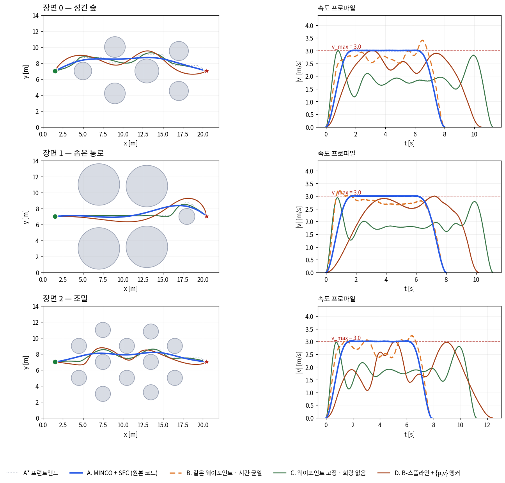

# 08. ZJU FAST Lab 플래너 계보 — 5개 저장소 정리와 비교

Elastic-Tracker 하나만 보면 "가시성 제약이 붙은 추적 플래너"입니다.
하지만 같은 연구실의 다른 저장소들과 나란히 놓으면, 이 저장소가 **공용 최적화 엔진 위에 얹힌
응용 하나**라는 구조가 드러납니다. 그 엔진이 GCOPTER/MINCO입니다.

| 저장소 | 논문 | 게재처 | 연도 | 대상 로봇 |
|---|---|---|---:|---|
| [GCOPTER](https://github.com/ZJU-FAST-Lab/GCOPTER) | Geometrically Constrained Trajectory Optimization for Multicopters | IEEE T-RO 38(5):3259–3278 | 2022 | 멀티콥터 (범용 엔진) |
| [ego-planner](https://github.com/ZJU-FAST-Lab/ego-planner) | EGO-Planner: An ESDF-free Gradient-based Local Planner for Quadrotors | IEEE RA-L | 2021 | 단일 쿼드로터 |
| [EGO-Planner-v2](https://github.com/ZJU-FAST-Lab/EGO-Planner-v2) | Swarm of micro flying robots in the wild | Science Robotics 7(66):eabm5954 | 2022 | 쿼드로터 군집 |
| [Elastic-Tracker](https://github.com/ZJU-FAST-Lab/Elastic-Tracker) | Elastic Tracker: A Spatio-temporal Trajectory Planner for Flexible Aerial Tracking | IEEE ICRA | 2022 | 추적 쿼드로터 |
| [DDR-opt](https://github.com/ZJU-FAST-Lab/DDR-opt) | Universal Trajectory Optimization Framework for Differential Drive Robot Class | IEEE T-ASE 22:13030–13045 | 2025 | 지상 차동구동 로봇 |

---

## 8.1 배경 — MINCO란 무엇인가

다섯을 가르는 것도 묶는 것도 결국 MINCO 하나입니다. 먼저 이것부터 봅니다.

> Zhepei Wang, Xin Zhou, Chao Xu, Fei Gao,
> *Geometrically Constrained Trajectory Optimization for Multicopters*,
> IEEE T-RO 38(5):3259–3278, 2022 ([arXiv:2103.00190](https://arxiv.org/abs/2103.00190))

MINCO는 궤적 최적화 **알고리즘이 아니라 궤적을 표현하는 방식**입니다.
이름은 **MIN**imum **CO**ntrol의 약자입니다.

### 출발점 — 무엇이 이미 정해져 있는가

`s`중 적분기에 대한 **무제약 다단계 제어 노력 최소화** 문제를 생각합니다.
시작·끝 상태가 고정되고 중간에 `M−1`개의 웨이포인트를 지나야 할 때 `∫‖p⁽ˢ⁾‖²`를 최소화하는 궤적입니다.

논문의 **Theorem 2**가 그 해의 필요충분조건을 줍니다. 최적 궤적은

- 각 조각이 차수 **2s − 1**의 다항식이고,
- 중간 시각 `tᵢ`에서 **2s − dᵢ − 1**번 연속 미분 가능하며,
- 경계 조건을 만족합니다.

결정적인 대목은 **비용 함수를 한 번도 평가하지 않고** 이 조건만으로 최적해를 직접 구성할 수 있고,
그 해가 **유일**하다는 것입니다. 그래서 다항식 계수 `c`는 자유 변수가 아니라 `(q, T)`의 함수가 됩니다.

```
𝔗_MINCO = { p(t) : [0,T] ↦ ℝᵐ  |  c = ℳ(q, T),  T ≻ 0 }

  q = (q₁ … q_{M−1})   중간 웨이포인트
  T = (T₁ … T_M)ᵀ      각 조각의 소요 시간
  c ∈ ℝ^{2Ms×m}        다항식 계수 — q와 T로부터 유일하게 결정
```

### 계수는 O(M)에 나온다

연속성 조건과 경계 조건을 쌓으면 계수에 대한 선형 시스템이 됩니다.
조각 `i`의 조건은 이웃 조각하고만 엮이므로 그 행렬은 **대역폭 O(s)의 밴디드 행렬**입니다.

```
M(T) · c = b(q),    M ∈ ℝ^{2Ms × 2Ms}
```

밴디드 PLU 분해로 **O(M)** — 조각 수에 선형입니다. 조밀 행렬이었다면 O(M³)일 문제입니다.

> **표기 주의** — 논문은 조각 수를 **M**으로, Elastic-Tracker 코드는 **N_**으로 씁니다.
> 이 문서는 논문을 인용할 때 M, 코드를 인용할 때 N을 그대로 두었습니다. 같은 것입니다.

### 그래디언트도 O(M)에 돌아온다

표현만 예쁘고 그래디언트가 비싸면 쓸모가 없습니다. 비용 `F(c,T)`의 그래디언트를 결정변수 쪽으로
되돌리는 것은 **같은 밴디드 구조를 전치해서 한 번 더 푸는 것**으로 끝납니다.

```
Mᵀ G = ∂F/∂c

∂H/∂Tᵢ = ∂F/∂Tᵢ − Tr{ Gᵢᵀ (∂Eᵢ/∂Tᵢ) cᵢ }
```

전방 평가도 O(M), 역전파도 O(M). **이 대칭성이 MINCO의 실질적 가치입니다** —
L-BFGS가 요구하는 "값 하나 + 그래디언트 하나"를 둘 다 선형 시간에 줍니다.

```
       ┌──────────┐   ┌──────────────────┐   ┌─────┐   ┌────────────────┐
   ┌──►│   q, T   ├──►│  M(T)·c = b(q)   ├──►│  c  ├──►│    F(c, T)     │
   │   │ 결정변수 │   │  밴디드 LU · O(M) │   │계수 │   │ 비용+제약 페널티│
   │   └──────────┘   └──────────────────┘   └─────┘   └───────┬────────┘
   │ L-BFGS 갱신                                               │
   │   ┌──────────────┐   ┌──────────────────┐   ┌─────────────▼──────┐
   └───┤ ∂H/∂q, ∂H/∂T │◄──┤  Mᵀ·G = ∂F/∂c    │◄──┤  ∂F/∂c , ∂F/∂T     │
       └──────────────┘   │ 역방향 solve·O(M) │   │   조밀 제약 평가    │
                          └──────────────────┘   └────────────────────┘
```

### 차수 s가 정하는 것

| s | 최소화 대상 | 다항식 차수 2s−1 | 이 계열에서 |
|---:|---|---:|---|
| 2 | 가속도 (min acceleration) | 3 | GCOPTER가 지원 |
| 3 | 저크 (min jerk) | 5 | **Elastic-Tracker · EGO-Planner-v2** — `MinJerkOpt`, `PolyTraj.order = 5` |
| 4 | 스냅 (min snap) | 7 | GCOPTER가 지원 |

쿼드로터에서 저크·스냅이 특별한 이유는 **미분평탄성** 때문입니다. 위치의 3계·4계 미분이
바디레이트·모터 입력과 직접 연결되므로, 그걸 최소화하면 **액추에이터에 거는 요구가 작아집니다.**

> ### ⚠ 에너지 최소화가 아닙니다
>
> 흔한 오해라 짚어 둡니다. 최소화되는 것은 `∫‖p⁽ˢ⁾‖² dt`이고 이것은 **제어 노력(control effort)**입니다 —
> 이름 자체가 **MIN**imum **CO**ntrol이지 minimum energy가 아닙니다.
>
> 쿼드로터 에너지의 대부분은 **호버링 추력**이 먹습니다. 가만히 떠 있어도 `mg`를 계속 내야 하니까요.
> 추력은 **가속도(2계)**에 대응하지 저크·스냅에 대응하지 않습니다.
> **최소 스냅 궤적은 에너지 최적이 전혀 아닙니다** — 실제로 에너지를 줄이려면 추력의 적분을
> 목적함수에 넣어야 하는데, 이 계열은 아무도 그렇게 하지 않습니다.
>
> 대신 얻는 것은 셋입니다.
>
> **① 액추에이터 여유** — 스냅 → 각가속도 → 토크이고, 쿼드로터의 롤·피치 토크는
> **마주 보는 로터 간 추력 차이**로 만듭니다. 스냅이 크면 로터 RPM이 크게 벌어져
> `max_rpm 35000`에 붙거나 `min_rpm 1200` 아래로 떨어집니다. 포화되는 순간 제어가 무너집니다.
>
> **② 물리적 재현 가능성** — 모터는 1차 지연입니다
> (`quadrotor_dynamics.hpp:134`, `τ = 0.03333 s` → 차단 **약 4.8 Hz**).
> 그보다 빠른 스냅 성분은 **명령해도 모터가 못 따라옵니다.**
>
> **③ 수학적 편의** — 하필 L2 노름의 적분이라야 Theorem 2가 성립합니다.
> 다른 비용으로 바꾸면 **MINCO 자체가 성립하지 않습니다.**
>
> Elastic-Tracker에는 하나 더 — 바디레이트가 작으면 **카메라가 덜 흔들립니다.**
> 가시성이 목적인 저장소라 이건 부수 효과가 아니라 본론에 가깝습니다.

### 그래서 무엇이 달라지는가

이 문제를 **정직하게** 쓰면 이렇게 생겼습니다. 회랑 5개(`N = 10`) 기준입니다.

```
min  J(c, T)                       c = 다항식 계수 6N×3 = 180개,  T = 구간 시간 10개

s.t. 조각 i 끝 = 조각 i+1 시작       등식 제약 135개 — 위치·속도·가속도·저크·스냅 × 9지점 × 3축
     p(0)=p₀, v(0)=v₀, a(0)=a₀ …    등식 제약 18개 — 경계 조건
     Tᵢ > 0,   ΣTᵢ = T_Σ            부등식 10개 + 등식 1개
     ∀t:  n·(p(t) − p₀) ≤ 0         부등식 제약 무한개 — 연속체 위에서 성립해야 함
     ∀t:  ‖v(t)‖ ≤ v_max            부등식 제약 무한개
```

**변수 190개에 등식 제약 154개, 그리고 연속 부등식 제약 무한개.**
이런 문제를 풀려면 제약을 다루는 기계가 따로 필요합니다.

- **SQP**는 매 반복 제약을 선형화한 QP 부분문제를 풉니다 — 내부에 **QP 솔버가 또** 필요하고
  (예: OSQP), 활성집합 추적·라그랑주 승수·메리트 함수가 따라붙습니다.
- **내부점법**은 경계에서 발산하는 장벽항 `−μ Σ log(−gᵢ)`을 붙이고 `μ`를 줄여 가며
  매번 KKT 시스템을 풉니다. 늘 실현가능 영역 *안에* 머물러야 합니다.

둘 다 반복 1회 비용이 L-BFGS보다 훨씬 큽니다. L-BFGS 한 반복은 사실상 **벡터 내적 몇 번**
(2중 루프 재귀)이 전부니까요. 50 ms 예산에서는 이 차이가 승부를 가릅니다.

MINCO는 **제약을 없애는 서로 다른 수법 세 가지**를 겁니다.
셋이 같은 동작이 아니라는 점이 중요합니다 — 앞의 둘은 제약을 **정말로** 없애고,
마지막 하나는 **비용으로 바꿔 놓을 뿐**입니다.

**① "그건 네가 정하는 게 아니야"**

> 두 점을 찍으면 그 사이 직선은 **하나로 정해집니다.** 그런데 직선의 기울기와 절편을 *변수*로 두고
> "두 끝점을 지나야 한다"를 *제약*으로 거는 건 바보 같은 짓이죠 — 그 둘은 **끝점이 정하는 값**입니다.

웨이포인트와 시간을 정하면 최소 저크 궤적은 **유일**합니다(Theorem 2). 그러니 계수 180개는
변수가 아니라 **계산해서 나오는 값**입니다. 변수 목록에서 빼면 **딸린 제약 153개도 같이 사라집니다.**

**② "밖으로 나갈 수 없는 좌표계"**

> `0 ≤ p ≤ 1`을 지켜야 한다면 보통 솔버에게 제약을 겁니다. 그런데 `p = sin²θ`로 바꾸면?
> **θ에 무슨 값을 넣든 p는 자동으로 0과 1 사이**입니다.
> 울타리를 치우는 대신 **울타리 안쪽만 가리키는 지도**를 그린 셈입니다.

같은 수를 두 번 씁니다 — 시간은 `expC2`로(뭘 넣어도 양수, 합이 보존),
웨이포인트는 **다면체 꼭짓점의 볼록결합**으로(뭘 넣어도 다면체 안).

**③ "벽 대신 벌금"**

> 주차 금지 구역에 **차단봉을 세우는 것**과 **벌금을 매기는 것**은 다릅니다.
> 차단봉은 물리적으로 못 들어가게 하지만, **벌금은 들어갈 수 있습니다** — 비쌀 뿐이죠.

회랑·속도·가속도의 연속 제약은 **없앨 방법이 없어** `ρ·max(0, pen)³`이라는 **비용으로 바꿔**
목적함수에 넣었습니다. 궤적은 **여전히 회랑을 벗어날 수 있습니다.**

**①②는 제약이 정말 사라집니다** — 어떤 값을 넣어도 항등적으로 성립하니까요.
**③은 남아 있습니다** — 비싸졌을 뿐입니다. 이 차이가 뒤에서 `validcheck()`가 필요한 이유가 됩니다.

```
   결정변수 190개  │  제약 164개 + ∞          ← 정직하게 쓴 문제
                   │  (등식 154 · 부등식 10 · 연속 부등식 ∞)
        │               │          │
        ▼               ▼          ▼
  ┌───────────┐  ┌───────────┐  ┌─────────────┐
  │① 최적성    │  │② 매끄러운 │  │③ 시간 적분항│
  │ 연속성·경계│  │ 시간·다면체│  │ 회랑·동역학 │
  │ 정확히 소거│  │ 정확히 소거│  │ 소거 아님 ⚠ │
  └─────┬─────┘  └─────┬─────┘  └──────┬──────┘
        ▼               ▼               ┊ (목적함수로 이동)
  결정변수 t9+p+δ1 │  제약 0개           ← MINCO 이후, L-BFGS 하나로
```

| 수법 | 대상 | 방식 | 제약이 정말 사라지나 |
|---|---|---|---|
| **① 최적성 조건** | 계수 `c` 전부 + 연속성·경계 등식 제약 | 밴디드 시스템의 **일부로 흡수** | **예 — 항등적으로** |
| **② 매끄러운 사상** | `Tᵢ > 0`, `ΣTᵢ = T_Σ`, 웨이포인트 ∈ 다면체 | `expC2` 정규화 · 역 스테레오 사영 | **예 — 항등적으로** |
| **③ 시간 적분 항** | 회랑·속도·가속도의 **연속** 제약 | K개 샘플에서 `ρ·max(0, pen)³` | **아니오 — 비싸게 만들 뿐** |

①의 실체는 `minco.hpp`를 열면 바로 보입니다. 경계 조건이 *제약*이 아니라
밴디드 시스템의 **첫 세 행**으로 들어가 버립니다.

```cpp
// minco.hpp:210-215 — 경계 조건이 연립방정식의 일부가 된다
A(0, 0) = 1.0;  A(1, 1) = 1.0;  A(2, 2) = 2.0;
b.row(0) = headPVA.col(0).transpose();   // p(0) = p₀
b.row(1) = headPVA.col(1).transpose();   // v(0) = v₀
b.row(2) = headPVA.col(2).transpose();   // a(0) = a₀
```

> ### ⚠ 흔한 오해 — 변수가 줄어드는 게 아닙니다
>
> "190개에서 몇십 개로 줄었다"고 읽기 쉽지만 **사실이 아닙니다.** 웨이포인트 하나는 3자유도인데,
> ②의 역 스테레오 사영은 그것을 **다면체 꼭짓점 수 −1 개**의 파라미터로 표현합니다 — **과대 파라미터화**입니다.
>
> 오일러 공식으로 어림하면 면이 `F`개인 3D 다면체의 꼭짓점은 약 `2F−4`개입니다.
> 회랑 5개(`N=10`, 웨이포인트 9개) 기준으로:
>
> ```
> 면  8개 → dim_p ≈  99 → 총 109개   (정직한 버전 190개보다 적음)
> 면 14개 → dim_p ≈ 207 → 총 217개   (오히려 많음)
> 면 20개 → dim_p ≈ 315 → 총 325개   (훨씬 많음)
> ```
>
> **MINCO는 변수를 늘려서 제약을 없앤 거래입니다.** L-BFGS는 변수가 늘어도 반복당 `O(mn)`으로
> 선형이지만, 제약이 하나라도 있으면 SQP나 내부점법으로 넘어가야 합니다 — 그쪽이 훨씬 비쌉니다.

결과적으로 L-BFGS에게 넘어가는 것은 **지켜야 할 조건이 하나도 없는** 문제입니다.
결정변수 벡터에 **어떤 실수를 넣어도** 유효한 궤적이 나옵니다. 솔버 호출부가 그것을 그대로 보여 줍니다.

```cpp
// traj_opt.cc:315 — 제약을 넘기는 자리가 아예 없다
lbfgs_optimize(dim_t_ + dim_p_ + 1,   // 변수 개수
               x_,                    // 시작점
               &minObjective,
               &objectiveFunc,        // 목적함수 + 그래디언트
               nullptr, &earlyExit, this, &lbfgs_params);
```

인자는 **변수 개수 · 시작점 · 목적함수 콜백**이 전부입니다. `lbfgs_raw.hpp:1103`의 시그니처에도
제약을 받는 매개변수가 없습니다. SQP·내부점법이 필요로 하는 것들이 **존재하지 않습니다.**

> ### ⚠ 중요 — 이 주장은 절반만 참입니다
>
> ③은 소거가 아닙니다. 웨이포인트는 다면체 안에 **보장**되지만,
> **웨이포인트 *사이*의 궤적은 회랑을 벗어날 수 있습니다.** `‖v(t)‖ ≤ v_max`도 마찬가지입니다.
> 그 제약들은 제거된 것이 아니라 `ρ_P = 10000` 같은 큰 가중치로 **아주 비싸게 만든 것**뿐입니다.
>
> 증거가 코드에 있습니다 — `planning_nodelet.cpp:731`의 `validcheck()`가
> **최적화가 끝난 궤적을 0.01초 간격으로 다시 샘플링해** 점유 격자와 대조합니다.
> 제약이 진짜로 보장됐다면 **이 검사는 필요 없습니다.** 페널티 방식이 모서리를 살짝 깎는 궤적을
> 내놓을 수 있기 때문에 존재하는 안전망입니다.
> (`setBoundConds`가 시작·끝 속도를 `vmax`로 강제 클램프하는 것도 같은 성격입니다.)
>
> 그래서 MINCO 계열은 **하드 보장을 포기하고 속도를 산** 설계입니다 —
> 8.12절에서 볼 MIT의 GCS가 볼록성을 끝까지 유지해 전역 최적에 가까운 해를 얻되
> 무거운 것과 정확히 반대편입니다.

정리하면 — **①②가 제약을 정말로 없애고 ③이 나머지를 비용으로 바꾼 덕분에**
SQP도 내부점법도 필요 없고 L-BFGS 하나로 끝납니다.

> **이름 정리** — **MINCO**는 궤적 *표현*(클래스)이고, **GCOPTER**는 그 표현 위에 회랑·동역학
> 제약을 얹어 실제로 푸는 *프레임워크*이자 저장소 이름입니다.

---

## 8.2 미분평탄성 — MINCO가 왜 위치만 풀어도 되는가

8.1절에서 MINCO는 위치 웨이포인트 `q`와 시간 `T`를 최적화한다고 했습니다. 그런데 쿼드로터를
실제로 움직이는 것은 **모터 4개**이고 자세는 SO(3) 위에 있습니다. 위치 다항식 하나가 어떻게
그 전부를 결정할까요? **미분평탄성**이 그 다리입니다.

### 정의

Fliess, Lévine, Martin, Rouchon (1995). 어떤 비선형 시스템에 **평탄 출력** `z`가 존재해서
**모든 상태와 모든 입력**이 `z`와 그 **유한 개 시간 미분**의 대수 함수로 쓰이면 그 시스템은 미분평탄합니다.

```
x(t) = Φ(z, ż, …, z⁽�q⁾)          u(t) = Ψ(z, ż, …, z⁽�q⁺¹⁾)
```

핵심은 **적분이 없다**는 것입니다. `z(t)`를 하나 그리면 그 궤적에 필요한 상태와 입력이
**미분과 대수 연산만으로** 즉시 나옵니다 — 미분방정식을 풀 필요가 없습니다.

계획하는 쪽에서 이게 뜻하는 바는 결정적입니다. **동역학 제약이 사라집니다.**
`z(t)`를 충분히 매끄럽게만 그리면 그것은 *자동으로* 실현 가능한 궤적입니다.

### 쿼드로터의 평탄 출력

입력 4개(총추력 + 3축 모멘트), 평탄 출력도 4개 — **위치 (x, y, z)와 요각 ψ**.
Mellinger & Kumar 2011이 이것을 체계화했고 그 논문이 곧 minimum snap의 출발점입니다.

```
m·a + m·g·e₃ = T·b₃   ⟹   T = m‖a + g·e₃‖,   b₃ = (a + g·e₃)/‖a + g·e₃‖

b₂ = (b₃ × b₁ᵈ)/‖b₃ × b₁ᵈ‖,  b₁ = b₂ × b₃,  R = [b₁ b₂ b₃]
                                              b₁ᵈ = [cos ψ, sin ψ, 0]
```

**가속도가 자세를 결정합니다.** 쿼드로터는 추력을 한 방향(`b₃`)으로만 낼 수 있으므로
원하는 가속도를 내려면 기체가 그쪽을 향해야 합니다. 남은 1자유도를 요각 ψ가 채웁니다.

### 코드에서 그대로 보입니다

Elastic-Tracker의 SO(3) 제어기가 위 식을 거의 글자 그대로 구현합니다
(`so3_controller.hpp`). 피드백 항(kx, kv)만 걷어내면 교과서 평탄 사상입니다.

```cpp
force_ = kx∘(p_des - p) + kv∘(v_des - v) + m*a_des + … + m*g*(0,0,1);
b3c = force_.normalized();                 // ← b₃
b1d = (cos(des_yaw), sin(des_yaw), 0);     // ← b₁ᵈ
b2c = b3c.cross(b1d).normalized();         // ← b₂
b1c = b2c.cross(b3c).normalized();         // ← b₁
R << b1c, b2c, b3c;                        // ← R
```

> **그래서 플래너가 자세를 계산하지 않습니다** — `PolyTraj` 메시지에는 위치 계수와 요각 하나뿐입니다.
> 자세도 추력도 바디레이트도 없습니다. `traj_server`가 p, v, a를 넘기면 `so3_controller`가
> 평탄 사상으로 나머지를 복원합니다. **플래너가 SO(3)를 한 번도 건드리지 않는 것**이 평탄성 덕분입니다.

### 단, 네 번째 평탄 출력은 최적화되지 않습니다

쿼드로터의 평탄 출력은 `(x, y, z, ψ)` 넷인데 **Elastic-Tracker의 MINCO는 앞의 셋만 다룹니다.**
요각 ψ는 최적화에 **아예 들어가지 않습니다.**

```
// PolyTraj.msg — 위치는 다항식 계수, 요각은 스칼라 하나
float32[] coef_x, coef_y, coef_z    // 6 × piece_num 개씩
float32   yaw                       // ← 궤적이 아니라 값 하나

// planning_nodelet.cpp:403 — 최적화가 아니라 휴리스틱
double yaw = std::atan2(dp.y(), dp.x());   // 목표물 쪽을 향해라, 끝

// traj_server.cpp:96 — 급회전 방지용 레이트 제한만
if (d_yaw_abs >= 0.02) yaw = last_yaw_ + d_yaw/d_yaw_abs * 0.02;
                                           // 100 Hz × 0.02 rad ⇒ 최대 2 rad/s
```

결정적인 증거 — `traj_opt.cc` 전체(751행)에 **"yaw"라는 문자열이 한 번도 나오지 않습니다.**
요각은 비용 항에도, 제약에도, 그래디언트에도 없습니다.

**이 계열은 4차원 평탄 출력 중 3차원만 최적화하고 나머지 하나는 사후 휴리스틱으로 채웁니다.**
추적 임무에서는 "카메라를 목표물 쪽으로"라는 답이 자명하니 잘 통하지만, **요각 자체가 임무에
중요한 경우**에는 이 구조가 한계입니다. GCOPTER의 `flatness.hpp`가 `ψ`와 `dψ`를 입력으로 받는 것은
그 확장 여지를 열어 둔 것입니다.

### 저크와 스냅의 정체

```
   p  ──▶  ṗ = v  ──▶  p̈ = a  ──▶  p⁽³⁾ jerk  ──▶  p⁽⁴⁾ snap
   │        │           │             │                │
  위치     속도      추력 T        바디레이트        각가속도 ω̇
                      자세 R           ω            → 모터 토크

  └────────── s = 3 최소 저크 (다섯 중 넷) ──────────┘
  └──────────────── s = 4 최소 스냅 ─────────────────────────┘
```

`b₃`가 가속도로 정해지므로 그 *변화율* `ḃ₃`를 알려면 `ȧ` = 저크가 필요하고, `ḃ₃`가 곧 ω를 줍니다.
한 단계 더 내려가면 `ä` = 스냅이 각가속도를, 그것이 관성을 통해 **모터 토크**를 결정합니다.
**저크와 스냅은 임의로 고른 차수가 아닙니다.**

### 평탄성이 깨지는 곳

| 특이점 | 언제 | 이 계열에서 |
|---|---|---|
| 자유낙하 | `a + g·e₃ = 0` — 추력 0이면 `b₃` 미정 | `so3_controller.hpp`의 `force_.norm() > 1e-6` 검사 |
| 완전 수평 자세 | `b₃ ∥ b₁ᵈ` — 외적이 0이라 `b₂` 미정. `b₁ᵈ`는 **항상 수평**이므로 추력 축이 수평면에 눕는 **90° 기울어진** 자세 | 일반 비행에서는 도달하지 않음. SE(3) 계획(Fast-Racing)처럼 **기체를 눕히는** 응용에서 문제 |
| 항력 무시 | 순수 강체 모델은 공기 저항을 뺌 | 아래 참조 |

### 항력이 들어가도 여전히 평탄합니다

> M. Faessler, A. Franchi, D. Scaramuzza, *Differential Flatness of Quadrotor Dynamics Subject to
> Rotor Drag for Accurate Tracking of High-Speed Trajectories*, IEEE RA-L 3(2):620–626, 2018.
> [arXiv:1712.02402](https://arxiv.org/abs/1712.02402)

UZH 그룹이 **"선형 로터 항력이 걸린 쿼드로터 동역학이 위치와 헤딩에 대해 미분평탄함을 증명"**했습니다.
항력을 미지의 외란으로 두고 피드백으로 때우는 대신 **모델 안에 넣어도 평탄성이 유지된다**는 뜻입니다.

GCOPTER의 `flatness.hpp`가 이것을 구현합니다. `FlatnessMap::forward()`는 속도·가속도·저크·요각·요각속도를
받아 **추력·쿼터니언·바디레이트**를 내놓고, `backward()`는 그 출력에 대한 그래디언트를
**다시 위치 미분 쪽으로 되돌립니다.**

> **이것이 GCOPTER만의 자산입니다** — `backward()`가 있다는 것은 "추력이 최대치를 넘지 마라",
> "바디레이트가 한계를 넘지 마라"를 궤적 최적화 비용 항으로 **직접** 걸 수 있다는 뜻입니다.
> 나머지 넷은 없습니다. Elastic-Tracker와 EGO-Planner-v2는 `‖v‖ ≤ v_max`, `‖a‖ ≤ a_max`라는
> **대리 제약**만 겁니다. 가속도 한계는 추력 한계의 근사일 뿐이고 자세가 기울수록 나빠집니다.

### 지상 로봇의 평탄성 — DDR-opt의 진짜 기여

유니사이클(차동구동)도 미분평탄합니다. 평탄 출력은 **위치 (x, y)**뿐입니다.

```
ẋ = v·cosθ,   ẏ = v·sinθ,   θ̇ = ω

θ = atan2(ẏ, ẋ),   v = ±√(ẋ² + ẏ²),   ω = (ẋÿ − ẏẍ)/(ẋ² + ẏ²)
```

분모가 `ẋ² + ẏ² = v²`입니다 — **v = 0에서 전부 무너집니다.** θ는 `atan2(0,0)`으로 미정이고
ω는 `0/0`입니다.

쿼드로터의 자유낙하 특이점은 실제 비행에서 거의 만나지 않습니다. 그런데 **지상 로봇의 v = 0은
상시적입니다** — 출발·정지·제자리 회전·전후진 전환마다 지나갑니다.
비행체용 기법을 그대로 가져오면 정확히 그 지점에서 깨집니다.

DDR-opt는 궤적 표현을 **"운동 상태 또는 그 적분값 — 각속도와 선속도 — 의 다항식 파라미터화"**로
바꾸고, 그것이 **"로봇의 운동을 제어 원리에 본질적으로 맞춘다"**고 씁니다.

> **읽어 보면** — `(x, y)`를 다항식으로 두면 `v`와 `ω`가 *나눗셈으로* 유도되어 `v = 0`이 특이점이 됩니다.
> 반대로 `(v, ω)`를 다항식으로 두면 `v = 0`은 그냥 **다항식이 지나가는 한 값**일 뿐이고
> `(x, y)`는 적분으로 나옵니다 — 나눗셈이 사라집니다. DDR-opt가 왜 이륜·스키드스티어·무한궤도를
> 한 틀로 덮는지도 여기서 설명됩니다. 구동 방식이 달라도 **결국 (v, ω)로 제어**하기 때문입니다.
> — 이 문단은 논문 초록의 서술을 근거로 한 **해석**이며, DDR-opt 최적화기 소스를 직접 읽은 것은 아닙니다.

### 정리 — 로봇별 평탄 출력

| 시스템 | 입력 수 | 평탄 출력 | 주요 특이점 | 이 계열에서 |
|---|---:|---|---|---|
| 쿼드로터 | 4 | x, y, z, ψ | 자유낙하 (T = 0) | GCOPTER · ego-planner · EGO-v2 · Elastic-Tracker |
| 쿼드로터 + 로터 항력 | 4 | x, y, z, ψ (여전히 평탄) | 동일 + 속도 0 근처 평활 | **GCOPTER만** — `flatness.hpp` |
| 차동구동 (유니사이클) | 2 | x, y | **v = 0 — 상시적** | DDR-opt · Dftpav · Car-like-swarm |

평탄 출력의 개수가 입력의 개수와 같다는 점에 주목하세요. 우연이 아니라 평탄 시스템의 정의상 그렇습니다.
덕분에 **계획 공간이 원리적으로 최소 차원**이 됩니다 — 쿼드로터라면 상태 12차원·입력 4차원짜리
비선형 시스템이 **스칼라 함수 네 개**로 완전히 기술됩니다.

> **두 단계를 헷갈리지 마세요** — **평탄성**이 계획 공간을 *최소*로 줄여 주고(12+4차원 → 함수 4개),
> 그 위에서 **MINCO**가 다시 *유한* 차원으로 잘라냅니다(함수 → `q`, `T`).
> 그리고 8.1절의 ②가 제약을 없애려고 **일부러 다시 부풀립니다**(웨이포인트 3자유도 → 꼭짓점 수만큼).
> 줄이고, 자르고, 다시 부풀리는 세 단계입니다. 마지막이 손해처럼 보이지만
> **제약을 전부 없애는 값**으로는 싼 편입니다.

---

## 8.3 계보 — 무엇이 줄기인가

GCOPTER가 트렁크이고, 나머지 셋은 **그 헤더를 저장소 안에 그대로 벤더링**해서 씁니다.
파일 목록으로 확인되는 사실입니다.

```
GCOPTER  gcopter/include/gcopter/
         firi · flatness · gcopter · geo_utils · lbfgs · minco · quickhull
         root_finder · sdlp · sfc_gen · trajectory · voxel_dilater · voxel_map
                    │
     ┌──────────────┼──────────────────────────┐
     ▼              ▼                          ▼
Elastic-Tracker  EGO-Planner-v2            DDR-opt
traj_opt/include/ planner/traj_opt/         back_end/include/
  traj_opt/         include/optimizer/        gcopter/
  minco             gcopter                   minco
  poly_traj_utils   poly_traj_optimizer       lbfgs
  geoutils          poly_traj_utils           root_finder
  root_finder       lbfgs                     sdlp
  sdlp              root_finder               trajectory
  quickhull
```

Elastic-Tracker 쪽은 로컬에서 직접 확인했습니다. `minco.hpp`, `poly_traj_utils.hpp`,
`geoutils.hpp`, `root_finder.hpp`가 모두 `Copyright (c) 2021 Zhepei Wang` — GCOPTER 제1저자입니다.
`sdlp.hpp`만 원저자가 다릅니다(`Copyright (c) 1990 Michael E. Hohmeyer`, Seidel LP 구현).

**ego-planner v1만 이 계보 밖에 있습니다.** MINCO 논문(2021)보다 먼저 나왔고
B-스플라인을 씁니다. v1 → v2는 개선이 아니라 **표현을 갈아엎은 재작성**입니다.

---

## 8.4 두 축으로 보는 지형도

이 다섯 개를 가르는 결정적 차이는 두 가지뿐입니다.

**축 1 — 궤적을 무엇으로 표현하는가**
- **B-스플라인**: 제어점의 볼록포 성질로 안전성을 얻지만, 시간 배분이 균일 노트에 묶여 뻣뻣합니다.
- **MINCO**: 웨이포인트 `P`와 구간 시간 `T`만으로 다항식이 결정됩니다. 시간이 최적화 변수가 됩니다.

**축 2 — 장애물이 비용에 어떻게 들어오는가**
- **{p, v} 앵커 쌍**: 충돌한 궤적과 충돌 없는 가이드 경로를 비교해, 부딪힌 지점에만
  평면 `(기준점 p, 법선 v)`를 하나 심습니다. ESDF를 만들지 않습니다.
- **안전 회랑(SFC)**: 경로 주변에 볼록 다면체 열을 만들고 궤적을 그 안에 가둡니다.

|  | B-스플라인 | MINCO |
|---|---|---|
| **{p, v} 앵커** | **ego-planner v1** | **EGO-Planner-v2** |
| **SFC 다면체** | — | **GCOPTER**, **Elastic-Tracker** |

DDR-opt는 이 격자에 들어가지 않습니다. 충돌 처리 방식이 아니라 **로봇 모델 자체**를
바꾼 갈래이기 때문입니다 (비홀로노믹 지상 로봇).

---

## 8.5 저장소별 정리

### GCOPTER — 엔진

> "일반적으로 제약이 걸린 멀티콥터 계획 문제를 **무제약 최적화로 변환**한다."

핵심 주장은 세 가지입니다.

1. **MINCO 표현** — 무제약 제어 노력 최소화의 최적성 조건에서 유도한 희소 표현.
   결정변수가 웨이포인트와 구간 시간뿐이고, 그 위의 연산이 **선형 복잡도**입니다.
2. **매끄러운 사상으로 기하 제약 제거** — 다면체 안쪽이라는 부등식 제약을
   변수 변환으로 *정확히* 없앱니다. 제약 처리 루틴이 필요 없어집니다.
3. **희소 파라미터화와 조밀 제약 평가의 분리** + **flatness map의 역방향 미분** —
   추력·틸트각·바디레이트 같은 실제 상태-입력 제약을, 비선형 항력까지 포함해 다룹니다.

고유 자산으로 `firi.hpp`(Fast Iterative Regional Inflation, 회랑 생성)와
`flatness.hpp`(항력 포함 미분평탄성)를 갖고 있습니다. **이 둘은 다른 네 저장소에 없습니다.**

- 의존: ROS, **OMPL**, Eigen. 벤치마크 시 `cpufreq-set -g performance` 권장.
- ★1.3k · 최종 갱신 2023-10

### ego-planner (v1) — ESDF를 버린 국소 플래너

> "궤적 최적화가 실제로 훑는 공간은 ESDF 갱신 범위의 아주 일부다. 그 중복이 낭비다."

문제 의식이 명확합니다. ESDF는 맵 전체에 거리장을 깔지만, 최적화는 궤적 주변 좁은 관 안에서만
그래디언트를 씁니다. 그래서 **거리장을 만들지 않고**, 충돌이 났을 때만 그 자리에 정보를 심습니다.

- 충돌 궤적과 충돌 없는 가이드 경로를 비교해 페널티를 구성
- 장애물 정보는 **새로 부딪혔을 때만** 저장 → 필요한 것만 추출
- 동역학적 실현 가능성이 깨지면 **시간 배분을 늘림**
- 원래 형상을 유지한 채 고차 미분을 조정하는 **비등방 곡선 적합**

계획 1회 ≈ **1 ms**를 표방합니다. 패키지는
`bspline_opt`(최적화기), `path_searching`, `plan_env`, `plan_manage`, `traj_utils`.

★2.6k로 **다섯 중 가장 많이 쓰입니다.** 단일 기체 국소 회피의 사실상 표준 참조 구현입니다.

### EGO-Planner-v2 — 군집

Science Robotics 표지 작업("Swarm Playground")입니다. v1의 충돌 처리 아이디어는 유지하되
**표현을 MINCO로 갈아탔고**, 군집 항을 더했습니다. 헤더 목록이 그 사실을 그대로 보여 줍니다.

```
traj_opt/include/optimizer/
  gcopter.hpp  poly_traj_optimizer.h  poly_traj_utils.hpp  lbfgs.hpp  root_finder.hpp
```

최적화기 멤버는 `poly_traj::MinJerkOpt jerkOpt_`이고, 비용 항은 다음과 같습니다.

| 항 | 가중치 | 역할 |
|---|---|---|
| `obstacleGradCostP` | `wei_obs_`, `wei_obs_soft_` | v1의 `ConstraintPoints{base_point, direction}` 앵커 방식 유지 |
| `swarmGradCostP` | `wei_swarm_`, `wei_swarm_mod_` | **기체 간 상호 회피 (신규)** |
| `feasibilityGradCostV/A/J` | `wei_feas_` | 속도·가속도·저크 |
| `distanceSqrVarianceWithGradCost2p`<br>`lengthVarianceWithGradCost2p` | `wei_sqrvar_` | 균등 분포 정규화 |
| `initAndGetSmoothnessGradCost2PT` | `wei_time_` | 평활도 + 시간 |

패키지에 **`swarm_bridge`**(기체 간 통신)와 **`drone_detect`**(상호 시각 검출)가 추가된 것이
v1과의 가장 눈에 띄는 차이입니다. 워크스페이스가 용도별로 넷으로 나뉘어 있습니다 —
`main_ws`, `formation_ws`(편대), `tracking_ws`(추적), `interlaced_flight_ws`(교차 비행).

★727 · 최종 갱신 2023-10

### Elastic-Tracker — 추적

[01](01-overview.md)–[07](07-code-notes.md) 문서에서 다룬 저장소입니다. 위치를 다시 잡으면,
**MINCO 표현을 가져다 자체 최적화기를 얹은** 응용입니다. 정확히 말하면 GCOPTER 프레임워크를
통째로 쓰는 것이 아닙니다 — `gcopter.hpp`는 없고 `minco.hpp`와 기하·솔버 유틸만 벤더링한 뒤
`traj_opt.cc`(751행)를 직접 씁니다. (EGO-Planner-v2는 반대로 `gcopter.hpp`를 갖고 있습니다.)

1. **가시성 제약** — 목표물마다 부채꼴 가시 영역을 계산하고
   `cos θ_less − (a·b)/(|a||b|)` 형태의 코사인 페널티를 겁니다. 다섯 중 **유일**합니다.
2. **탄성 시간** — 총 시간 `sumT = tracking_dur + deltaT²`를 결정변수로 둡니다.

회랑 생성은 GCOPTER의 `firi.hpp`가 아니라 **외부 [DecompROS](https://github.com/sikang/DecompROS)의
`EllipsoidDecomp3D`**를 씁니다. 같은 연구실의 최신 도구 대신 이전 세대 라이브러리를 쓴 셈인데,
논문 시점(ICRA 2022 투고, 2021년 작업)이 GCOPTER T-RO 게재와 겹치기 때문으로 보입니다.

★331 · 최종 갱신 2023-06 — 다섯 중 가장 조용합니다.

### DDR-opt — 지상 로봇으로의 이식

유일하게 **비행체가 아닙니다.** 그리고 유일하게 2025년까지 갱신되고 있습니다.

> "구동 방식의 차이는 정밀 제어를 원할 때 각각 다른 기구학 모델링을 요구한다.
> 게다가 비홀로노믹 동역학과 측면 슬립이 실현 가능하고 질 좋은 궤적을 얻는 난도를 다르게 만든다."

여기서 "universal"은 **이륜 / 사륜 스키드-스티어 / 무한궤도** 세 가지를 하나의 프레임워크로
덮는다는 뜻입니다. 실제 로봇 세 종으로 검증했다고 밝히고 있습니다.

핵심 아이디어는 표현의 전환입니다. 비행체는 위치 `(x, y, z)`가 미분평탄 출력이라 그대로 다항식으로
두면 되지만, 차동구동 로봇은 그렇지 않습니다. 그래서 **운동 상태 자체 또는 그 적분값**
(선속도·각속도)을 다항식으로 파라미터화합니다 — "로봇의 운동을 제어 원리에 본질적으로 맞춘다"는
표현을 씁니다.

구조가 다른 넷과 확연히 다릅니다.

| 모듈 | 역할 |
|---|---|
| `back_end` | 궤적 최적화 (`include/gcopter/`에 MINCO 벤더링) |
| `front_end` | 경로 탐색 — **JPS**(Jump Point Search). 나머지 넷의 A*와 다름 |
| `utils/plan_env` | **SDF 맵**(`sdf_map`) — 이 계열에서 **유일하게 거리장을 씀**. ego-planner가 버린 그것 |
| `nmpc_controller` / `mpc_controller` | **비선형/선형 MPC 추종 제어** |
| `icrekf` | ICR(순간회전중심) 추정 EKF |
| `plan_manager` | 임무 조율 |

**MPC 제어기와 상태 추정기가 저장소 안에 함께 있습니다.** 비행체 쪽 넷이 궤적 생성까지만 하고
제어를 외부(PX4, `so3_controller`)에 맡기는 것과 대비됩니다. 지상 로봇은 슬립 때문에
계획-제어를 분리하기 어렵다는 판단으로 읽힙니다.

- 의존: ROS, **OSQP 0.6.3 + osqp-eigen 0.8.1** (MPC의 QP 솔버), tf2-sensor-msgs
- 빌드가 `catkin build`(catkin_tools)입니다 — 나머지 넷의 `catkin_make`와 다릅니다.
- ★420 · 최종 갱신 2025-12

---

## 8.6 솔버 스택

"L-BFGS로 푼다"는 한 줄 뒤에는 성격이 전혀 다른 솔버 일곱이 층을 이루고 있습니다.

| 솔버 | 문제 종류 | 알고리즘 | 복잡도 | 쓰이는 곳 |
|---|---|---|---|---|
| **L-BFGS** | 무제약 비선형 | 유사 뉴턴 (제한 메모리) | O(mn)/반복 | **다섯 저장소 전부** |
| **밴디드 LU** | 밴디드 선형계 | 피벗 없는 LU | O(M) | MINCO 내부 |
| **SDLP** | 저차원 선형계획 | Seidel 무작위 증분 | 기대 O(m) | 다면체 내부점 |
| **QuickHull** | 볼록껍질 / 꼭짓점 열거 | 증분 beneath-beyond | O(n log n)~ | H-표현 → V-표현 |
| **RootFinder** | 다항식 근 | 동반행렬 / 구간 분리 | 차수 의존 | 최대 속도·가속도 정확 계산 |
| **OSQP** | 볼록 QP | ADMM 연산자 분할 | 반복당 1회 역대입 | **DDR-opt** — MPC · (계열 밖 CMPCC도) |
| **OMPL** | 샘플링 기반 경로 | RRT*/PRM/BIT* | 확률적 완전성 | **GCOPTER만** — 전역 경로 |

### L-BFGS — 라인서치가 두 버전으로 갈립니다

Nocedal 1980 (*Math. of Computation* 35(151), Northwestern). 헤시안을 만들지 않고 최근 `m`개의
`(s, y)` 쌍만으로 2중 루프 재귀로 방향을 계산합니다. SciPy `L-BFGS-B`, PyTorch `torch.optim.LBFGS`의
그 알고리즘입니다.

이 계열 안에 실제 차이가 있습니다 — **로컬 저장소에서 직접 확인한 사실**입니다.

| | Elastic-Tracker `lbfgs_raw.hpp` | GCOPTER `lbfgs.hpp` (현행) |
|---|---|---|
| 라인서치 | `line_search_morethuente` + backtracking 폴백 | **Lewis–Overton** |
| 만족 조건 | Armijo + **strong** Wolfe | Armijo + **weak** Wolfe |
| 대상 함수 | 매끄러운 함수 | 연속 · **조각별 매끄러운** 함수 |
| 근거 문헌 | Nocedal 1980 (libLBFGS 계열) | Lewis & Overton 2013 + Li & Fukushima 2011 |

GCOPTER 헤더가 이유를 직접 밝힙니다 — Lewis–Overton은 "backtracking만큼 견고하면서,
**strong Wolfe 조건이 대개 성립하지 않는** 연속·조각별 매끄러운 함수에까지 적용된다."

**왜 중요한가**: 이 계열의 비용 함수는 조각별로만 매끄럽습니다. Elastic-Tracker의 `penF`는
`x = 2ε`에서 값과 1계 도함수만 이어지고 2계는 점프합니다(4차 → 선형).
즉 **Elastic-Tracker는 자기 비용 함수보다 한 세대 오래된 라인서치를 쓰고 있습니다.**
backtracking 폴백이 있어 실용상 돌아가지만, 최신 GCOPTER를 가져오면 이론적 정합성이 맞습니다.

### 밴디드 LU — 라이브러리가 아닙니다

`minco.hpp`의 `BandedSystem` 클래스. 밴드 밖은 저장조차 않고 `N×(하+상+1)` 배열만 씁니다.
주석이 스스로 한계를 밝힙니다 — **"효율을 위해 행렬 A에 피벗을 *전혀* 적용하지 않는다."**
시간 배분이 병적으로 치우치면 불안정해질 수 있는데, `expC2`가 `Tᵢ > 0`을 구조적으로
보장하는 것이 이 위험을 눌러 줍니다.

### SDLP — Seidel의 선형계획법

Raimund Seidel 1991, *Discrete & Computational Geometry* 6:423–434,
"Small-dimensional linear programming and convex hulls made easy". 기대 복잡도 O(d!·m) —
차원을 상수로 보면 **제약 수에 선형**입니다.

여기 필요한 건 심플렉스법이 겨냥하는 것과 정반대입니다 — **변수 3~4개에 제약 수십 개**인
문제를 **20 Hz로 수십 번** 풀어야 합니다. 용도는 `geoutils::findInterior` /
`findInteriorDist`이고, 회랑 후처리(병합·수축·연결성 보정)가 전부 이 값으로 판정합니다.

ZJU FAST Lab이 [별도 저장소](https://github.com/ZJU-FAST-Lab/SDLP)로도 공개했습니다.
원 저작권 표기는 `Copyright (c) 1990 Michael E. Hohmeyer`로, 이 계열 헤더 중 유일하게 저자가 다릅니다.

### QuickHull — H-표현을 V-표현으로

Barber, Dobkin, Huhdanpaa 1996, *ACM TOMS* 22(4). Qhull(qhull.org)의 알고리즘이고
SciPy `spatial.ConvexHull`, MATLAB `convhulln`, CGAL이 씁니다.

회랑 생성기가 주는 건 **H-표현**(반공간 교집합)인데, MINCO의 웨이포인트 파라미터화는
**꼭짓점**이 있어야 볼록 결합을 만들 수 있습니다. 그 변환이 `geoutils::enumerateVs`입니다.
먼저 SDLP로 내부점을 찾아 원점을 옮긴 뒤 극쌍대를 취하면 꼭짓점 열거가 볼록껍질 문제가 됩니다 —
그래서 두 솔버가 항상 붙어 다닙니다.

실패하면 `generate_traj`가 즉시 false를 반환합니다. 실행 중 보이는 `ROS_ERROR("extractVs fail!")`이 이 경로입니다.

### RootFinder — 샘플링이 아니라 정확

`root_finder.hpp` (874행, 자체 구현). 최대 속력을 구할 때 흔한 방법은 조각을 잘게 샘플링하는
것인데 **샘플 사이의 첨두를 놓칩니다.** MINCO는 궤적이 다항식이라는 사실을 그대로 씁니다.

```
coeff = polySqr(vx) + polySqr(vy) + polySqr(vz)   // ‖v(t)‖²
coeff *= d/dt                                     // 도함수
candidates = solvePolynomial(coeff, l, r, tol)    // 모든 실근
candidates ∪ {0, 1}                               // 끝점 포함
maxVelRate = max over candidates                  // 정확한 최댓값
```

`poly_traj_utils.hpp:159–190`. 동역학 실현 가능성 판정이 보수적 여유 없이 정확해집니다.

### OSQP — DDR-opt만

Stellato, Banjac, Goulart, Bemporad, Boyd, *Mathematical Programming Computation* 12(4):637–672, 2020.
Oxford · Stanford · IMT Lucca · Princeton. ADMM 연산자 분할.

다섯 중 DDR-opt만 별도 QP 솔버를 씁니다 — 궤적 최적화가 아니라 `mpc_controller` /
`nmpc_controller` 때문입니다. MPC는 매 주기 **같은 구조에 데이터만 바뀐 QP**를 푸는데,
OSQP가 정확히 그 형태를 겨냥합니다. `min ½xᵀPx + qᵀx  s.t.  l ≤ Ax ≤ u`.

- **인수분해 1회 재사용** — 준정부호 KKT 행렬을 한 번만 분해
- **나눗셈 없음** — 초기 분해 이후. 임베디드 하드웨어 적합
- **웜스타트** — 이전 주기 해에서 출발. MPC에서 결정적
- **실현불가능 증명서** — 반복열에서 검출하는 최초의 연산자 분할법

저자들은 내부점법 대비 통상 10배, 캐싱·웜스타트 시 그 이상을 보고합니다.
**P가 양정부호일 필요도, 제약이 선형독립일 필요도 없습니다** — 모델이 지저분한 지상 로봇에 맞는 선택입니다.

### OMPL — GCOPTER만

Kavraki Lab, Rice University (NSF 지원). PRM · RRT · RRT* · EST · SBL · KPIECE · BIT*.
MoveIt의 기본 플래너입니다.

GCOPTER는 예제에서 전역 경로를 OMPL로 뽑습니다. **다른 넷은 자체 A*를 씁니다** —
Elastic-Tracker의 `env.hpp`에 A*가 세 벌 들어 있는 이유입니다.
OMPL은 의도적으로 충돌 검사와 시각화를 포함하지 않아 특정 검사기에 묶이지 않지만,
반대로 바로 쓸 수 있는 물건이 아닙니다. 로컬 격자에 A*를 직접 짜는 편이 가볍다는 판단입니다.

### 왜 범용 NLP 솔버를 쓰지 않는가

| 도구 | 성격 | 왜 여기서 안 쓰는가 |
|---|---|---|
| IPOPT · SNOPT | 범용 NLP (내부점법/SQP) | 일반 희소 선형대수를 씁니다. 최적제어 특유의 **밴디드 구조를 활용하지 못합니다** |
| CasADi | 기호 프레임워크 + 자동미분 | IPOPT·SNOPT로 넘기는 **중개자**. 위 한계를 물려받습니다 |
| ACADO · GPOPS-II | 최적제어 전용 | MINCO 논문이 **명시적으로 비교**하며 "수 자릿수" 차이를 주장합니다 |
| acados | ACADO 재작성, 임베디드 SQP | 강력하지만 여전히 **제약이 남은** 문제를 풉니다 |

**솔버에게 넘길 때 제약이 남아 있지 않으면 제약을 다루는 솔버가 필요 없습니다.**
8.1절의 세 수법이 끝나면 L-BFGS가 받는 것은 지켜야 할 조건이 하나도 없는 문제이고,
거기엔 L-BFGS가 가장 싼 도구입니다.

> **단, 공짜는 아닙니다** — 세 번째 수법(③)은 제약을 *없앤* 것이 아니라 **목적함수의 페널티로
> 옮긴 것**입니다. 회랑과 동역학 제약은 **보장되지 않습니다**. 그래서 최적화가 끝난 뒤에도
> `validcheck()`가 궤적을 다시 샘플링해야 합니다.
> **SQP·내부점법을 안 쓰는 대가로 하드 보장을 내준 것**입니다.

뒤집어 보면 이 설계는 **제약을 소거하거나 페널티로 바꿀 수 있는 문제에만** 적용됩니다. 비볼록 제약이나
정수 결정(어느 회랑을 지날지 고르기)은 이 틀 밖에 있고, 그래서 회랑을 *미리* 정해 두는
프런트엔드가 반드시 앞에 붙습니다.

---

## 8.7 상세 비교

### 알고리즘

| | GCOPTER | ego-planner | EGO-v2 | Elastic-Tracker | DDR-opt |
|---|---|---|---|---|---|
| 궤적 표현 | MINCO (원조) | 균일 B-스플라인 | MINCO | MINCO | 운동상태 다항식 |
| 시간 최적화 | ✅ | ❌ (사후 연장) | ✅ | ✅ (+총시간 신축) | ✅ |
| 충돌 처리 | SFC (FIRI) | {p,v} 앵커 | {p,v} 앵커 | SFC (DecompROS) | **SDF 맵** (`sdf_map`) |
| 거리장(SDF) 사용 | ❌ | ❌ | ❌ | ❌ | ✅ **유일** |
| 솔버 | L-BFGS | L-BFGS | L-BFGS | L-BFGS | L-BFGS + OSQP |
| 상태-입력 제약 | ✅ flatness map | 속도·가속도 | v·a·jerk | v·a | 휠속도 / v·ω |
| 항력 · 슬립 모델링 | ✅ 로터 항력 | ❌ | ❌ | ❌ | 측면 슬립을 문제로 명시 |
| 다기체 | ❌ | ❌ | ✅ | ❌ | ❌ |
| 목표물 추적 | ❌ | ❌ | ✅ (tracking_ws) | ✅ | ❌ |
| 가시성 보장 | ❌ | ❌ | ❌ | ✅ | ❌ |
| 제어기 포함 | ❌ | ❌ | ❌ | ❌ (시뮬용만) | ✅ NMPC |

### 엔지니어링

| | GCOPTER | ego-planner | EGO-v2 | Elastic-Tracker | DDR-opt |
|---|---|---|---:|---|---|
| ★ | 1.3k | **2.6k** | 727 | 331 | 420 |
| 최종 갱신 | 2023-10 | 2025-03 | 2023-10 | 2023-06 | **2025-12** |
| 외부 의존 | OMPL | Armadillo, (CUDA) | — | Armadillo, (CUDA) | OSQP, osqp-eigen |
| 빌드 | catkin_make | catkin_make | catkin_make | catkin_make | **catkin build** |
| 라이선스 | **MIT** | GPL-3.0 | GPL-3.0 | GPL-3.0 | GPL-3.0 |
| 실기 배포 | 예제 위주 | RealSense 드라이버 동봉 | 실기 군집 검증 | PX4 전제 (미포함) | 실로봇 3종 검증 |

---

## 8.8 직접 구현해 비교하기

여기까지는 논문과 코드를 *읽어서* 정리한 것입니다. 이제 **실제로 돌려 봅니다.**

`minco.hpp`·`lbfgs_raw.hpp`·`geoutils.hpp`와 `traj_opt.cc`·`traj_opt_fake.cc`는 **ROS 의존이 거의 없어**,
`getParam` 호출만 벗겨 내면 **원본 최적화기를 그대로 링크**할 수 있습니다.
아래 **A는 재구현이 아니라 Elastic-Tracker의 실제 코드**입니다.
코드와 재현 방법은 [`docs/bench/`](bench/README.md)에 있습니다.

| 비교 대상 | 구현 | 무엇을 격리하는가 |
|---|---|---|
| **A. MINCO + SFC** | **원본 `traj_opt_fake.cc` 링크** | 기준선 |
| **B. 시간만 균일** | A의 웨이포인트·총시간 **동일**, 배분만 균일 | **시간 배분** |
| **C. 웨이포인트 고정** | A* 경로점 통과, 회랑 없음 | **웨이포인트 자유도** |
| **D. B-스플라인 + 앵커** | ego-planner 정식화 자체 구현 | **궤적 표현** |

프런트엔드(A*)와 회랑(SFC)은 **공유**하므로 차이는 백엔드에서만 옵니다.
네 방법 모두 **동역학 한계에 붙도록** 시간을 스케일했습니다 —
`∫jerk²`는 T에 매우 민감해 총 시간이 다르면 비교가 무의미해집니다.
v_max = 3 m/s, a_max = 6 m/s², `clearance_d` = 0.2 m.



*왼쪽은 경로, 오른쪽은 속도 프로파일. **A와 B는 경로가 완전히 같습니다** — 차이는 오른쪽에만 나타납니다.*

### 장면 0 — 성긴 숲
| 방법 | 길이 m | ∫jerk² | ∫snap² | 최소 여유 m | 여유면 위배 m | v_max | a_max | T s | ms |
|---|---:|---:|---:|---:|---:|---:|---:|---:|---:|
| **A. MINCO + SFC (원본 코드)** | 19.50 | 57 | 438 | 0.186 | 0.1486 | 3.01 | 2.85 | 8.01 | 7.0 |
| B. 같은 웨이포인트 · 시간 균일 | 19.50 | 221 | 5151 | 0.185 | 0.1500 | **3.41** ⚠ | 4.59 | 8.01 | †0.00 |
| C. 웨이포인트 고정 · 회랑 없음 | 20.37 | 392 | 7466 | 0.349 | — | 3.00 | 5.75 | 11.27 | †0.00 |
| D. B-스플라인 + {p,v} 앵커 | 21.35 | 82 | 27966 | 0.841 | — | 3.00 | 2.97 | 10.48 | 1.4 |

### 장면 1 — 좁은 통로
| 방법 | 길이 m | ∫jerk² | ∫snap² | 최소 여유 m | 여유면 위배 m | v_max | a_max | T s | ms |
|---|---:|---:|---:|---:|---:|---:|---:|---:|---:|
| **A. MINCO + SFC (원본 코드)** | 19.51 | 63 | 486 | 0.231 | 0.1218 | 3.01 | 2.89 | 8.02 | 5.7 |
| B. 같은 웨이포인트 · 시간 균일 | 19.51 | 274 | 6203 | 0.229 | 0.1235 | **3.24** ⚠ | 6.40 | 8.02 | †0.00 |
| C. 웨이포인트 고정 · 회랑 없음 | 20.05 | 461 | 9704 | 0.414 | — | 2.94 | 6.00 | 11.13 | †0.00 |
| D. B-스플라인 + {p,v} 앵커 | 20.96 | 70 | 34116 | 0.767 | — | 3.00 | 3.39 | 10.18 | 1.3 |

### 장면 2 — 조밀
| 방법 | 길이 m | ∫jerk² | ∫snap² | 최소 여유 m | 여유면 위배 m | v_max | a_max | T s | ms |
|---|---:|---:|---:|---:|---:|---:|---:|---:|---:|
| **A. MINCO + SFC (원본 코드)** | 19.26 | 72 | 587 | 0.129 | 0.1707 | 3.02 | 2.96 | 7.88 | 5.9 |
| B. 같은 웨이포인트 · 시간 균일 | 19.26 | 226 | 4743 | 0.129 | 0.1697 | **3.23** ⚠ | 4.70 | 7.88 | †0.00 |
| C. 웨이포인트 고정 · 회랑 없음 | 20.25 | 438 | 9079 | 0.570 | — | 2.98 | 6.00 | 11.20 | †0.00 |
| D. B-스플라인 + {p,v} 앵커 | 21.16 | 207 | 101196 | 0.408 | — | 3.00 | 5.29 | 12.42 | 1.4 |

† B·C는 **반복 최적화를 돌지 않습니다.** 웨이포인트와 시간이 이미 정해져 있어
`minco.hpp`의 밴디드 선형계 `M(T)c = b(q)`를 **한 번 푸는 것이 전부**입니다.
그 시간이 A·D의 L-BFGS 반복 시간과 같은 축에 있지 않으므로 **비교 대상이 아닙니다** —
오히려 "MINCO 궤적 하나를 만드는 데 드는 비용은 사실상 0"이라는 Theorem 2의 O(M) 주장을 보여 주는 값입니다.

### 읽어 낸 것 넷

**① 시간 배분만으로 저크가 3~4배**

A와 B는 **경로가 완전히 같고 총 시간도 같습니다.** 웨이포인트도 같습니다. 다른 것은
**그 시간을 조각들에 어떻게 나누는가** 하나뿐입니다. 그런데 ∫jerk²가 **3.8 · 4.3 · 3.2배**로
벌어지고, B는 속도 한계를 넘습니다 (**3.41 · 3.24 · 3.23** m/s, 한계 3.0).

속도 프로파일이 이유를 보여 줍니다 — A는 한계에서 **평탄한 구간**을 만들지만 B는 **계속 요동칩니다.**
8.1절의 "시간이 최적화 변수"라는 말의 실측값이 이것입니다.

**② 웨이포인트를 풀어 주면 시간이 30~40% 준다**

C는 A* 경로점을 **그대로 통과**해야 합니다. 같은 동역학 한계에서 **T가 1.39~1.42배**,
∫jerk²는 **6~7배**입니다. 회랑을 주고 그 안에서 웨이포인트를 **자유롭게** 두는 것이
길이(+3~5%)보다 **시간과 부드러움**에서 훨씬 크게 돌아옵니다.

**③ B-스플라인은 여유를 크게 벌지만 스냅을 잃는다**

D의 최소 여유는 **A의 3.2~4.5배**입니다 — 앵커가 궤적을 장애물에서 힘껏 밀어냅니다.
대신 경로가 **7~10% 길고** ∫snap²가 **64~172배**입니다.

스냅 차이는 튜닝이 아니라 **구조적**입니다. 3차 B-스플라인은 노트에서 **저크가 불연속**이라
스냅이 임펄스로 튑니다. MINCO(s=3, 5차)는 Theorem 2에 따라 접합부에서 **스냅까지 연속**입니다.

**④ 매끄러운 페널티는 끝내 제약을 정확히 만족시키지 못한다**

8.1절 ③과 KKT 논의에서, 매끄러운 3차 페널티는 **제약을 정확히 만족시킬 수 없다**고 했습니다.
실제로 측정됩니다 — 페널티가 보는 경계 기준 **14.9 · 12.2 · 17.1 cm**의 잔여 위배가 남습니다.

그런데도 **실제 회랑 면 기준 위배는 세 장면 모두 정확히 0**이고 최소 여유도
**18.6 · 23.1 · 12.9 cm**로 넉넉합니다. `clearance_d = 0.2 m` 마진이 그 잔여량을 전부 흡수합니다.

마진이 실제로 주는 것은 **보장의 하한**입니다. 잔여 위배가 `pen`이면 회랑 면까지
최소 `clearance_d − pen`은 남아 있음이 **보장**됩니다.

```
성긴 숲    잔여 위배 0.149 → 보장 하한 0.051 m  ·  실측 0.186 m
좁은 통로  잔여 위배 0.122 → 보장 하한 0.078 m  ·  실측 0.231 m
조밀      잔여 위배 0.171 → 보장 하한 0.029 m  ·  실측 0.129 m
```

**"소프트 페널티 + 마진"이 왜 안전한지**가 이 부등식입니다. 뒤집으면
**마진을 잔여 위배보다 작게 잡는 순간 장애물에 닿는다**는 뜻이기도 합니다.

### 계산 시간

A는 장면당 **5.6 ~ 7.0 ms**로 20 Hz(50 ms) 예산 안에 넉넉히 들어옵니다 — 다만 이 벤치마크는
**2D 평면에 원판 장애물**이고 회랑이 9개인 단순한 문제입니다. D는 1.3~1.4 ms로 더 빠른데
**변수가 적고 회랑 다면체를 다루지 않기** 때문입니다.

### 직접 움직여 보기 — HTML 판에만 있습니다

[`docs/lineage.html`](lineage.html)의 08절에는 **같은 최적화기를 브라우저에서 다시 도는
대화형 도구**가 있습니다. **장애물을 끌어 옮기고, 크기를 바꾸고, 시작점과 목적지를 옮기면**
네 방법이 그 자리에서 다시 풉니다. 구현은 [`docs/bench/planner.js`](bench/planner.js)이며
`minco.hpp`의 밴디드 행렬·비용·그래디언트를 그대로 옮긴 **평면(2D) 이식본**입니다.

```bash
cd docs/bench && node verify.js     # 이식본 결과를 C++ results.csv 와 대조
```

세 장면 기준 편차 — **C는 길이·T 모두 0.00%**(최적화 없는 순수 선형 풀이),
D는 길이 0.25% · T 1.9%, A는 길이 0.36% · T 0.51% · v_max 0.05%.
다만 **A의 ∫jerk²는 최대 22%** 벌어집니다. 라인서치가 원본의 More-Thuente 대신
약한 Wolfe 브래킷이라 **다른 국소 최적해**에 앉기 때문입니다.
**C가 소수점까지 일치하는 것**이 이식한 밴디드 행렬과 경계 조건이 옳다는 가장 강한 증거입니다.

> ### ⚠ 이 벤치마크의 한계
>
> **A만 원본 코드입니다.** B·C는 원본 `minco.hpp`를 쓰되 조합은 이 벤치마크의 것이고,
> **D는 ego-planner 정식화의 재구현**입니다 — 실제 ego-planner 저장소를 돌린 것이 아닙니다.
> **D의 절대 수치를 ego-planner의 성능으로 읽으면 안 됩니다.** 구조적 성질만 유효합니다.
>
> **회랑 생성기도 이 벤치마크의 것입니다.** Elastic-Tracker는 DecompROS를 쓰지만 ROS 없이
> 돌려야 해서 IRIS 방식의 분리평면 생성기를 새로 썼습니다. 처음 판에는 **잘라 낸 장애물을
> 다시 후보로 집어 드는 결함**이 있어 회랑마다 장애물이 하나만 제거되고 나머지가 회랑 안에
> 남았습니다. 대화형 도구를 만들며 발견해 고쳤고, 위 수치는 **고친 뒤 다시 측정한 값**입니다.
>
> 2D 원판 장애물 · 장면 3개는 **통계적으로 유의한 표본이 아닙니다.**
> ROS 2만 설치된 환경이라 **ROS 1 기반 원본 저장소 전체는 빌드하지 못했습니다** —
> 매핑·EKF·리플랜 루프는 포함되지 않았습니다.

---

## 8.9 무엇을 골라야 하나

| 목적 | 추천 | 이유 |
|---|---|---|
| **MINCO를 이해하고 싶다** | GCOPTER | 원본이고 문서(`misc/`에 학위논문)가 가장 충실합니다 |
| **단일 기체 국소 회피** | ego-planner | 가장 단순하고 가장 검증된 코드. ★2.6k |
| **군집 / 편대** | EGO-Planner-v2 | `swarm_bridge`까지 갖춘 유일한 선택지 |
| **움직이는 목표물 추적** | Elastic-Tracker | 가시성 보장은 여기밖에 없습니다 |
| **지상 로봇** | DDR-opt | 유일한 비홀로노믹 지원. MPC 제어기까지 포함 |
| **새 응용을 만들 기반** | GCOPTER | 나머지가 전부 여기서 갈라져 나왔습니다 |

### 이식 난이도

Elastic-Tracker의 가시성 제약을 EGO-Planner-v2로 옮기는 작업은 **생각보다 쉽습니다.**
둘 다 MINCO이고, 비용 항이 같은 자리에 붙기 때문입니다.

```
Elastic-Tracker  addTimeCost()         → grad_cost_visibility()
EGO-Planner-v2   swarmGradCostP() 옆   → 같은 시그니처로 추가
```

반대로 ego-planner **v1**으로 옮기는 것은 훨씬 어렵습니다. B-스플라인 제어점에는
"시각 `t`의 위치"라는 개념이 MINCO만큼 직접적이지 않아, 목표물 예측 시퀀스와 짝짓는 부분을
새로 설계해야 합니다.

---

## 8.10 MINCO 이후 — 후속 연구

MINCO가 T-RO에 실린 뒤 ZJU FAST Lab은 **같은 표현을 다른 로봇과 다른 제약으로 계속 밀어붙였습니다.**
이 문서가 다루는 다섯은 그 흐름의 일부일 뿐입니다.

| 프로젝트 | 무엇을 확장했는가 | 발표 | ★ |
|---|---|---|---:|
| [Fast-Racing](https://github.com/ZJU-FAST-Lab/Fast-Racing) | **SE(3) 전신 자세** — 기체를 기울여 좁은 틈 통과 | 2021 | 328 |
| [Fast-Perching](https://github.com/ZJU-FAST-Lab/Fast-Perching) | **공중 부착** — 종단 시각·자세·속도 동시 충족 | 2022 | 123 |
| [Dftpav](https://github.com/ZJU-FAST-Lab/Dftpav) | **차량형 로봇** — 미분평탄성 기반. DDR-opt의 직전 세대 | 2023 | 482 |
| [Car-like-Robotic-swarm](https://github.com/ZJU-FAST-Lab/Car-like-Robotic-swarm) | 차량 **군집** | 2023 | 158 |
| [Implicit-SDF-Planner](https://github.com/ZJU-FAST-Lab/Implicit-SDF-Planner) | **임의 형상 로봇** — 연속 암시적 SDF | IROS 2023 | 272 |
| [uneven_planner](https://github.com/ZJU-FAST-Lab/uneven_planner) | **비평탄 지형** 차량 궤적 | 2024 | 230 |
| Swarm-Formation | **편대 유지** | 2022 | 565 |
| [ego-planner-swarm](https://github.com/ZJU-FAST-Lab/ego-planner-swarm) | EGO-Swarm — **분산·비동기** 군집 | ICRA 2021 | 2.2k |
| [REMANI-Planner](https://github.com/Robotics-STAR-Lab/REMANI-Planner) | **모바일 매니퓰레이터** 전신 (HITSZ 공동) | ICRA 2024 | — |

전부 MINCO를 궤적 표현으로 씁니다. 바뀌는 것은 **제약의 종류**(자세·형상·지형·기체 간 거리)이지
표현이 아닙니다 — 이것이 "범용 표현"이라는 주장의 실제 근거입니다.

솔버 부품 둘은 독립 저장소로 나왔습니다 —
[LBFGS-Lite](https://github.com/ZJU-FAST-Lab/LBFGS-Lite)(★444, MIT)와
[SDLP](https://github.com/ZJU-FAST-Lab/SDLP).

### FIRI — 회랑 생성 자체를 갈아엎다

> Q. Wang, Z. Wang, M. Wang, **J. Ji**, Z. Han 외, *Fast Iterative Region Inflation for Computing
> Large 2-D/3-D Convex Regions of Obstacle-Free Space*, [arXiv:2403.02977](https://arxiv.org/abs/2403.02977), 2024

저자 명단에 **Jialin Ji** — Elastic-Tracker 제1저자가 있습니다. 자기 플래너의 병목을 다시 공격한 결과물입니다.

겨냥한 상대는 MIT의 **IRIS**(Deits & Tedrake, WAFR 2014)입니다. IRIS는 매 반복 **반정부호계획(SDP)**을
풀어 최대 부피 내접 타원체를 구하는데 그게 느리고, **생성된 다면체가 시드 점을 포함한다는 보장이 없습니다.**
FIRI는 시드 제약을 명시적으로 넣은 Restrictive Inflation으로 그 "관리가능성"을 확보하고,
2-D에서는 SDP 대신 **해석적 선형 복잡도 알고리즘**을 제시합니다.

> **Elastic-Tracker와의 간극** — Elastic-Tracker는 FIRI도 IRIS도 아닌 **DecompROS**(UPenn, RA-L 2017)를
> 씁니다. 2021년 작업 시점에 FIRI는 존재하지 않았습니다. 지금 같은 시스템을 만든다면
> `firi.hpp`로 바꾸는 것이 가장 값싼 개선입니다.

---

## 8.11 계획과 제어의 경계 — MPCC와 CMPCC

지금까지 다룬 것은 전부 **궤적 생성**입니다. 생성된 궤적은 "시각 `t`에 위치 `p`"라는 시간표를 주고,
별도의 추종 제어기가 그걸 따라갑니다. 그런데 그 분리에는 대가가 있습니다 —
**궤적은 계획 시점의 세계만 압니다.** 바람이 불거나 모델이 틀리면 제어기는
**이미 뒤처진 채로 원래 시간표를 쫓아가려** 합니다.

### 윤곽 제어 — 시간표를 버리기

**Contouring control**은 참조를 *시간의 함수*가 아니라 **경로의 함수**로 봅니다.
진행도(progress) `θ`를 상태에 추가하고 두 가지를 동시에 최적화합니다.

- **윤곽 오차(contouring error)** — 경로에서 벗어난 거리. **최소화**
- **진행도(progress)** — 경로를 따라 나아간 정도. **최대화**

"정해진 시각에 정해진 위치"가 아니라 **"경로에 붙어 있으면서 가능한 한 빨리"**입니다.
**시간표 자체가 사라집니다.**

| 단계 | 문헌 | 무엇을 했나 |
|---|---|---|
| 기원 | Lam, Manzie, Good, *IEEE CDC*, 2010 | **CNC 공작기계**의 2축 윤곽 제어. "정확도 최대화와 이동 시간 최소화라는 **경쟁하는 목표**"를 하나의 MPC 비용으로 |
| 로보틱스 진입 | Liniger, Domahidi, Morari, 2015 | **1:43 RC카 레이싱.** "궤적 계획과 추종을 **하나의 비선형 최적화 문제로 결합**" |
| 드론 · ZJU | **CMPCC** — Ji, Zhou, Xu, Gao, *ISER* 2020 | 비행 **회랑을 하드 제약**으로. 플래너와 제어기 **사이의 미들레이어** |
| 드론 · UZH | **MPCC** — Romero, Sun, Foehn, Scaramuzza, *T-RO* 38(6), 2022 | **시간 배분과 제어를 동시에** 풀어 시간 최적에 근접 |

```
 이 문서의 다섯 (넷)        CMPCC · ZJU 2020         MPCC · UZH 2022
 ┌───────────────┐        ┌───────────────┐        ┌───────────────┐
 │ 플래너 20 Hz  │        │    플래너     │        │  참조 경로    │
 └───────┬───────┘        └───────┬───────┘        │  시간표 없음  │
    궤적 p(t)                 궤적 + 회랑          └───────┬───────┘
    시간표 고정                   │                        │
         ▼                ┌───────▼───────┐        ┌───────▼───────┐
 ┌───────────────┐        │ CMPCC 미들레이어│        │     MPCC      │
 │  추종 제어기  │        │ 회랑 = 하드제약 │        │ 계획 + 제어 통합│
 │  SO(3) · PX4  │        │ 속도 온라인 최적│        │ 진행도 최대화  │
 └───────────────┘        └───────┬───────┘        │ 윤곽오차 최소화│
  밀리면 시간표를                 ▼                │ 전체 동역학    │
  쫓아가려 함             ┌───────────────┐        └───────────────┘
                          │    제어기     │         60 km/h · 5g 이상
                          └───────────────┘
```

### CMPCC — 같은 사람들이 만든 아래층

> **Jialin Ji**, **Xin Zhou**, Chao Xu, Fei Gao, *CMPCC: Corridor-based Model Predictive
> Contouring Control for Aggressive Drone Flight*, ISER 2020.
> [arXiv:2007.03271](https://arxiv.org/abs/2007.03271) ·
> [코드](https://github.com/ZJU-FAST-Lab/CMPCC) (★300, GPL-3.0, OSQP)

저자 명단을 보세요 — **Jialin Ji는 Elastic-Tracker 제1저자, Xin Zhou는 ego-planner 제1저자**입니다.
외부 경쟁자가 아니라 **같은 연구실이 자기 스택의 아래층으로 만든 물건**이고, 논문도 스스로
"우리의 *기존 플래너*와 제어기 사이의 미들레이어"라고 적고 있습니다.

여기서 이 문서 전체에서 가장 흥미로운 대비가 나옵니다. 8.1절에서 본 것처럼 MINCO는 회랑 제약을
**페널티로 미뤘습니다.** CMPCC는 **바로 그것을 하드 제약으로 되살립니다.**

| | Elastic-Tracker (2022) | CMPCC (2020) |
|---|---|---|
| 회랑 | 페널티 `ρ_P·pen³` — **소프트** | **하드 제약** |
| 시간 배분 | 계획 시점에 `δ²`로 신축 | **매 제어 주기에 진행도로** |
| 솔버 | L-BFGS — 무제약 | **OSQP** — 제약 QP |
| 지평 | 3초 (`tracking_dur`) | 짧은 후퇴 지평 |
| 층 | 플래너 | 플래너와 제어기 사이 |

같은 사람이 2년 간격으로 **정반대 선택**을 한 셈인데 모순이 아닙니다. **지평의 길이가 다르기 때문**입니다.
제어 층은 지평이 짧아 변수가 적으니 제약 QP를 **매 주기 풀 여유**가 있고, 계획 층은 지평이 길어
변수가 많으니 **무제약으로 만드는 편이 이깁니다.** 8.6절의 "제약이 남으면 SQP·내부점법이
필요하다"는 이야기의 뒷면입니다.

### MPCC — 시간 배분 문제를 런타임으로

> A. Romero, S. Sun, P. Foehn, D. Scaramuzza, *Model Predictive Contouring Control for
> Time-Optimal Quadrotor Flight*, IEEE T-RO 38(6):3340–3356, 2022.
> [arXiv:2108.13205](https://arxiv.org/abs/2108.13205)

같은 그룹의 **CPC**(8.12절의 Science Robotics 2021)는 전체 동역학을 고려한 **정확한** 시간 최적
궤적을 만들지만 **수 분에서 수 시간**이 걸립니다. 오프라인 전용이라는 뜻입니다.

MPCC의 해법은 **그 어려운 시간 배분 문제를 궤적 생성에서 빼내 제어기 안으로 옮기는 것**입니다.
참조 경로만 받고 시간표는 받지 않은 뒤, 매 제어 주기에 "지금 상태에서 경로를 따라 가장 멀리
나아가려면"을 다시 풉니다. 정확한 시간 최적은 포기하지만 **실시간으로** 그에 근접합니다 —
60 km/h, 5g 이상, **세계 챔피언 파일럿보다 빠른 랩타임**.

### 세 번째 축 — 시간 배분을 어디서 정하는가

```
계획 시점에 고정 ──────────────────────────────► 매 제어 주기에 결정

 ego-planner      Elastic-Tracker        CMPCC           MPCC
 사후 연장만      δ² 신축 · 20 Hz      진행도 · 회랑    진행도 + 전체 동역학
 (변수 아님)      (계획 층)            (미들레이어)     (제어 층)
```

> **그래서 이 문서의 다섯에 무엇을 뜻하나**
>
> **다섯 중 넷은 궤적 생성까지만 하고 추종을 외부에 맡깁니다** — 그 경계에서 "지금 실제로
> 어디에 있는가"라는 정보가 한 번 버려집니다.
>
> DDR-opt만 `nmpc_controller`를 저장소에 갖고 있는데, 이제 그것이 **예외가 아니라 이 흐름의
> 일부**로 보입니다 — 지상 로봇이라 슬립 때문에 분리가 어려웠던 것이고, 같은 방향의 답입니다.
>
> 그리고 **Elastic-Tracker 아래에 CMPCC를 붙이는 것**은 임의의 조합이 아니라 **같은 연구실의
> 두 결과물을 설계 의도대로 잇는 것**입니다. CMPCC가 정확히 그 용도로 만들어졌고,
> 회랑을 하드 제약으로 되살려 8.1절 ③의 소프트 페널티 약점을 아래층에서 메워 줍니다.

---

## 8.12 다른 학파의 접근

가장 선명한 구분선은 **"어느 볼록 영역들을 지날 것인가"라는 이산적 선택을 누가 하는가**입니다.

```
프런트엔드가 결정 ─────────────────────────────────► 최적화가 함께 결정
        │                       │                          │
  MINCO/GCOPTER           Fast-Planner                    GCS
  ZJU FAST Lab               HKUST                   MIT · Tedrake
  A*/OMPL이 순서 고정      위상적 후보 여러 개        볼록 집합의 그래프에서
  → 안에서 국소 최적화     → 각각 풀고 고르기         최단경로 — 선택까지 최적화

  빠름 · 20 Hz 리플랜                          전역 최적에 가까움 · 무거움
```

UZH 계열은 회랑을 아예 쓰지 않아 이 축 밖에 있습니다.

### MIT — Robot Locomotion Group (Russ Tedrake)

**Graph of Convex Sets**는 자유 공간을 볼록 집합으로 분해한 뒤 각 집합을 정점, 집합 간 이동을
볼록 함수를 갖는 간선으로 두고 **최단경로 문제**로 세웁니다. "어느 집합들을 지날지"라는
**조합적 선택이 문제 안에 들어갑니다.** 혼합정수 문제이지만 매우 조인 볼록 완화가 있어
실용적으로 전역 최적에 가까운 해를 줍니다.

| | MINCO / GCOPTER | GCS |
|---|---|---|
| 회랑 선택 | 프런트엔드가 **미리** 고정 | 최적화가 **함께** 결정 |
| 최적성 | 고정된 회랑 안에서 국소 | 완화가 조여 **전역에 근접** |
| 푸는 것 | 무제약 NLP (L-BFGS) | 볼록/혼합정수 (내부점법) |
| 속도 | **ms 단위** — 20 Hz 리플랜 | 상대적으로 무거움 |
| 잘 맞는 곳 | 온보드 실시간 회피 | 매니퓰레이터 · 오프라인 고품질 |

족보도 얽혀 있습니다 — GCOPTER의 `firi.hpp`는 Tedrake 그룹의 IRIS를 겨냥한 것이고,
Elastic-Tracker가 쓰는 DecompROS는 UPenn Kumar 그룹의 것입니다.
**회랑을 만드는 도구는 대부분 미국에서, 그 위의 궤적 표현은 ZJU에서** 나온 셈입니다.

### HKUST — Aerial Robotics Group (Shaojie Shen)

"경쟁"이라 부르기 애매합니다 — **Fei Gao가 Fast-Planner 논문의 공저자**이고,
ego-planner README도 **Fast-Planner를 명시적으로 acknowledge**합니다.
같은 뿌리에서 갈라진 두 갈래로 보는 편이 정확합니다.

갈라진 지점은 **ESDF**입니다. Fast-Planner는 ESDF를 만들어 그 그래디언트를 쓰고,
ego-planner는 그게 낭비라고 판단해 버렸습니다. 대신 Fast-Planner의 **위상적 경로 탐색**
(서로 다른 위상의 후보를 여러 개 만들어 각각 최적화한 뒤 고르기)은 MINCO 계열이 갖지 못한 강점입니다.

### UZH — Robotics and Perception Group (Davide Scaramuzza)

**질문 자체가 다릅니다.** MINCO 계열이 "안전하고 부드럽게, 실시간으로"를 묻는다면
UZH는 **"기체의 물리적 한계까지 짜내면 얼마나 빠른가"**를 묻습니다.

*Time-optimal waypoint flight*(Foehn, Romero, Scaramuzza, Science Robotics 2021)의 기여는
**시간 배분 문제**를 정면으로 푼 것입니다. 기존 방법들은 웨이포인트를 미리 정한 이산 시각에
걸어야 했는데 그 시각을 사전에 알 수 없었습니다. CPC(complementary progress constraints)는
궤적을 따르는 **진행도**를 도입해 시간 배분과 궤적을 동시에 최적화합니다.

Elastic-Tracker의 `T_Σ = T_s + δ²`와 비교하면 흥미롭습니다 — 둘 다 "시간을 변수로" 만드는데,
MINCO는 **부드러움을 최소화하고 시간에 벌점**을, CPC는 **시간을 최소화하고 액추에이터 한계를 제약**으로 겁니다.

최근 이 그룹은 최적화를 떠나 **강화학습**으로 이동했습니다. **Swift**(Nature 620, 2023)는
인간 챔피언을 이긴 드론 레이싱 시스템으로, 궤적 최적화 없이 학습된 정책이 직접 제어 명령을 냅니다.

### 그 밖의 계보

| 그룹 | 기여 | 이 계열과의 관계 |
|---|---|---|
| UPenn GRASP (Kumar) | **Minimum snap** (ICRA 2011), 2,400회 이상 인용 | **모든 것의 조상.** MINCO의 s=4가 이것 |
| UPenn GRASP (Sikang Liu 외) | **Safe Flight Corridor** (RA-L 2017) — DecompROS | **Elastic-Tracker가 실제로 쓰는 회랑 생성기** |
| ETH Zurich ASL | `mav_trajectory_generation`, Voxblox | MINCO 이전 세대 표준. **시간 배분은 외부에서** |
| MIT ACL (How) | **FASTER** (T-RO 2021) — 안전 백업 궤적 | Elastic-Tracker의 비상 정지보다 **원칙적인** 안전 보장 |
| Freiburg syscop (Diehl) | ACADO → **acados** | 8.6절의 벤치마크 상대 |

> **정리** — MINCO 계열이 잘하는 것은 "제약을 소거해 무제약으로 만들고 20 Hz로 다시 푼다"입니다.
> 바꿔 말하면 **전역 최적성을 포기하고 속도를 산** 설계입니다.
> GCS는 전역성을, UZH는 시간 최적성을, Fast-Planner는 위상적 다양성을 각각 가져갑니다 —
> **넷 다 같은 문제를 풀지 않습니다.**

---

## 8.13 최근 연구 지형 — 3D와 동적 장애물

다섯 저장소가 풀지 않은 두 방향 — **움직이는 장애물**과 **제대로 된 3D 지각** — 은 다른 연구실들이
각자 따로 밀어 왔습니다. 두 흐름은 오랫동안 평행선이었고, **2022년 이후에야 조금씩 만나기 시작했습니다.**
HTML 판(`lineage.html` 13절)에는 2019–2026 연표가 있습니다. 조사 시점은 2026-09이며, 대괄호 번호는
[8.17 참고문헌](#817-참고문헌)의 항목입니다.

표기 — **ZJU** = ZJU FAST Lab 공저 · **MINCO** = MINCO 사용이 확인됨 · **코드** = 공개 저장소 확인 ·
**확인 안 됨** = 이번 조사에서 확인하지 못함

### 동적 장애물 — 제약을 어디에 거는가

| 방식 | 연구 | 그룹 · 발표 | 요지 |
|---|---|---|---|
| 반응형 | [이벤트 카메라 회피](https://www.science.org/doi/10.1126/scirobotics.aaz9712) [D1] | UZH · *Sci. Robotics* 2020 | 이벤트 스트림의 시간 정보로 정적/동적을 가르고 곧바로 회피 명령 |
| 반응형 | [CoNi-OA](https://arxiv.org/abs/2510.24315) [D2] · ZJU | *RA-L* 2025 | LiDAR 한 프레임으로 변조 행렬을 만들어 속도를 직접 조정. 5 ms 미만 |
| 확률 제약 MPC | [확률 제약 NMPC](https://autonomousrobots.nl/assets/files/publications/19-zhu-RAL.pdf) [D3] · 코드 | TU Delft · *RA-L* 2019 | 충돌 확률의 조인 상한으로 CCNMPC를 실시간화 |
| 확률 제약 MPC | [T-MPC](https://arxiv.org/abs/2401.06021) [D4] · 코드 | TU Delft · *T-RO* 2024 | 서로 다른 호모토피의 궤적 여러 개를 병렬 최적화, 최저 비용을 실행 |
| 확률 제약 MPC | [Intent-MPC](https://arxiv.org/abs/2409.15633) [D5] · 코드 | CMU · *RA-L* 2025 | MDP로 장애물 의도를 예측해 의도별 후보를 만들고 MPC |
| hard · 시공간 회랑 | [RSFC](https://ieeexplore.ieee.org/document/9310337/) [D6] | SNU · *RA-L* 2021 | 상대 안전 비행 회랑으로 시변·비볼록 충돌 제약을 볼록화. 50기 평균 49.7 ms/기 |
| hard · 시공간 회랑 | [MADER](https://arxiv.org/abs/2010.11061) [D7] · 코드 | MIT ACL · *T-RO* 2022 | 궤적 구간마다 외곽 다면체, **분리 평면을 결정변수로** |
| hard · 시공간 회랑 | [RMADER](https://arxiv.org/abs/2303.06222) [D8] · 코드 | MIT ACL · *RA-L* 2023 | 통신 지연에도 재귀적 실현가능성 |
| hard · 시공간 회랑 | [DYNUS](https://arxiv.org/abs/2504.16734) [D9] · 코드 | MIT ACL · arXiv 2025 | AEKF + 등가속 예측, 예측 잔차로 불확실성 확장 → 시공간 회랑 MIQP. 탐색·안전·비상 궤적 |
| hard · 시공간 회랑 | [**SANDO**](https://arxiv.org/abs/2604.07599) [D10] · 코드 | MIT ACL · arXiv 2026 | 시간층 다면체를 **최악 도달 영역만큼만** 팽창. MIQP 변수 소거로 최대 7.4배. 전역 soft + 국소 hard |
| hard · 시공간 회랑 | [SPOT](https://arxiv.org/abs/2602.01189) [D11] · 코드 | *ICRA* 2026 | 비전 분할·추적 + 4D 시공간 SFC |
| 시공간 그래프 | [안전 구간 계획](https://arxiv.org/abs/2409.10647) [D12] | UPenn · *ICRA* 2025 | "한 구성이 안전한 시간 창" 위의 동적 가시성 그래프 탐색 + B-스플라인 |
| 시공간 그래프 | [**ST-GCS**](https://arxiv.org/abs/2503.00583) [D13] · 코드 | *IROS* 2025 | GCS를 시간축으로 확장, 궤적 점유를 시공간 볼록 집합으로 예약 — [8.12](#812-다른-학파의-접근)의 GCS와 직결 |
| 시공간 그래프 | [탐색형 ST-GCS](https://arxiv.org/abs/2607.00444) [D14] | arXiv 2026 | 같은 그래프를 최선 우선 탐색으로 |
| soft 비용 | [**TRUST-Planner**](https://arxiv.org/abs/2508.14610) [D15] · MINCO | BIT · *TIE* 2026 | 동적 거리장 + 위상 경로 + UTF-MINCO 다중 분기. 성공률 96% |
| 인식 결합 | [FAPP](https://arxiv.org/abs/2312.08743) [D16] · 코드 | HKU ArcLab · *T-RO* 2025 | 점군을 정적/동적으로 분할, 공분산 적응 추정, 적응 재계획 — 수 ms |
| 인식 결합 | [HEPP](https://arxiv.org/abs/2505.17438) [D17] | HKU ArcLab · arXiv 2025 | 거리·그래디언트 포함 로보센트릭 지도 + 위상 경로 — 혼잡 환경 15 m/s |
| 인식 결합 | [위험 인지 궤적 샘플링](https://arxiv.org/abs/2201.06645) [D18] | arXiv 2022 | 이중 구조 입자 동적 점유 지도 — 검출·추적 모듈 없이 |
| 인식 결합 | [onboard_detector](https://arxiv.org/abs/2303.00132) [D19] · 코드 | CMU · *RA-L* 2024 | 경량 검출기 앙상블로 RGB-D 동적 장애물 검출·추적, D435i에서 검증 |

MINCO 계열에서 **비협조** 동적 장애물을 다룬 것은 이번 조사 범위에서 TRUST-Planner가 사실상 유일합니다.
ZJU FAST Lab의 2025–26년 작업 중 MINCO 기반 비협조 동적 장애물 논문은 찾지 못했습니다 —
같은 연구실의 CoNi-OA는 궤적 최적화가 아닌 반응형입니다.

### 3D 가시성 · 표적 추적

| 연구 | 그룹 · 발표 | 가시성 · 지각 모델 | 동적 |
|---|---|---|---|
| [Fast-Tracker](https://arxiv.org/abs/2011.03968) [V1] · ZJU | *ICRA* 2021 | 민첩한 표적 추적 시스템 — 이 갈래의 출발점 | 확인 안 됨 |
| [Visibility-aware Traj. Opt.](https://arxiv.org/abs/2103.06742) [V2] · ZJU | *IROS* 2021 | 거리·각도·가림을 합친 3D 가시성 지표, yaw 공동 최적화 | 확인 안 됨 |
| [**Elastic Tracker**](https://arxiv.org/abs/2109.07111) [4] · ZJU · MINCO | *ICRA* 2022 | 고정 높이 2D 부채꼴 + 코사인 페널티 — **유사 3D** | 표적만 예측 |
| [Auto-Filmer](https://ieeexplore.ieee.org/document/9998054/) [V3] · ZJU · 코드 | *RA-L* 2023 | 사용자 지정 구도와 동역학을 통합한 촬영 계획 | 확인 안 됨 |
| [Adaptive Tracking & Perching](https://arxiv.org/abs/2312.11866) [V4] · ZJU | *T-RO* 2024 | FOV 원뿔을 **구 열로 근사**, 자세 결합 SE(3) 가시성. ET를 **"pseudo-3D"로 명시 지적** | 정적 |
| [의도 인지 추적](https://arxiv.org/abs/2309.08854) [V5] · ZJU | *IROS* 2024 | 선회 의도를 도달 영역으로 평가 → 의도 기반 hybrid A* 예측 | 확인 안 됨 |
| [SVPTO](https://ieeexplore.ieee.org/document/10113878/) [V6] | 2023 | 상대 거리·각도를 능동 조정해 가림과 충돌을 동시에 | 확인 안 됨 |
| [확률적 가시성 (BPOD)](https://arxiv.org/abs/2306.06363) [V7] | *ACC* 2024 | 확률적 상태에서의 검출 확률, 선형화 SDF + SCP | 정적 |
| [Masnavi 외](https://arxiv.org/abs/2406.14639) [V8] | arXiv 2024 | CVAE + 미분 가능 최적화 층 정책 | 확인 안 됨 |
| [QP Chaser](https://arxiv.org/abs/2302.14273) [V9] | SNU · *T-ASE* 2025 | 예측 오차·표적 전신 고려, 호모토피 단일 QP로 도달 영역 가시성 최대화 | **움직이는 물체의 도달 영역** |
| [ROAR](https://ieeexplore.ieee.org/document/11027668/) [V10] | *RA-L* 2025 | 표적 상실·궤적 품질 — **세부 확인 안 됨** | 확인 안 됨 |
| [Eva-Tracker](https://arxiv.org/abs/2602.12549) [V11] · 코드 | 대련이공대 · *ICRA* 2026 | 시야 전용으로 미리 계산한 FoV-ESDF, 표적 재획득 경로 | 정적 |
| [Track A\*](https://arxiv.org/abs/2605.05338) [V12] | arXiv 2026 | 오프라인 4D (x,y,z,t) 탐색 — 벤치마크용 기준 궤적 | — |
| [OA-VAT](https://arxiv.org/abs/2604.21453) [V13] | *CVPR* 2026 | 조건부 확산 모델로 가림 회피 경로 | 확인 안 됨 |

### 교차점 — 동적 × 지각

| 연구 | 움직이는 것 | 무엇을 지키나 | 남는 것 |
|---|---|---|---|
| [PANTHER](https://ieeexplore.ieee.org/document/9721028/) / [Deep-PANTHER](https://ieeexplore.ieee.org/document/10012552/) [X1][X2] · 코드 | 비협조 동적 장애물 | **장애물을 센서 시야 안에** — 평탄성 + Hopf fibration으로 회전 공동 최적화 | 표적이 없습니다 |
| [**Swarm-Tracker**](https://arxiv.org/abs/2512.01280) [X3] · MINCO · 코드 | 협조적 팀원 (**방송 궤적 pⱼ(t)**) | SSDF 3D 가림 + FOV 정렬, SE(3), MINCO(위치 s=4, yaw s=2) | 가림체의 궤적을 **안다는** 전제 |
| [QP Chaser](https://arxiv.org/abs/2302.14273) [V9] | 움직이는 물체 | 도달 영역을 고려한 표적 가시성 | 3D FOV·자세 결합은 확인 안 됨 |

**협조적 동적 가림은 이미 MINCO 안에서 풀렸습니다** — Swarm-Tracker입니다.
남은 것은 가림체의 궤적을 모르는 경우입니다.

### 3D 표현의 새 흐름

| 연구 | 그룹 · 발표 | 요지 | 이 계보와의 접점 |
|---|---|---|---|
| [FIRI](https://arxiv.org/abs/2403.02977) [6] · ZJU | arXiv 2024 | 시드 포함을 보장하는 대형 볼록 영역 | [8.10](#810-minco-이후--후속-연구) — DecompROS 교체 후보 |
| [SUPER](https://www.science.org/doi/10.1126/scirobotics.ado6187) [G1] · 코드 | HKU MaRS · *Sci. Robotics* 2025 | LiDAR 점군 위 직접 계획, 안전·탐색 이중 궤적, 20 m/s 이상 | FASTER식 백업 궤적의 3D 고속판 |
| [Splat-Nav](https://arxiv.org/abs/2403.02751) [G2] | *T-RO* 2025 | Gaussian Splatting 위 안전 보장 다면체 회랑 + Bézier | 회랑의 입력이 점유 격자에서 3DGS로 |
| [PolyMerge](https://arxiv.org/abs/2606.16232) [G3] | arXiv 2026 | 3DGS를 과대 근사 볼록 다면체 덮개로 압축 | 같은 방향의 경량화 |

### 학습 × 최적화

| 연구 | 그룹 · 발표 | 요지 | MINCO와의 관계 |
|---|---|---|---|
| [YOPO](https://ieeexplore.ieee.org/document/10528860/) [L1] · 코드 | 톈진대 · *RA-L* 2024 | 인식·탐색·최적화를 한 네트워크로, 프리미티브 오프셋 회귀 | 다항식 궤적 회귀 |
| [YOPOv2-Tracker](https://arxiv.org/abs/2505.06923) [L2] | 톈진대 · arXiv 2025 | 종단간 추적·항법, 궤적 비용 그래디언트를 역전파 | 프리미티브 앵커 |
| [YOPO 개선판](https://arxiv.org/abs/2608.15741) [L3] · MINCO | 톈진대 · arXiv 2026 | 다중 호모토피 예측, 동역학 장벽 페널티 | **2조각 MINCO 표현 채택** |
| [DiffPhysDrone](https://www.nature.com/articles/s42256-025-01048-0) [L4] · 코드 | SJTU · *Nature MI* 2025 | 미분 가능 점질량 시뮬레이터로 정책을 직접 최적화 | 궤적 최적화를 정책 학습으로 대체 |
| [자기지도 미분 최적화](https://arxiv.org/abs/2504.04289) [L5] | *ICRA* 2026 | 학습 깊이 인식 + 미분 가능 궤적 최적화 + 신경망 시간 배분 | 확인 안 됨 |

### 연구실 지형

| 연구실 | 이 조사의 대표작 | 접근 | 이 계보와의 관계 |
|---|---|---|---|
| ZJU FAST (Fei Gao · Chao Xu) | MINCO · Elastic Tracker · Perching · 의도 인지 · CoNi-OA | soft 비용 + 무제약 L-BFGS | **본류** |
| HKU MaRS (Fu Zhang) | SUPER · Swarm-Tracker | LiDAR 3D 고속 · SE(3) 협조 추적 | **MINCO를 가져다 씀** |
| HKU ArcLab (Peng Lu) | FAPP · HEPP | 인식 결합 경량 계획 | 동적 장애물 인식의 참고 |
| MIT ACL (Jonathan How) | MADER → PANTHER → DYNUS → SANDO | hard 제약 · 분리 평면 · 시공간 회랑 · 지각 인지 | **대척점** — FASTER의 연장 |
| TU Delft AMR (Alonso-Mora) | 확률 제약 NMPC · T-MPC | 확률 제약 · 호모토피 병렬 MPC | 불확실성 처리의 참고 |
| TU Delft MAVLab (de Croon) | AvoidBench | 벤치마크 | ego-planner를 비교 대상에 포함 |
| CMU (Kenji Shimada) | onboard_detector · Intent-MPC | RGB-D 인식 · 의도 예측 MPC | 인식 모듈 재사용 후보 |
| UPenn GRASP (Vijay Kumar) | 안전 구간 계획 | 시공간 가시성 그래프 | SFC(DecompROS)의 원조 그룹 |
| SNU (H. Jin Kim) | RSFC · QP Chaser | 상대 SFC · QP 추적 | 동적 가림에 가장 가까운 추적 연구 |
| UZH RPG (Scaramuzza) | 이벤트 카메라 회피 | 저지연 반응형 | [8.12](#812-다른-학파의-접근) |
| SJTU (Danping Zou) | DiffPhysDrone | 미분 가능 물리 학습 | 최적화 대신 학습 |
| 톈진대 (Bailing Tian) | YOPO 계열 | 학습 플래너 | 개선판이 MINCO 채택 |
| BIT (Teng Long) | TRUST-Planner | UTF-MINCO + 동적 거리장 | MINCO 위의 비협조 동적 장애물 |
| 대련이공대 (Huchuan Lu) | Eva-Tracker | FoV-ESDF 추적 | 추적 갈래의 최신 경쟁작 |

### 서베이 · 벤치마크

| 종류 | 문헌 | 요지 |
|---|---|---|
| 서베이 | [동적 환경 계획 서베이](https://arxiv.org/abs/2606.02677) [S1] · arXiv 2026 | 샘플링·그래프 탐색·MPC·학습·고전 국소 계획의 5분류, 예측 불확실성과 "얼어붙는 로봇" |
| 서베이 | [UAV 이동 표적 추적 서베이·분류](https://ieeexplore.ieee.org/document/10445025/) [S2] · *TII* 2024 | 검출 추적 · 추종 추적 · 협력 추적 |
| 서베이 | [UAV 이동 표적 추적 리뷰](https://www.sciencedirect.com/science/article/pii/S2214914725000327) [S3] · *Defence Technology* 2025 | 과제로 가시성·가림, 동적 환경의 실시간 예측 |
| 서베이 | [과제 중심 UAV 추적 서베이](https://www.sciencedirect.com/org/science/article/pii/S1546221826004121) [S4] · *CMC* 2026 | 비전 추적 측 — 작은 표적·블러·가림·저조도·경량화 |
| 벤치마크 | [AvoidBench](https://arxiv.org/abs/2301.07430) [S5] · *ICRA* 2023 · 코드 | 회피 알고리즘 벤치마크 — 성능·환경 지표, ego-planner 포함 비교 |
| 벤치마크 | [DeTrack](https://arxiv.org/abs/2605.17451) [S6] · arXiv 2026 | 드론 체화 추적 — 고도에 따른 가시성·안전 상충, 움직이는 방해물 |

---

## 8.14 다음 연구 방향 — 공백과 로드맵

### 계보가 서 있는 자리

| 저장소 | 3D | 동적 | 다음 과제 (제안) |
|---|---|---|---|
| GCOPTER | 3D 회랑 · 전신 SE(3) 예제 | 정적 | 시간층 다면체와의 결합 |
| ego-planner | 3D 항법 | 정적 | B-스플라인이라 절대시각 비용 이식이 어려움 ([8.9](#89-무엇을-골라야-하나)) |
| EGO-Planner-v2 | 3D 항법 · `tracking_ws` | **협조적** (`swarmGradCostP`) | 방송 궤적을 **예측 궤적 + 불확실성 팽창**으로 바꿔 비협조로 일반화 |
| Elastic-Tracker | 항법 3D · **지각 유사 3D** | 표적만 예측 | 가시 원뿔 + FOV·자세 → 동적 가림 |
| DDR-opt | 평면 지상 로봇 | 확인 안 됨 | 보행자 사이 주행 — T-MPC와 비교 |

환경의 시간성 × 가시성의 차원으로 놓으면 이렇습니다.

|  | 가시성 없음 — 항법 | 평면 · 유사 3D 가시성 | 3D 가시성 · FOV · 자세 |
|---|---|---|---|
| **정적** | GCOPTER · ego-planner · DDR-opt | **Elastic-Tracker** | Perching · Eva-Tracker · SVPTO |
| **협조적 동적** | EGO-Planner-v2 · MADER · RMADER | — | **Swarm-Tracker** |
| **비협조 동적** | DYNUS · SANDO · TRUST · FAPP · T-MPC | QP Chaser (차원 확인 안 됨) | PANTHER (표적 없음) · **공백** |

### 남은 공백

협조적 가림체는 **Swarm-Tracker**가 MINCO 안에서 이미 풀었고, 동적 장애물을 시야에 두는 것은
**PANTHER**가 풀었습니다. 비어 있는 것은 셋이 한꺼번에 걸리는 경우입니다 —
**① 궤적을 모르는 비협조 가림체**를 예측 불확실성과 함께, **② 기체 자세가 정하는 3D 시야** 안에서,
**③ Elastic-Tracker식 탄성 시간**으로 추적하는 문제. 가장 짧은 경로는 Swarm-Tracker의 방송 궤적 pⱼ(t)를
**예측 궤적 + 도달 영역 팽창**(DYNUS·SANDO)으로 바꾸는 것입니다.

### soft냐 hard냐

| | soft — 시간 샘플 페널티 (MINCO 계열) | hard — 시간층 다면체 (SANDO) |
|---|---|---|
| 형태 | `J = Σₖ ρΔt·max(0, Rⱼ(tₖ)² − ‖p(tₖ) − oⱼ(tₖ)‖²)³`, `Rⱼ(t) = rⱼ + d_s + σt` | `p(t) ∈ 𝒫_ℓ, ∀t ∈ [t_ℓ, t_ℓ₊₁]`, `𝒫_ℓ = 𝓕 ∖ ⋃ⱼ Reachⱼ` |
| 솔버 | L-BFGS 한 번, 제약 0개 | MIQP |
| 보장 | 없음 — 샘플 사이·페널티만큼 침범 가능, `validcheck` 필요 | 있음 |
| 속도 | ms | 변수 소거로 최대 7.4배 가속 |

MINCO 쪽에서 hard에 다가가려면 시간층 다면체를 회랑으로 쓰면 됩니다. 다만 그래도 보장되는 것은
**웨이포인트까지**이고, 구간 사이는 여전히 페널티입니다([8.1](#81-배경--minco란-무엇인가)의 ③).

### 동적 가림 — 정식화

표적 샘플 i, 장애물 j에 대해 시선 선분 `[p(tᵢ), gᵢ]`와 장애물 중심 `oⱼ(tᵢ)`의 거리를 씁니다.

```
u = gᵢ − p,   λ = clamp((oⱼ − p)·u / ‖u‖², 0, 1),   q = p + λu
c = w · max(0, (rⱼ(tᵢ) + m)² − ‖oⱼ − q‖²)³
∂c/∂p = 3w · pen² · 2(1 − λ)(oⱼ − q)          ← 포락선 정리. λ가 0·1에서 잘려도 연속
```

`(1 − λ)` 인자가 뜻하는 바가 있습니다 — 가림체가 표적에 붙어 있으면(λ → 1) 드론을 움직여도 소용이 없고,
그래디언트도 저절로 0이 됩니다. 들어갈 자리는 셋입니다: Elastic-Tracker `addTimeCost()`의
`grad_cost_visibility` 옆, EGO-Planner-v2 `swarmGradCostP` 옆, Swarm-Tracker의 팀원 가림 비용 옆.

### 제안 로드맵

| 단계 | 작업 | 완료 기준 |
|---|---|---|
| 0 · 기반 | ROS 1 Noetic 환경(호스트가 ROS 2면 컨테이너) · Elastic-Tracker 결함 9건 중 8건 수정 · 비용 항별 유한차분 그래디언트 검사 · 장애물 참값·가시성 필터·평가 노드 | 원본 설정의 기준선 지표 |
| 1 · 비협조 동적 장애물 | 절대시각 샘플 soft 비용 + `r₀ + σt` · 짧은 시간 창 A* 셀 차단 · 궤적 검사에 예측 장애물 · (선택) SANDO식 층 | 교차 시나리오 동적 충돌 0, 정적 회귀 없음 |
| 2 · 3D 지각 | 3D 표적 예측 · 거리 껍질 + 고도각 · 부채꼴 → 가시 원뿔 · FOV·자세 비용 `z_b = (a + g e₃)/‖·‖` | 고도 변화 표적에서 시선 확보율·FOV 내 비율 상승 |
| 3 · 동적 가림 | 선분–구 비용 · 시간 인덱스 광선–구 검사 · 원뿔에서 가려지는 방향 제외 | 최장 가림 시간·표적 상실 감소 |

기반 코드 후보:

| | Elastic-Tracker | Swarm-Tracker |
|---|---|---|
| 궤적 표현 | MINCO s=3 | MINCO s=4 (위치) · s=2 (yaw) |
| 가시성 | 2D 부채꼴 (유사 3D) | SSDF 3D 가림 + FOV 정렬, SE(3) |
| 동적 가림 | 없음 | 협조적 팀원 |
| 탄성 시간 | 있음 (`T_Σ = T_s + δ²`) | 확인 안 됨 |
| 센서 | 깊이 카메라 | LiDAR |
| 코드 이해도 | 전부 읽음, 결함 9건 파악 | 읽지 않음 |

평가는 AvoidBench [S5]식 충돌·이격 지표와 DeTrack [S6]식 가시성 지표를 섞습니다 — 시선 확보율 · FOV 내 비율 ·
최장 가림 시간 · 표적 상실 횟수 · 동적 충돌 수 · 계획 시간 p95 < 50 ms. 공개 코드가 있는 기준선은
Elastic-Tracker 원본 · Eva-Tracker · Swarm-Tracker · SANDO(충돌 회피만)입니다.

> **가정** — 시뮬레이션 전용, 장애물 위치는 참값, 목표는 기능 구현. soft 비용이므로 충돌 회피는
> 보장이 아니라 줄이는 것입니다. 보장이 필요하면 1단계의 SANDO식 층을 켭니다.

---

## 8.15 다른 로봇 분야 — 레이싱카 · 모바일 · 사족 · 휴머노이드

8.13·8.14는 드론 안의 이야기였습니다. 같은 질문 — 어떤 방식을 쓰고, 무엇이 대세이고, 어디로 가는가 — 를
다섯 분야에 던지면 답이 크게 갈립니다. **레이싱카만 여전히 "최적화 + MPC"가 스택의 중심**이고, 사족·휴머노이드는
저수준이 강화학습으로 넘어갔으며, 모바일 로봇은 그래프 탐색 + 샘플링 MPC, 도로 자율주행은 대형 학습 모델 + 검증층입니다.
궤적 최적화는 사라지지 않았습니다 — **자리가 바뀌었습니다.** 스택 전체를 맡던 주 플래너에서, 참조와 교사를 만드는 생성기,
안전을 확인하는 검증층, 그리고 추종 제어기로.

HTML 판(`lineage.html` 15절)에는 색으로 구분한 매트릭스와 MINCO–학습 결합 구조 도해가 있습니다.
조사 시점은 2026-09-11이며, 대괄호 번호는 [8.17 참고문헌](#817-참고문헌)의 항목입니다.

### 한눈에 — 분야 × 방식

**대세** = 배치·우승·기본값에서 주류로 확인 · 정착 = 널리 쓰이지만 중심은 아님 · 부상 = 증거가 빠르게 늘지만 배치는 제한적 ·
축소 = 자리를 내주는 중 · 소수 = 일부 연구·사례 · 없음 = 이번 조사에서 증거 없음

| 방식 계열 | 드론 (참고) | 레이싱카 | 모바일 로봇 | 도로 자율주행 | 사족보행 | 휴머노이드 |
|---|---|---|---|---|---|---|
| 모델 기반 제어 (MPC · WBC · LQR · 추종) | **대세** | **대세** | **대세** | **대세** | 축소 | 정착 |
| **궤적 최적화 — 이 계보** (TO · NMPC · MINCO) | **대세** | **대세** | 정착 | 정착 | 정착 | 정착 |
| 탐색·샘플링 계획 (그래프 · Frenet · MAPF) | 정착 | **대세** | **대세** | 정착 | 정착 | 축소 |
| 샘플링 MPC (MPPI · DIAL-MPC) | 소수 | 부상 | 정착 | 없음 | 소수 | 부상 |
| 강화학습 sim-to-real (저수준) | 부상 | 부상 | 부상 | 부상 | **대세** | **대세** |
| 모방학습 · 모션 트래킹 | 소수 | 소수 | 부상 | **대세** | 소수 | **대세** |
| 종단간 · 학습형 플래너 | 부상 | 소수 | 부상 | **대세** | 부상 | 부상 |
| 파운데이션 모델 · VLA | 소수 | 없음 | 부상 | 부상 | 부상 | 부상 |
| 월드 모델 · 생성 모델 | 소수 | 소수 | 소수 | 부상 | 소수 | 부상 |

**궤적 최적화 줄에서 대세는 드론과 레이싱카 두 칸뿐입니다.** 나머지 넷은 "정착" — 쓰이지만 스택의 중심은 아닙니다.
반대로 강화학습 줄의 대세는 다리 달린 두 분야입니다. 상태는 학계와 산업 증거를 합친 판단이라, 같은 칸 안에서도 학계는
활발한데 배치가 없는 경우가 많습니다.

### 분야별 — 방식 · 대세 · 다음

#### 자율주행 레이싱카 — 궤적 최적화: 스택의 중심

- **쓰는 방식** — 트랙을 미리 알기 때문에 가장 무거운 최적화를 **오프라인**으로 뺍니다. 최소곡률 QP나 최소시간 최적제어
  (직접 콜로케이션 + IPOPT)로 레이스라인을 만들고, 주행 중에는 Frenet 좌표에서 다항식 후보를 샘플링해 타당성 검사로 고른 뒤
  Tube·LPV-MPC, LQR, Pure Pursuit로 따라갑니다. 상태 추정은 다중 센서 EKF [R12].
- **대세** — 스택을 공개한 상위 팀 — TUM(A2RL 2024 우승 스택) [R1], TII Unimore [R2], KAIST [R10], ForzaETH [R4] — 이
  **모두 같은 모듈형**입니다. F1TENTH 벤치마크도 "최적화 + 추종이 가장 빠르다"고 정리합니다 [R5]. 다만 IAC 최다 우승팀
  PoliMOVE와 Cavalier는 스택을 공개하지 않아 "이길수록 MPC"라고는 말할 수 없습니다. RL이 제품에 들어간 공개 사례는
  심 레이싱의 GT Sophy(GT7, 2023)가 대표적입니다 [R7].
- **다음** — 단독 → 4대(CES 2025) → **6대 동시 결승**(A2RL 2025) [R11]으로 바뀌면서 게임이론 요소가 샘플링 플래너의
  비용·가이던스로 들어오는 중입니다(시뮬레이션 단계) [R8]. 잔차 RL [R6]과 학습 동역학은 MPC를 보정하는 형태이고,
  월드 모델 에이전트는 실차 256 km/h 시험까지 나왔지만 대회 사용은 확인되지 않았습니다 [R9]. IU 팀은 제어기를
  PP → 선형 MPC → MPPI로 바꿔 왔습니다 [R3].

#### 모바일 로봇 — 궤적 최적화: 학계에 머묾

- **쓰는 방식** — 위치 추정 → 레이어드 코스트맵 → **그래프 탐색 전역 계획**(NavFn, Smac Hybrid-A*·State Lattice [N2]) →
  20–50 Hz 로컬 컨트롤러(MPPI · RPP · DWB · Graceful). 창고에서는 로봇 한 대보다 **플릿 교통관리**(Lifelong MAPF,
  중앙 배차)가 처리량을 좌우합니다.
- **대세** — Nav2 기본 로컬 컨트롤러가 Humble의 DWB에서 Jazzy 이후 **MPPI**로 바뀌었습니다 [N1] — 예제 기본값이 곧
  양산 채택은 아니고 벤더 알고리즘은 대부분 비공개입니다. 창고 MAPF 대회의 우승 해법과 기본 계획기는 모두 탐색 기반
  (PIBT·LNS 계열) [N8][N9]. BARN에서는 2024년 행동복제 팀이 처음 실물 우승했지만 상위 팀 모두 규칙 기반 상태기계를
  섞었고 [N3], 2025년에는 학습형 팀이 결선 우승을 잇지 못했습니다 [N13].
- **다음** — 계층형 스택 유지 + MPPI 기능 강화, 학습·VLM 모듈은 코스트맵 층이나 critic으로 흡수될 가능성이 큽니다.
  플릿은 **탐색 코어 + 학습 유도·할당**(1만 대 규모 [N7]). 내비 파운데이션 모델(NoMaD [N5] · NavDP [N4] · NaVILA [N6])은
  대부분 프리프린트·시뮬레이션 평가이고, Amazon DeepFleet의 10% 개선은 회사 주장입니다 [N10]. 오프로드(DARPA RACER)는
  계획·제어층을 공개하지 않았습니다 [N11].

#### 도로 자율주행 — 궤적 최적화: 검증 · 후처리로

- **쓰는 방식** — 오픈소스 기준선은 규칙 기반 결정 + Frenet DP/QP(Apollo)나 MPT(Autoware) + MPC·PP 추종. 학계는 nuPlan에서
  **규칙 기반 PDM-Closed가 우승**한 뒤(2023) [A1] 학습 플래너 → 쿼리 기반 종단간 → **여러 후보를 만들어 점수로 고르는**
  구조(DiffusionDrive [A3] · GTRS [A2])로 옮겨 갔습니다.
- **대세** — NAVSIM 공식 챌린지 3회가 모두 "후보 생성 + 스코어링" 계열 우승. 양산 ADAS는 단일 종단간 네트워크를 내세우고
  (Tesla FSD v12, XPeng VLA 2.0 [A13]), 로보택시는 **대형 학습 모델 + 명시적 검증층**입니다 — Waymo는 교사 파운데이션 모델을
  증류한 온보드 모델의 궤적을 독립 검증층이 물리 hard 제약과 교통법규로 점검한다고 밝혔고 [A6][A7], Mercedes CLA의
  NVIDIA DRIVE AV는 "종단간 + 병렬 고전 안전 스택"입니다 [A8]. Autoware도 Diffusion Planner 노드를 규칙 기반 구성요소와
  나란히 둡니다 [A9].
- **다음** — VLM·VLA + RL 후학습(2025 Waymo 종단간 챌린지 1위 [A4])과 대규모 closed-loop RL [A5]이 넓어지고, 추론 시점의
  언어 단계를 없애는 흐름도 있습니다 [A13]. NAVSIM 점수 산정 결함과 closed-loop 순위 역전이 보고되어 평가 자체가
  쟁점입니다 [A10]. 궤적 최적화와 MPC는 **실현가능성 투영 · 제약 검증 · 추종**으로 남을 가능성이 큽니다.

#### 사족보행 — 궤적 최적화: 발디딤 · 참조 · 교사 데이터로

- **쓰는 방식** — 2018–2022년에는 convex MPC + 전신 제어(MIT Cheetah), 지각 NMPC [Q8], TAMOLS 같은 모델 기반 최적제어가
  **보행 제어기 그 자체**였습니다. 2019년 이후 GPU 병렬 시뮬레이션의 PPO · 도메인 랜덤화 · teacher-student 증류로 학습한
  **sim-to-real RL**이 표준이 되었습니다 [Q1][Q2].
- **대세** — ANYbotics는 2023년 RL 보행을 전 운용 로봇에 배포했다고 밝혔고(자사 발표) [Q3], Boston Dynamics는 Spot에서
  **병렬 MPC 지평 평가를 RL 정책으로 대신하고 MPC는 유지**하는 형태로 업데이트를 배포했습니다 [Q4]. 공개된 산업 구조는
  "RL 보행 + (선택적) 모델 기반 층 + 기하·의미 내비"입니다.
- **다음** — **하이브리드**가 가장 근거가 강합니다: TO 발디딤 참조 + RL 추종(DTC [Q5]), 샘플링 발디딤 + RL 추종(KAIST [Q6]),
  TO 궤적 18만 개로 사전학습한 뒤 RL(KAIST APT-RL [K4]), 바퀴-다리 로봇의 계층형 RL 내비 [Q9]. 샘플링 MPC(DIAL-MPC [Q7])는
  학습 없는 대안이지만 실기 검증이 적은 신흥 단계입니다. 파운데이션 모델은 보행보다 상위 내비·점검에 먼저 들어왔습니다 [Q10].

#### 휴머노이드 — 궤적 최적화: 보상 · 참조 · 데이터 생성기

- **쓰는 방식** — 고전 스택은 ZMP·LIPM·DCM 발자국 계획 + centroidal·전신 MPC + 1 kHz QP 전신 제어. 2023–24년 GPU 병렬 PPO
  sim-to-real이 기본값이 되었고 [H1], 2024–25년에는 **인간 모캡을 리타게팅해 따라가는 전신 제어**(ASAP [H6] 등), 2025–26년에는
  행동 파운데이션 모델(SONIC [H5]), 지각 기반 전신 파쿠르 [H10], System 2/1/0 VLA 계층이 부상했습니다.
- **대세** — 공개 기술 발표가 있는 기업은 모두 **보행 저수준을 시뮬레이션 RL로** 옮겼습니다 — Figure(Helix 02의 System 0이
  수작업 C++ 109,504줄 대체 [H2][H11]), Agility(작은 LSTM이 IK·ID 대체 [H3]), NVIDIA GR00T(하체 RL + 상체 IK [H12]).
  예외는 BD로, 450M 파라미터 LBM이 **MPC 기반 인터페이스 위에서** 30 Hz로 돕니다 [H4]. Tesla · 1X · Apptronik · UBTech은
  비공개이고, 학계 신규 논문 다수는 Unitree G1에서 검증됩니다.
- **다음** — 모션 추적을 키운 범용 저수준 제어기가 속도 명령 보행을 흡수할 가능성이 높고, **VLA–전신 제어기 인터페이스**
  (기저 속도 · 발·손 자세 · 모션 토큰)가 경쟁 지점입니다. MPC·TO는 보상·참조·데이터 생성(AMO [H8] · MPC 가이드 RL [H9])과
  상위 계획 쪽으로 가고, 저차 모델 MPC 연구도 이어집니다 [H7]. 대회는 원격조종에 페널티를 주고 완전 자율을 요구하는 쪽으로
  바뀌고 있습니다 [H13][H14].

### 분야를 가로지르는 흐름

| 흐름 | 무슨 일이 일어나는가 | 분야 |
|---|---|---|
| 저수준 제어는 RL로 | GPU 병렬 시뮬레이션(Isaac Lab [C1] · MuJoCo Playground [C2]) + PPO + 증류가 다리 로봇과 드론 레이싱의 기본값. RL은 더 나은 목적함수를 최적화한다는 분석 [C3]. 인프라는 Newton·MuJoCo Warp로 모이는 중 [C8][C13]. 풀스케일 레이싱카·도로는 예외 | 사족 · 휴머노이드 · 드론 |
| 궤적 최적화의 자리 이동 | 주 플래너 → 참조·교사 생성기(DTC [Q5]), 안전·검증층(Waymo [A7] · SUPER의 MINCO 백업 궤적 [G1]), 추종 제어기(BD Atlas [H4]). 레이싱카만 예외 | 전 분야 |
| 해 하나 → 병렬 후보 + 평가 | Frenet 샘플링, MPPI critic 롤아웃 [N12], 샘플링 발디딤, DIAL-MPC [Q7], NAVSIM 우승 스코어러 [A2]. GPU 병렬성과 비미분 비용이 공통 동인. 확산과 MPPI의 이론적 연결 [C10] | 도로 · 모바일 · 레이싱 · 다리 |
| 파운데이션 모델은 위층으로 | 확산·flow 행동 헤드(Diffusion Policy [C4] · π0 [C5])를 단 VLA가 서브골·중간 명령을 맡고, 실시간 균형·회피는 하위 제어기에 — Helix 02 [H2], GR00T N1.6 [H12], LBM [H4], NaVILA [N6], DriveVLM [A12]. 산업 표준은 아직 아님 | 휴머노이드 · 모바일 · 사족 · 도로 |
| 월드 모델은 시뮬레이터·평가기로 먼저 | Waymo World Model [A11] · Cosmos [C7] · Veo 정책 평가 [C6]. 계획에 쓰는 연구(DreamerV3 [C12] · NWM [N15])는 늘지만 실시간 루프의 월드 모델 MPC 배치 사례는 없음 | 도로 · 휴머노이드 · 모바일 |
| 데이터·embodiment 스케일링 | 모캡 prior [H5], 절차 생성 embodiment [C11], 다중 플랫폼 내비 데이터 [N14], 계획 모델 멱법칙 [A14]. 교차 embodiment 산업 배치 증거는 없음 | 휴머노이드 · 사족 · 모바일 · 도로 |
| 인증이 층을 가른다 | 학습이 안전 기능을 맡으면 인증 비용이 급증 → "학습은 성능층, 결정론 로직은 안전층" [P1][P3] | 모바일 · 휴머노이드 · 도로 |
| 평가의 현실화 | open → closed-loop(점수 신뢰성 논란 [A10]), 단독 → 6대 결승 [R11], 처리량 → 실행 지연 [N9], 원격조종 → 완전 자율 의무 [H14] | 도로 · 레이싱 · 모바일 · 휴머노이드 |

### 보이지 않던 층 — 인증 · 원격 지원 · 산업 현장

**인증 · 규제.** 학습 정책이 안전 기능을 맡는 순간 제3자 인증과 고장률 논증이 필요해져 비용이 급증합니다. 그래서 산업은
학습을 성능층에 두고, 안전 스캐너 보호필드 · 안전 PLC · 속도·분리 감시 같은 등급화된 결정론 안전층을 경계로 세웁니다.
EU 기계류 규정 2023/1230(2027-01-20 적용)은 AI 기반 안전 기능을 가진 기계를 새로 규율하고 [P1][P2], 자율주행은 UL 4600
safety case로 학습 요소를 논증해 받아들입니다 [P3]. 학계의 안전 필터 [C9]도 인증 전에는 안전층이 아니며, 이족 휴머노이드는
동력을 끊으면 넘어지는 **fail-passive gap**이 남아 있습니다 [P4][P5].
→ 페널티 기반 MINCO는 보장이 없어 인증 논증에서는 약점입니다(추론).

**원격 지원 · 오프보드 계획.** Waymo는 동시 근무 원격 지원 요원 약 70명이 차량 3,000대에 **조언만** 하고(조향·제동 안 함,
차량이 거부 가능, 편도 지연 중앙값 약 150 ms) [P6][P7], 로보택시 7개 기업 모두 원격 지원 빈도를 공개하지 않았으며
원격 운전을 허용하는 곳은 Tesla뿐입니다 [P9]. 캘리포니아는 2026-04 원격 운전자·보조원 기준을 도입했습니다 [P18].
NTSB가 조사 중인 2026-01 사건에서는 원격 요원의 답이 계획기 판단에 들어가 스쿨버스를 지나쳤습니다(원인 미판정) [P8].
퍼서비어런스는 주행의 90% 이상을 온보드 ENav로 달리고 [P12][P13], 2025-12에는 Claude가 궤도 영상·경사 자료로 경유점을
만들어 디지털 트윈 검증 뒤 210 m·246 m를 달렸습니다 — 경유점 사이는 온보드 AutoNav가 맡았습니다 [P10][P11].
→ 파운데이션 모델은 "전략적 경유점"을, 실시간 루프는 보수적 온보드 실행기가 쥡니다.

**산업 현장.** Komatsu 초대형 자율 트럭 누적 1,000대(2026-04) [P14], EACON 3,500대 이상(2026-08, 자사 발표) [P15],
Aurora 무인 화물 노선 10개(2026-02) [P16], Deere 자율 트랙터의 카메라 16대 + 신경망 약 100 ms 판정 [P17].
경로계획 알고리즘은 공개하지 않습니다. 공통점은 제한된 운행 영역, 중앙 관제·원격 지원, 중복 설계, 외부 감사 safety case —
**학습을 가드레일 안에 가둔 하이브리드**입니다.

### 한국에서는

다리 로봇 연구의 **하이브리드 성향**, 그리고 실외 배송 로봇에서 **인증이 설계를 이끈다**는 점이 두드러집니다.

| 연구실 | 대표 성과 | 방식 |
|---|---|---|
| KAIST 황보제민 (RaiSim · Raibo) | 변형 지형 보행 [K1] · 이산 지형 고속 주행 [Q6] · RAIBO2 풀코스 마라톤 완주(2024-11) [K7] | RL — 액추에이터·지형 모델 주입, 샘플링 발디딤 + RL 추종 |
| KAIST 박해원 (HOUND · MARVEL) | 자석 발 벽 등반 [K2] · Contact-Implicit MPC [K3] · APT-RL [K4] | MPC와 RL 병행 — 최근엔 궤적 최적화를 RL의 교사로 |
| KAIST 명현 | DreamWaQ [K5] · DreamWaQ++ [K6] · ICRA 2023 사족 로봇 대회 우승 | 고유수용·외수용 융합 RL |
| 서울대 박재흥 (TOCABI) | 토크 기반 이족 RL [K8] | 토크 제어 전통 + RL |

RAIBO2 마라톤은 자율 내비게이션이 아니라 보행 내구성 실증입니다(자율 주행은 후속 과제). 레인보우로보틱스 RBQ는 동역학 기반
보행과 AI 보행을 결합·전환한다고 밝히고 [K23], Boston Dynamics(현대차그룹 소유)는 Spot이 MPC + RL, Atlas가 MPC 위의 LBM입니다
[Q4][H4][K22]. 휴머노이드 산업은 대부분 발표·실증 단계이고, 정부는 K-휴머노이드 연합(2025-04) [K9]과 KIST 주관 504억 원 과제
(2026–2030) [K10]를 진행 중입니다.

실외 배송 로봇은 2023-11 법 개정으로 **운행안전인증 + 보험**을 갖춘 실외이동로봇이 보도를 다닐 수 있게 되면서 시작됐습니다 [K11].
인증 단위는 **로봇 + 관제장치 한 묶음**, 심사 항목은 규격·운행속도 · 겉모양 · 동적 특성 · 주변 인식 · 비상정지 · 방수 ·
횡단보도 통행 · 관제장치 8개입니다(2025-11 개정으로 16 → 8개, 심사기간 60 → 30일) [K13]. 개정 전 기준으로 최고속도는 질량에
연동됐습니다 — 100 kg 이하 15 km/h, 100–230 kg 10 km/h, 230 kg 초과 5 km/h [K14]. KIRIA 등록은 2026-09-11 기준 22개 모델 ·
10개 기업입니다 [K12].

| 기업 | 인증 모델 | 공개된 스택 | 규모 |
|---|---:|---|---|
| 뉴빌리티 | 6 | 카메라 5대 · 라이다 없음 · 딥러닝 3D 인지 [K25] | 2025년 말 305대(실내외) [K17] |
| 로보티즈 | 5 | 1호 인증 · 5세대에 3D 라이다 첫 탑재(2026 하반기 예정) [K18] | 약 200대, 2026년까지 약 2,000대 목표 [K24] |
| 우아한형제들 (딜리) | 3 | 3D 점군지도 SLAM · 모션 플래닝은 최적화 기반 + 학습 기반(종류 비공개) [K16] | 주행거리 99% 이상 무개입(회사 발표) |
| 현대자동차 | 1 | MobED Pro 조건부 인증(횡단보도 통행 불가, 가시거리 내 운행) [K20] · 신호 연계 횡단 실증 [K19] | 제한구역 운용 전제 |
| 네이버랩스 | 1 | 실외 인증 Lungo · 1784 클라우드 로봇 인프라 [K26] | 비공개 |

**로컬 플래너 알고리즘은 어느 기업도 공개하지 않았습니다.** 인증 조건을 보면 계획 문제의 핵심은 민첩성이 아니라 규칙을 지키기 위한
이산 결정, 보행자 근접 시 감속·정지, 신호 시간창, 원격 개입입니다(분석). 규모는 국내 최대 운영사가 수백 대, 미국 Serve Robotics가
2,000대 이상입니다 [K21]. 연구 쪽에서는 KAIST LiCS가 BARN 2024를 행동복제로 우승했습니다 [K15].

### MINCO 계보에 주는 의미

다섯 분야를 합치면, 경사 기반 궤적 최적화는 **스택 전체를 맡는 주 플래너**에서 **명시적 제약과 안전을 책임지는 층**으로
좁혀지고 있습니다. 밀려난 것은 아닙니다 — 제약 만족과 설명 가능성이 필요한 곳에서는 여전히 핵심입니다.

| | 어디서 |
|---|---|
| 자리가 남은 곳 | 미지 환경 고속 비행(SUPER [G1]) · 가시성·거리 제약이 명시적인 표적 추적 · 레이싱 레이스라인과 시간최적 재계획 · 차동·차량형 지상 로봇(학계, DDR-opt [5]) · 다리 로봇의 참조·데이터 생성 · 도로의 실현가능성 검증 |
| 학습에 내준 곳 | 다리 로봇의 저수준 보행 · 드론 레이싱의 극한 비행 · 양산 ADAS의 행동 선택과 궤적 생성 |
| 경쟁자가 다른 곳 | 산업 지상 로봇 — 상대는 학습이 아니라 **샘플링 MPC**(비미분 코스트맵·학습 비용을 그대로 씀) [N1][N12] |
| 맞지 않는 곳 | 불연속 접촉 · 이산 발디딤 · 전신 토크 제약 — 한국 최신 연구도 RL이나 contact-implicit MPC를 택함 [K3][K4] |

MINCO가 학습과 결합하는 구조는 셋으로 나눌 수 있습니다(분류는 이 조사의 해석).

1. **생성 + 최적화 보증** — 학습 생성기(확산 · VLA · RL 정책) → 후보·참조 → **MINCO**(투영 · 백업 궤적 · 검증) → 추종 제어기.
   예: SUPER의 백업 궤적 [G1], 구조가 같은 예로 Waymo 검증층 [A6].
2. **최적화 교사 + 학습 실행** — **MINCO · 궤적 최적화**(참조 · 대량 궤적) → 학습 정책(증류 · 모방 · RL 미세조정) → 로봇.
   예: DTC [Q5] · APT-RL [K4] · YOPO 개선판의 MINCO 표현 [L3].
3. **3층** — 학습 상위층(예측 · 모드 · 경유점, 150 ms–수 초 늦게 비동기로) → **MINCO 20 Hz**(재계획 · 사후 검증) → MPC · RL 추종.
   구조가 같은 예: 퍼서비어런스 AI 계획 주행 [P10]. 8.14 로드맵이 키우는 층입니다.

이 자리에 들어가려면 MINCO 쪽에 네 가지가 더 필요합니다.

- **입력 인터페이스** — 외부 경유점·통로, 제약 가중치, 의미 라벨을 받는 경로. 원격·파운데이션 모델 힌트는 늦게 비동기로 도착합니다 [P7][P10].
- **보증의 빈칸 메우기** — GCOPTER는 통로 제약을 사상으로 정확히 없애지만 연속시간 동역학 제약은 샘플 지점 페널티입니다
  ([8.1](#81-배경--minco란-무엇인가)의 ③). 사후 검증기와 최소위험기동 fallback이 필요합니다 — ENav의 보수적 충돌 검사가 예입니다 [P13].
- **비미분 비용과 국소해** — GPU 병렬 다중 초기화, 학습 prior, 샘플링 롤아웃 + 경사 정제 [C10].
- **비홀로노믹 · 접촉 시스템** — Frenet·yaw-호길이 매개화와 하위 추종기를 함께 설계.

> **8.14와의 연결** — 8.14 로드맵은 3층 구조의 가운데 층을 드론 추적에서 키우는 작업으로 읽을 수 있습니다.
> **표적 추적 드론에서 학습 방식이 MINCO를 대체했다는 직접 증거는 2026-09 기준으로 찾지 못했습니다.** 이 연결은 해석입니다.

> **읽을 때 주의** — "대세"는 공개된 사례에 한정한 판단입니다. PoliMOVE · Cavalier, Tesla Optimus · 1X, 광산 OEM, 중국 사족 OEM,
> 국내 배송 로봇 기업은 계획·제어 알고리즘을 공개하지 않았습니다. 기업 수치는 회사 발표이고, 2026년 arXiv 논문 다수는 심사 전
> 프리프린트입니다. IAC Laguna Seca(2026-09-03)·A2RL Imola(2026-09-05) 결과는 조사 시점에 공식 페이지에 없었고, 창고 MAPF 대회
> 2026 결과는 2026-11에 나옵니다.

---

## 8.16 이 문서의 근거와 한계

**깊이가 균일하지 않습니다.** 정직하게 밝힐 부분입니다.

| 저장소 | 근거 |
|---|---|
| Elastic-Tracker | **소스 전체를 읽었고, 최적화기는 링크해 실행했습니다** ([01](01-overview.md)–[07](07-code-notes.md), [8.8절](#88-직접-구현해-비교하기), [bench/](bench/README.md)) |
| GCOPTER | README, T-RO 논문 초록, 헤더 파일 목록 |
| ego-planner | README, RA-L 논문 초록, 패키지 목록 |
| EGO-Planner-v2 | README, 헤더 목록, `poly_traj_optimizer.h`의 비용 항·멤버 이름 |
| DDR-opt | README, T-ASE 논문 초록, 디렉터리 구조 |

한때 "미확인"이었던 DDR-opt의 충돌 처리는 **GitHub API로 전체 파일 트리를 받아**
`utils/plan_env/sdf_map.h`를 확인하면서 채웠습니다. 다만 **그 SDF가 최적화 비용에 어떻게
들어가는지**는 `optimizer.cpp`를 읽지 않아 모릅니다 — 표에는 "SDF 맵을 쓴다"까지만 적었습니다.

HTML 버전(`docs/lineage.html`)에는 다섯 저장소의 **파일 탐색기**가 있습니다 —
탭으로 저장소를 고르면 GitHub API로 받은 실제 파일 트리와 각 파일의 역할을 볼 수 있고,
저장소별 **검증 깊이 배지**가 함께 표시됩니다.

**8.8절의 벤치마크는 근거의 종류가 다릅니다.** 읽은 것이 아니라 **실행한 것**입니다 —
다만 그 안에서도 등급이 갈립니다. **A만 Elastic-Tracker의 원본 최적화기를 링크해 돌린 결과**이고,
B·C는 원본 `minco.hpp` 위에 제가 조합한 것, **D는 ego-planner 정식화의 재구현**입니다.
따라서 D의 수치는 **ego-planner 저장소의 성능이 아니라 그 정식화의 구조적 성질**만 말해 줍니다.

즉 **Elastic-Tracker 외 네 개는 코드를 줄 단위로 읽고 쓴 것이 아닙니다.**
계보(어떤 헤더를 벤더링했는가)와 비용 항 구성처럼 파일 목록·심볼 이름으로 확인되는 사실은
근거가 있지만, "이 구현이 논문대로 동작하는가" 같은 판단은 이 문서 범위 밖입니다.

Elastic-Tracker에서 실제로 코드를 읽고 나서야 발견한 결함이 9건이었다는 점을
([07. 코드 리딩 노트](07-code-notes.md)) 참고로 덧붙입니다. 나머지 넷에도
README만으로는 보이지 않는 것들이 있을 가능성이 높습니다.

**8.15절도 근거의 종류가 다릅니다.** 코드를 읽은 것이 아니라 문헌과 공개 자료를 조사한 것입니다 — 여섯 분야를 하나씩 조사하고,
분야마다 인용 12건 이상을 다시 열어 "대세" 주장에 반증을 시도했으며(정정 · 확인 불가 · 과장 86건 반영), 빠진 주제 5건을 보완했습니다.
새 참고문헌 122개 가운데 118개가 정상 응답했습니다, 3개(K1·K2·Q3)는 봇 차단(403·429)으로 막혔지만 브라우저에서는 열리는 페이지입니다, 1개(K21)는 응답이 없었습니다. 뉴스로만 확인한 항목은 참고문헌에 *(헤드라인)*으로 표시했습니다.
조사 후반에는 웹 검색 한도가 소진되어 공식 페이지를 직접 여는 방식으로만 확인했습니다. 조사 시점은 2026-09-11입니다.

---

## 8.17 참고문헌

### 이 다섯 저장소

1. Z. Wang, X. Zhou, C. Xu, F. Gao, **"Geometrically Constrained Trajectory Optimization for Multicopters"**, *IEEE T-RO* 38(5):3259–3278, 2022. [arXiv:2103.00190](https://arxiv.org/abs/2103.00190) — **MINCO 원본**
2. X. Zhou, Z. Wang, H. Ye, C. Xu, F. Gao, **"EGO-Planner: An ESDF-free Gradient-based Local Planner for Quadrotors"**, *IEEE RA-L*, 2021. [arXiv:2008.08835](https://arxiv.org/abs/2008.08835)
3. X. Zhou, X. Wen, Z. Wang, Y. Gao, H. Li 외, **"Swarm of micro flying robots in the wild"**, *Science Robotics* 7(66):eabm5954, 2022. [doi:10.1126/scirobotics.abm5954](https://doi.org/10.1126/scirobotics.abm5954)
4. J. Ji, N. Pan, C. Xu, F. Gao, **"Elastic Tracker: A Spatio-temporal Trajectory Planner for Flexible Aerial Tracking"**, *IEEE ICRA*, 2022. [arXiv:2109.07111](https://arxiv.org/abs/2109.07111)
5. M. Zhang, N. Chen, H. Wang, J. Qiu, Z. Han 외, **"Universal Trajectory Optimization Framework for Differential Drive Robot Class"**, *IEEE T-ASE* 22:13030–13045, 2025. [arXiv:2409.07924](https://arxiv.org/abs/2409.07924)

### MINCO 계열의 확장

6. Q. Wang, Z. Wang, M. Wang, J. Ji, Z. Han 외, **"Fast Iterative Region Inflation…"**, 2024. [arXiv:2403.02977](https://arxiv.org/abs/2403.02977) — **FIRI**
7. X. Zhou, J. Zhu, H. Zhou, C. Xu, F. Gao, **"EGO-Swarm…"**, *IEEE ICRA*, 2021. [arXiv:2011.04183](https://arxiv.org/abs/2011.04183)
8. ZJU FAST Lab, **"Decentralized Spatial-Temporal Trajectory Planning for Multicopter Swarms"**, 2021. [arXiv:2106.12481](https://arxiv.org/abs/2106.12481)
9. 코드: [Fast-Racing](https://github.com/ZJU-FAST-Lab/Fast-Racing) · [Fast-Perching](https://github.com/ZJU-FAST-Lab/Fast-Perching) · [Dftpav](https://github.com/ZJU-FAST-Lab/Dftpav) · [Implicit-SDF-Planner](https://github.com/ZJU-FAST-Lab/Implicit-SDF-Planner) · [uneven_planner](https://github.com/ZJU-FAST-Lab/uneven_planner) · [REMANI-Planner](https://github.com/Robotics-STAR-Lab/REMANI-Planner)

### 윤곽 제어 (MPCC)

- **[M1]** D. Lam, C. Manzie, M. Good, **"Model Predictive Contouring Control"**, *IEEE CDC*, 2010 — **MPCC의 기원**
- **[M2]** A. Liniger, A. Domahidi, M. Morari, **"Optimization-based autonomous racing of 1:43 scale RC cars"**, *Optimal Control Applications and Methods* 36:628–647, 2015. [arXiv:1711.07300](https://arxiv.org/abs/1711.07300) · [코드](https://github.com/alexliniger/MPCC)
- **[M3]** **J. Ji**, **X. Zhou**, C. Xu, F. Gao, **"CMPCC…"**, *ISER* 2020. [arXiv:2007.03271](https://arxiv.org/abs/2007.03271) · [코드](https://github.com/ZJU-FAST-Lab/CMPCC)
- **[M4]** A. Romero, S. Sun, P. Foehn, D. Scaramuzza, **"Model Predictive Contouring Control for Time-Optimal Quadrotor Flight"**, *IEEE T-RO* 38(6):3340–3356, 2022. [arXiv:2108.13205](https://arxiv.org/abs/2108.13205)

### 경쟁 정식화

10. T. Marcucci, M. Petersen, D. von Wrangel, R. Tedrake, **"Motion planning around obstacles with convex optimization"**, *Science Robotics* 8(84):eadf7843, 2023. [doi](https://www.science.org/doi/10.1126/scirobotics.adf7843) — **GCS**, [코드](https://github.com/RobotLocomotion/gcs-science-robotics)
11. R. Deits, R. Tedrake, **"Computing Large Convex Regions of Obstacle-Free Space through Semidefinite Programming"**, *WAFR*, 2014. [코드](https://github.com/rdeits/iris-distro) — **IRIS**
12. B. Zhou, F. Gao, L. Wang, C. Liu, S. Shen, **"Robust and Efficient Quadrotor Trajectory Generation for Fast Autonomous Flight"**, *IEEE RA-L*, 2019. [arXiv:1907.01531](https://arxiv.org/abs/1907.01531) — **Fast-Planner**
13. P. Foehn, A. Romero, D. Scaramuzza, **"Time-optimal planning for quadrotor waypoint flight"**, *Science Robotics* 6(56):eabh1221, 2021. [arXiv:2108.04537](https://arxiv.org/abs/2108.04537) · [코드](https://github.com/uzh-rpg/rpg_time_optimal)
14. E. Kaufmann, L. Bauersfeld, A. Loquercio, M. Müller, V. Koltun, D. Scaramuzza, **"Champion-level drone racing using deep reinforcement learning"**, *Nature* 620:982–987, 2023 — **Swift**
15. D. Mellinger, V. Kumar, **"Minimum snap trajectory generation and control for quadrotors"**, *IEEE ICRA*, 2011
16. S. Liu, M. Watterson, K. Mohta, K. Sun, S. Bhattacharya, C. Taylor, V. Kumar, **"Planning Dynamically Feasible Trajectories for Quadrotors Using Safe Flight Corridors in 3-D Complex Environments"**, *IEEE RA-L*, 2017. [DecompROS](https://github.com/sikang/DecompROS)
17. J. Tordesillas, B. Lopez, M. Everett, J. How, **"FASTER…"**, *IEEE T-RO*, 2021. [arXiv:2001.04420](https://arxiv.org/abs/2001.04420)
18. C. Richter, A. Bry, N. Roy, **"Polynomial Trajectory Planning for Aggressive Quadrotor Flight…"**, *ISRR*, 2013. [mav_trajectory_generation](https://github.com/ethz-asl/mav_trajectory_generation)

### 솔버

19. J. Nocedal, **"Updating Quasi-Newton Matrices with Limited Storage"**, *Mathematics of Computation* 35(151):773–782, 1980 — **L-BFGS**
20. A. S. Lewis, M. L. Overton, **"Nonsmooth optimization via quasi-Newton methods"**, *Mathematical Programming* 141:135–163, 2013
21. D.-H. Li, M. Fukushima, 비볼록 문제에 대한 cautious BFGS 갱신의 전역 수렴성, 2011
22. B. Stellato, G. Banjac, P. Goulart, A. Bemporad, S. Boyd, **"OSQP: an operator splitting solver for quadratic programs"**, *Math. Prog. Computation* 12(4):637–672, 2020. [doi](https://link.springer.com/article/10.1007/s12532-020-00179-2)
23. R. Seidel, **"Small-dimensional linear programming and convex hulls made easy"**, *Discrete & Comput. Geometry* 6:423–434, 1991. [PDF](https://people.eecs.berkeley.edu/~jrs/meshpapers/SeidelLP.pdf)
24. C. B. Barber, D. P. Dobkin, H. Huhdanpaa, **"The Quickhull Algorithm for Convex Hulls"**, *ACM TOMS* 22(4):469–483, 1996. [qhull.org](http://www.qhull.org/)
25. I. A. Şucan, M. Moll, L. E. Kavraki, **"The Open Motion Planning Library"**, *IEEE RAM* 19(4):72–82, 2012. [ompl.kavrakilab.org](https://ompl.kavrakilab.org/)
26. R. Verschueren, G. Frison, D. Kouzoupis 외, **"acados — a modular open-source framework for fast embedded optimal control"**, *Math. Prog. Computation*, 2022. [PDF](https://publications.syscop.de/Verschueren2021.pdf)

> **인용 정확도** — [1]–[18], [22]–[26]은 논문 페이지나 저장소에서 직접 확인했습니다.
> [19]–[21]은 GCOPTER `lbfgs.hpp` 헤더 주석이 인용한 문헌을 그대로 옮긴 것으로 원문을 대조하지는
> 않았습니다. [21]은 헤더의 서지사항이 축약되어 제목을 특정하지 못했습니다.

### 미분평탄성 (추가)

- **[F1]** M. Fliess, J. Lévine, P. Martin, P. Rouchon, **"Flatness and defect of non-linear systems: introductory theory and examples"**, *International Journal of Control* 61(6):1327–1361, 1995 — **미분평탄성의 정식화**
- **[F2]** D. Mellinger, V. Kumar, ICRA 2011 — 쿼드로터의 평탄 출력 (x, y, z, ψ). 위 [15]와 같은 문헌
- **[F3]** M. Faessler, A. Franchi, D. Scaramuzza, **"Differential Flatness of Quadrotor Dynamics Subject to Rotor Drag…"**, *IEEE RA-L* 3(2):620–626, 2018. [arXiv:1712.02402](https://arxiv.org/abs/1712.02402) — GCOPTER `flatness.hpp`의 이론적 근거

[F2]–[F3]은 직접 확인했고, **[F1]은 서지사항만 확인했으며 원문을 읽지는 않았습니다.**

### 동적 장애물 ([8.13](#813-최근-연구-지형--3d와-동적-장애물))

- **[D1]** D. Falanga, K. Kleber, D. Scaramuzza, **"Dynamic obstacle avoidance for quadrotors with event cameras"**, *Science Robotics* 5(40):eaaz9712, 2020. [doi](https://www.science.org/doi/10.1126/scirobotics.aaz9712)
- **[D2]** B. Zhang, X. Chen, Q. Chen, C. Xu, F. Gao, Y. Cao, **"Global-State-Free Obstacle Avoidance for Quadrotor Control in Air-Ground Cooperation"**, *IEEE RA-L* 10(7), 2025. [arXiv:2510.24315](https://arxiv.org/abs/2510.24315) — **CoNi-OA**
- **[D3]** H. Zhu, J. Alonso-Mora, **"Chance-Constrained Collision Avoidance for MAVs in Dynamic Environments"**, *IEEE RA-L* 4(2), 2019. [코드](https://github.com/tud-amr/mrca-mav)
- **[D4]** O. de Groot, L. Ferranti, D. Gavrila, J. Alonso-Mora, **"Topology-Driven Parallel Trajectory Optimization in Dynamic Environments"**, *IEEE T-RO* 41:110–126, 2024. [arXiv:2401.06021](https://arxiv.org/abs/2401.06021) · [코드](https://github.com/tud-amr/mpc_planner)
- **[D5]** Z. Xu, H. Jin, X. Han, H. Shen, K. Shimada, **"Intent Prediction-Driven Model Predictive Control for UAV Planning and Navigation in Dynamic Environments"**, *IEEE RA-L*, 2025. [arXiv:2409.15633](https://arxiv.org/abs/2409.15633) · [코드](https://github.com/Zhefan-Xu/Intent-MPC)
- **[D6]** J. Park, H. J. Kim, **"Online Trajectory Planning for Multiple Quadrotors in Dynamic Environments Using Relative Safe Flight Corridor"**, *IEEE RA-L* 6(2):659–666, 2021. [IEEE](https://ieeexplore.ieee.org/document/9310337/)
- **[D7]** J. Tordesillas, J. P. How, **"MADER: Trajectory Planner in Multiagent and Dynamic Environments"**, *IEEE T-RO* 38(1), 2022. [arXiv:2010.11061](https://arxiv.org/abs/2010.11061) · [코드](https://github.com/mit-acl/mader)
- **[D8]** K. Kondo 외, **"Robust MADER: Decentralized Multiagent Trajectory Planner Robust to Communication Delay in Dynamic Environments"**, *IEEE RA-L*, 2023. [arXiv:2303.06222](https://arxiv.org/abs/2303.06222) · [코드](https://github.com/mit-acl/rmader)
- **[D9]** K. Kondo, M. Peterson, N. Rober, J. Rached Viso, L. Jia, J. Chen, H. Merton, J. P. How, **"DYNUS: Uncertainty-aware Trajectory Planner in Dynamic Unknown Environments"**, arXiv:2504.16734, 2025 (T-RO 심사 중). [arXiv](https://arxiv.org/abs/2504.16734) · [코드](https://github.com/mit-acl/dynus)
- **[D10]** K. Kondo, J. Tordesillas, J. P. How, **"SANDO: Safe Autonomous Trajectory Planning for Dynamic Unknown Environments"**, arXiv:2604.07599, 2026. [arXiv](https://arxiv.org/abs/2604.07599) · [코드](https://github.com/mit-acl/sando)
- **[D11]** A. Srivastava, T. J. Chackenkulam, B. B. Teja, A. Thomas, M. Krishna, **"SPOT: Spatio-Temporal Obstacle-free Trajectory Planning for UAVs in Unknown Dynamic Environments"**, *IEEE ICRA*, 2026. [arXiv:2602.01189](https://arxiv.org/abs/2602.01189)
- **[D12]** S. Huang, Y. Wu, Y. Tao, V. Kumar, **"Safe Interval Motion Planning for Quadrotors in Dynamic Environments"**, *IEEE ICRA*, 2025. [arXiv:2409.10647](https://arxiv.org/abs/2409.10647)
- **[D13]** J. Tang, Z. Mao, L. Yang, H. Ma, **"Space-Time Graphs of Convex Sets for Multi-Robot Motion Planning"**, *IEEE/RSJ IROS*, 2025. [arXiv:2503.00583](https://arxiv.org/abs/2503.00583) · [코드](https://github.com/reso1/stgcs)
- **[D14]** J. Tang, Z. Mao, L. Yang, H. Ma, **"Search-Based Spatiotemporal and Multi-Robot Motion Planning on Graphs of Space-Time Convex Sets"**, arXiv:2607.00444, 2026. [arXiv](https://arxiv.org/abs/2607.00444)
- **[D15]** J. Li, J. Sun, J. Zhong, T. Long, **"TRUST-Planner: Topology-guided Robust Trajectory Planner for AAVs with Uncertain Obstacle Spatial-temporal Avoidance"**, *IEEE TIE*, 2026. [arXiv:2508.14610](https://arxiv.org/abs/2508.14610)
- **[D16]** M. Lu, X. Fan, H. Chen, P. Lu, **"FAPP: Fast and Adaptive Perception and Planning for UAVs in Dynamic Cluttered Environments"**, *IEEE T-RO*, 2025. [arXiv:2312.08743](https://arxiv.org/abs/2312.08743) · [코드](https://github.com/arclab-hku/FAPP)
- **[D17]** M. Lu, X. Fan, B. Xu, Z. Yan, R. Peng, H. Chen, L. Zhang, P. Lu, **"HEPP: Hyper-efficient Perception and Planning for High-speed Obstacle Avoidance of UAVs"**, arXiv:2505.17438, 2025. [arXiv](https://arxiv.org/abs/2505.17438)
- **[D18]** G. Chen, P. Peng, P. Zhang, W. Dong, **"Risk-aware Trajectory Sampling for Quadrotor Obstacle Avoidance in Dynamic Environments"**, arXiv:2201.06645, 2022. [arXiv](https://arxiv.org/abs/2201.06645)
- **[D19]** Z. Xu, X. Zhan, Y. Xiu, C. Suzuki, K. Shimada, **"Onboard dynamic-object detection and tracking for autonomous robot navigation with RGB-D camera"**, *IEEE RA-L*, 2024. [arXiv:2303.00132](https://arxiv.org/abs/2303.00132) · [코드](https://github.com/Zhefan-Xu/onboard_detector)

### 3D 가시성 · 표적 추적

- **[V1]** Z. Han, R. Zhang, N. Pan, C. Xu, F. Gao, **"Fast-Tracker: A Robust Aerial System for Tracking Agile Target in Cluttered Environments"**, *IEEE ICRA*, 2021. [arXiv:2011.03968](https://arxiv.org/abs/2011.03968)
- **[V2]** Q. Wang, Y. Gao, J. Ji, C. Xu, F. Gao, **"Visibility-aware Trajectory Optimization with Application to Aerial Tracking"**, *IEEE/RSJ IROS*, 2021. [arXiv:2103.06742](https://arxiv.org/abs/2103.06742)
- **[V3]** Z. Zhang, Y. Zhong, J. Guo, Q. Wang, C. Xu, F. Gao, **"Auto Filmer: Autonomous Aerial Videography Under Human Interaction"**, *IEEE RA-L* 8:784–791, 2023. [코드](https://github.com/ZJU-FAST-Lab/Auto-Filmer)
- **[V4]** Y. Gao, J. Ji, Q. Wang, R. Jin, Y. Lin, Z. Shang, Y. Cao, S. Shen, C. Xu, F. Gao, **"Adaptive Tracking and Perching for Quadrotor in Dynamic Scenarios"**, *IEEE T-RO*, 2024. [arXiv:2312.11866](https://arxiv.org/abs/2312.11866)
- **[V5]** Q. Ren, H. Yu, J. Dai, Z. Zheng, J. Meng, L. Xu, C. Xu, F. Gao, Y. Cao, **"Intention-Aware Planner for Robust and Safe Aerial Tracking"**, *IEEE/RSJ IROS*, 2024. [arXiv:2309.08854](https://arxiv.org/abs/2309.08854)
- **[V6]** H. Wang, Y. Zhang, L. Han 외, **"SVPTO: Safe Visibility-Guided Perception-Aware Trajectory Optimization for Aerial Tracking"**, IEEE 저널, 2023. [IEEE](https://ieeexplore.ieee.org/document/10113878/) — 저널명은 출처마다 다름(TII/TIE)
- **[V7]** H. Gao, P. Wu, Y. Su, K. Zhou, J. Ma, H. Liu, C. Liu, **"Probabilistic Visibility-Aware Trajectory Planning for Target Tracking in Cluttered Environments"**, *ACC*, 2024. [arXiv:2306.06363](https://arxiv.org/abs/2306.06363)
- **[V8]** H. Masnavi, A. K. Singh, F. Janabi-Sharifi, **"Differentiable-Optimization Based Neural Policy for Occlusion-Aware Target Tracking"**, arXiv:2406.14639, 2024. [arXiv](https://arxiv.org/abs/2406.14639)
- **[V9]** Y. Lee, J. Park, S. Jung, B. Jeon, D. Oh, H. J. Kim, **"QP Chaser: Polynomial Trajectory Generation for Autonomous Aerial Tracking"**, *IEEE T-ASE*, 2025. [arXiv:2302.14273](https://arxiv.org/abs/2302.14273)
- **[V10]** T. Zhang, C. Li, K. Zhao, H. Shen, T. Pang, **"ROAR: A Robust Autonomous Aerial Tracking System for Challenging Scenarios"**, *IEEE RA-L*, 2025. [IEEE](https://ieeexplore.ieee.org/document/11027668/) — 저자는 Eva-Tracker의 인용에서 옮김, 본문 미확인
- **[V11]** Y. Lin, Y. Liu, D. Wang, H. Lu, **"Eva-Tracker: ESDF-update-free, Visibility-aware Planning with Target Reacquisition for Robust Aerial Tracking"**, *IEEE ICRA*, 2026. [arXiv:2602.12549](https://arxiv.org/abs/2602.12549) · [코드](https://github.com/Yue-0/Eva-Tracker)
- **[V12]** H. Chen, K. Wang, J. Pei, **"Track A*: Fast Visibility-Aware Trajectory Planning for Active Target Tracking"**, arXiv:2605.05338, 2026. [arXiv](https://arxiv.org/abs/2605.05338)
- **[V13]** H. Sun, K. Zhou, H. Gao, S. Zhang, J. Hu, X. Wen, Q. Ye, M. Tan, **"Instance-level Visual Active Tracking with Occlusion-Aware Planning"**, *CVPR*, 2026. [arXiv:2604.21453](https://arxiv.org/abs/2604.21453) — **OA-VAT**

### 교차점 — 동적 × 지각

- **[X1]** J. Tordesillas, J. P. How, **"PANTHER: Perception-Aware Trajectory Planner in Dynamic Environments"**, *IEEE Access*, 2022. [코드](https://github.com/mit-acl/panther)
- **[X2]** J. Tordesillas 외, **"Deep-PANTHER: Learning-Based Perception-Aware Trajectory Planner in Dynamic Environments"**, *IEEE RA-L*, 2023
- **[X3]** L. Yin, Y. Ren, F. Zhu, L. Shi, F. Kong, B. Tang, W. Liu, X. Lyu, F. Zhang, **"Visibility-Aware Cooperative Tracking with Decentralized LiDAR-Based Aerial Swarms"**, arXiv:2512.01280, 2025. [arXiv](https://arxiv.org/abs/2512.01280) · [코드](https://github.com/hku-mars/Swarm-Tracker) — **Swarm-Tracker**

### 3D 표현

- **[G1]** Y. Ren, F. Zhu, G. Lu, Y. Cai, L. Yin, F. Kong, J. Lin, N. Chen, F. Zhang, **"Safety-assured high-speed navigation for MAVs"**, *Science Robotics*, 2025. [doi](https://www.science.org/doi/10.1126/scirobotics.ado6187) · [코드](https://github.com/hku-mars/SUPER) — **SUPER**
- **[G2]** T. Chen, O. Shorinwa, J. Bruno, A. Swann, J. Yu, W. Zeng, K. Nagami, P. Dames, M. Schwager, **"Splat-Nav: Safe Real-Time Robot Navigation in Gaussian Splatting Maps"**, *IEEE T-RO* 41, 2025. [arXiv:2403.02751](https://arxiv.org/abs/2403.02751)
- **[G3]** J. Hong, C.-Y. Chiu, S. Fridovich-Keil, G. Chou, **"PolyMerge: Compressing 3D Gaussian Splats with Polytope Coverings for Provably Safe Resource-Constrained Navigation"**, arXiv:2606.16232, 2026. [arXiv](https://arxiv.org/abs/2606.16232)

### 학습 × 최적화

- **[L1]** J. Lu, X. Zhang, H. Shen, L. Xu, B. Tian, **"You Only Plan Once: A Learning-Based One-Stage Planner With Guidance Learning"**, *IEEE RA-L* 9(7):6083–6090, 2024. [코드](https://github.com/TJU-Aerial-Robotics/YOPO)
- **[L2]** J. Lu, Y. Hui, X. Zhang, W. Feng, H. Shen, Z. Li, B. Tian, **"YOPOv2-Tracker: An End-to-End Agile Tracking and Navigation Framework from Perception to Action"**, arXiv:2505.06923, 2025. [arXiv](https://arxiv.org/abs/2505.06923)
- **[L3]** J. Lu, B. Tian, **"Some Modifications to Our End-to-End UAV Planner"**, arXiv:2608.15741, 2026. [arXiv](https://arxiv.org/abs/2608.15741)
- **[L4]** Y. Zhang, Y. Hu, Y. Song 외, **"Learning vision-based agile flight via differentiable physics"**, *Nature Machine Intelligence*, 2025. [doi](https://www.nature.com/articles/s42256-025-01048-0) · [코드](https://github.com/HenryHuYu/DiffPhysDrone)
- **[L5]** Y. Jiang, Y. Zhan, H. V. Gupta, C. Borde, J. Geng, **"A Self-Supervised Learning Approach with Differentiable Optimization for UAV Trajectory Planning"**, *IEEE ICRA*, 2026. [arXiv:2504.04289](https://arxiv.org/abs/2504.04289)

### 서베이 · 벤치마크

- **[S1]** Z. Shen, Y. Ou, S. Gupta, S. Zhao, D. Zhou, G. Wang, Z. Ren, J. Fan, L. Cheng, **"Motion Planning in Dynamic Environments: A Survey from Classical to Modern Methods"**, arXiv:2606.02677, 2026. [arXiv](https://arxiv.org/abs/2606.02677)
- **[S2]** N. Sun, J. Zhao, Q. Shi, C. Liu, P. Liu, **"Moving Target Tracking by Unmanned Aerial Vehicle: A Survey and Taxonomy"**, *IEEE TII* 20(5), 2024. [IEEE](https://ieeexplore.ieee.org/document/10445025/)
- **[S3]** B. Yan, Y. Wei, S. Liu, W. Huang, R. Feng, X. Chen, **"A review of current studies on the unmanned aerial vehicle-based moving target tracking methods"**, *Defence Technology*, 2025. [ScienceDirect](https://www.sciencedirect.com/science/article/pii/S2214914725000327)
- **[S4]** (저자 확인 안 됨), **"A Challenge-Driven Survey on UAV-Based Target Tracking"**, *Computers, Materials & Continua*, 2026. [ScienceDirect](https://www.sciencedirect.com/org/science/article/pii/S1546221826004121)
- **[S5]** H. Yu, G. C. H. E. de Croon, C. De Wagter, **"AvoidBench: A high-fidelity vision-based obstacle avoidance benchmarking suite for multi-rotors"**, *IEEE ICRA*, 2023. [arXiv:2301.07430](https://arxiv.org/abs/2301.07430) · [코드](https://github.com/tudelft/AvoidBench)
- **[S6]** G. Hu, H. Liu, S. Song, C. Li, F. Chen, J. Tang, **"DeTrack: A Benchmark and Altitude-Aware Dual World Model for Drone-embodied Tracking"**, arXiv:2605.17451, 2026. [arXiv](https://arxiv.org/abs/2605.17451)

> **인용 정확도 (8.13–8.14)** — [D]·[V]·[X]·[G]·[L]·[S]는 arXiv 초록, 학회·저널 페이지, 프로젝트·GitHub 페이지에서
> 서지와 요지를 확인했고 **코드는 실행하지 않았습니다.** [X3]의 MINCO 사용과 방송 궤적 가림 처리, [V4]의 구 열 FOV와
> "pseudo-3D" 지적, [V11]의 소속은 본문까지 확인했습니다. [V10]은 서지만 확인했고, [S4]는 저자를,
> [V6]는 저널명을(TII/TIE로 출처가 엇갈림) 확정하지 못했습니다. [D8]·[X2]·[L4]는 저자 일부만 확인해 "외"로 적었습니다.

### 자율주행 레이싱카 ([8.15](#815-다른-로봇-분야--레이싱카--모바일--사족--휴머노이드))

- **[R1]** Hoffmann, Sagmeister 외 (TUM Autonomous Motorsport), **"Head-to-Head autonomous racing at the limits of handling in the A2RL challenge"**, *arXiv, 2026 (Science Robotics 투고)*. [arXiv:2602.08571](https://arxiv.org/abs/2602.08571) — A2RL 2024 우승 스택 — 오프라인 OCP 레이스라인 · 4 s 샘플링 다항식 · Tube MPC · EKF
- **[R2]** Raji, Caporale, Gatti 외, Bertogna, **"er.autopilot 1.0: The Full Autonomous Stack for Oval Racing at High Speeds"**, *Field Robotics, 2024*. [arXiv:2310.18112](https://arxiv.org/abs/2310.18112) — TII Unimore — IPOPT 최소시간 · Frenet · HPIPM MPC
- **[R3]** Jardali, Pushp, Yu, Ali 외 (Indiana Univ.), **"From Zero to High-Speed Racing: An Autonomous Racing Stack"**, *arXiv, 2025*. [arXiv:2512.06892](https://arxiv.org/abs/2512.06892) — PP → 선형 MPC → MPPI
- **[R4]** Baumann, Ghignone, Kühne 외, Magno, **"ForzaETH Race Stack—Scaled Autonomous Head-to-Head Racing on Fully Commercial Off-the-Shelf Hardware"**, *Journal of Field Robotics, 2024*. [arXiv:2403.11784](https://arxiv.org/abs/2403.11784) — 최소곡률 QP · Frenet 추월 · F1TENTH 우승
- **[R5]** Evans, Trumpp, Caccamo 외, **"Unifying F1TENTH Autonomous Racing: Survey, Methods and Benchmarks"**, *arXiv, 2024*. [arXiv:2402.18558](https://arxiv.org/abs/2402.18558) — 최적화 + 추종이 가장 빠르다는 벤치마크 결론
- **[R6]** Ghignone, Baumann, Hu 외, **"RLPP: A Residual Method for Zero-Shot Real-World Autonomous Racing on Scaled Platforms"**, *IEEE ICRA, 2025*. [arXiv:2501.17311](https://arxiv.org/abs/2501.17311) — Pure Pursuit 위 잔차 RL
- **[R7]** Wurman, Barrett, Kawamoto 외, Kitano, **"Outracing champion Gran Turismo drivers with deep reinforcement learning"**, *Nature 602:223–228, 2022*. [Nature](https://www.nature.com/articles/s41586-021-04357-7) — GT Sophy — GT7 상용 배포(2023)
- **[R8]** Li, Zhao, Piccinini 외, **"SGTP: Sampling-based Game-Theoretic Planning for Real-Time Multi-Vehicle Autonomous Racing"**, *arXiv, 2026*. [arXiv:2607.25388](https://arxiv.org/abs/2607.25388) — GPU 샘플링 게임이론 계획 — 시뮬레이션만
- **[R9]** Shan, Lou, Zhou 외 (NTU · K2), **"Toward the Cognitive--Physical Limits of Embodied Intelligence through a World-Model-Centric Autonomous Racing Agent"**, *arXiv, 2026*. [arXiv:2608.10618](https://arxiv.org/abs/2608.10618) — 학습 결정 정책 + CiLQR MPC, 실차 256 km/h
- **[R10]** Jung, Finazzi, Seong 외, Shim (KAIST), **"An Autonomous System for Head-to-Head Race: Design, Implementation and Analysis; Team KAIST at the Indy Autonomous Challenge"**, *Field Robotics, 2024 (arXiv 2023)*. [arXiv:2303.09463](https://arxiv.org/abs/2303.09463) — 결정 · minimum-jerk 계획 · 타당성 검사 계층
- **[R11]** TII, **"World First: Autonomous Racing Leaps Forward as Abu Dhabi A2RL Season 2 Showcases Record Speed"**, *TII 보도자료, 2025-11*. [링크](https://www.tii.ae/news/world-first-autonomous-racing-leaps-forward-abu-dhabi-a2rl-season-2-showcases-record-speed) — 6대 동시 결승
- **[R12]** Betz, Zheng, Liniger 외, **"Autonomous Vehicles on the Edge: A Survey on Autonomous Vehicle Racing"**, *IEEE Open Journal of ITS, 2022*. [arXiv:2202.07008](https://arxiv.org/abs/2202.07008) — 자율 레이싱 서베이

### 모바일 로봇 ([8.15](#815-다른-로봇-분야--레이싱카--모바일--사족--휴머노이드))

- **[N1]** Nav2 maintainers, **"nav2_bringup/params/nav2_params.yaml"**, *GitHub main 브랜치, 2026-09 열람*. [GitHub](https://github.com/ros-navigation/navigation2/blob/main/nav2_bringup/params/nav2_params.yaml) — 기본 FollowPath = MPPIController, 전역 = NavFn (Humble은 DWB)
- **[N2]** Macenski, Booker, Wallace, Fischer, **"Cost-Aware Kinematically Feasible Planning for Mobile and Surface Robotics"**, *IEEE Robotics and Automation Practice 1, 2026*. [arXiv:2401.13078](https://arxiv.org/abs/2401.13078) — Smac 계획기
- **[N3]** Xiao, Xu, Datar, Warnell, Stone 외, **"Autonomous Ground Navigation in Highly Constrained Spaces: Lessons learned from The 3rd BARN Challenge at ICRA 2024"**, *IEEE Robotics & Automation Magazine, 2024*. [arXiv:2407.01862](https://arxiv.org/abs/2407.01862) — 첫 종단간 모방학습 우승, 상위 팀 모두 상태기계 하이브리드
- **[N4]** Cai, Peng, Yang 외, Pang, **"NavDP: Learning Sim-to-Real Navigation Diffusion Policy with Privileged Information Guidance"**, *IEEE ICRA, 2026*. [arXiv:2505.08712](https://arxiv.org/abs/2505.08712) — 확산 궤적 생성 + critic 선택
- **[N5]** Sridhar, Shah, Glossop, Levine, **"NoMaD: Goal Masked Diffusion Policies for Navigation and Exploration"**, *IEEE ICRA, 2024*. [arXiv:2310.07896](https://arxiv.org/abs/2310.07896)
- **[N6]** Cheng, Ji, Yang 외, Wang, **"NaVILA: Legged Robot Vision-Language-Action Model for Navigation"**, *RSS, 2025*. [arXiv:2412.04453](https://arxiv.org/abs/2412.04453) — VLA 중간 명령 + RL 보행 실행
- **[N7]** Jiang, Wang, Veerapaneni, Duhan, Sartoretti, Li, **"Deploying Ten Thousand Robots: Scalable Imitation Learning for Lifelong Multi-Agent Path Finding"**, *IEEE ICRA, 2025*. [arXiv:2410.21415](https://arxiv.org/abs/2410.21415) — 학습 + 충돌 해소 탐색 하이브리드
- **[N8]** Jiang 외, **"Scaling Lifelong Multi-Agent Path Finding to More Realistic Settings: Research Challenges and Opportunities"**, *SoCS, 2024*. [arXiv:2404.16162](https://arxiv.org/abs/2404.16162) — League of Robot Runners 조건 — 최대 1만 대, 스텝당 1초
- **[N9]** League of Robot Runners 주최측, **"MAPF-Competition Start-Kit"**, *GitHub v3.1.0, 2026-04*. [GitHub](https://github.com/MAPF-Competition/Start-Kit) — 2026 실행 트랙 — 실행 지연 · 풋프린트
- **[N10]** Agaskar, Siva 외, Pecora, Durham (Amazon Robotics), **"DeepFleet: Multi-Agent Foundation Models for Mobile Robots"**, *arXiv, 2025*. [arXiv:2508.08574](https://arxiv.org/abs/2508.08574) — 10% 개선은 회사 주장, 논문은 오프라인 평가
- **[N11]** DARPA, **"RACER's finish line"**, *DARPA 뉴스, 2026-01-14*. [링크](https://www.darpa.mil/news/2026/racer-finish-line) — 스택을 '알고리즘 · 데이터셋 · 신경망 모델'로만 기술
- **[N12]** Nav2 maintainers, **"Model Predictive Path Integral Controller (nav2_mppi_controller)"**, *GitHub, 2023–2026*. [GitHub](https://github.com/ros-navigation/navigation2/tree/main/nav2_mppi_controller) — critic 기반 롤아웃 평가
- **[N13]** Xiao 외 (GMU), **"ICRA 2025 BARN Challenge"**, *대회 페이지, 2025*. [링크](https://people.cs.gmu.edu/~xiao/Research/BARN_Challenge/BARN_Challenge25.html)
- **[N14]** Hirose, Glossop, Shah, Levine, **"OmniVLA: An Omni-Modal Vision-Language-Action Model for Robot Navigation"**, *IEEE ICRA, 2026*. [arXiv:2509.19480](https://arxiv.org/abs/2509.19480) — 10개 플랫폼 9,500시간
- **[N15]** Bar, Zhou, Tran, Darrell, LeCun, **"Navigation World Models"**, *CVPR, 2025*. [arXiv:2412.03572](https://arxiv.org/abs/2412.03572)

### 도로 자율주행 ([8.15](#815-다른-로봇-분야--레이싱카--모바일--사족--휴머노이드))

- **[A1]** Dauner, Hallgarten, Geiger, Chitta, **"Parting with Misconceptions about Learning-based Vehicle Motion Planning"**, *CoRL, 2023*. [arXiv:2306.07962](https://arxiv.org/abs/2306.07962) — nuPlan 2023 우승 규칙 기반 PDM-Closed
- **[A2]** Li 외 (NVIDIA), **"Generalized Trajectory Scoring for End-to-end Multimodal Planning"**, *arXiv, 2025*. [arXiv:2506.06664](https://arxiv.org/abs/2506.06664) — GTRS — CVPR 2025 NAVSIM v2 우승
- **[A3]** Liao, Chen 외, **"DiffusionDrive: Truncated Diffusion Model for End-to-End Autonomous Driving"**, *CVPR, 2025*. [arXiv:2411.15139](https://arxiv.org/abs/2411.15139)
- **[A4]** Rowe, de Schaetzen, Girgis, Pal, Paull, **"Poutine: Vision-Language-Trajectory Pre-Training and Reinforcement Learning Post-Training Enable Robust End-to-End Autonomous Driving"**, *arXiv, 2025*. [arXiv:2506.11234](https://arxiv.org/abs/2506.11234) — 2025 Waymo 종단간 챌린지 1위
- **[A5]** Jaeger, Dauner 외, **"CaRL: Learning Scalable Planning Policies with Simple Rewards"**, *CoRL, 2025 (PMLR 305)*. [링크](https://proceedings.mlr.press/v305/jaeger25a.html)
- **[A6]** Waymo, **"Demonstrably Safe AI For Autonomous Driving"**, *Waymo Blog, 2025-12*. [링크](https://waymo.com/blog/2025/12/demonstrably-safe-ai-for-autonomous-driving/) — 교사 파운데이션 모델 → 증류 → 온보드 검증층 (회사 발표)
- **[A7]** Waymo, **"10 AI Lessons from Driving 200+ Million Fully Autonomous Miles"**, *Waymo Blog, 2026-08*. [링크](https://waymo.com/blog/2026/08/10ailessons) — 검증층이 물리 hard 제약 · 교통법규 점검 (회사 발표)
- **[A8]** NVIDIA, **"NVIDIA DRIVE AV Raises the Bar for Vehicle Safety as Mercedes-Benz CLA Earns Top Euro NCAP Award"**, *NVIDIA Blog, 2026-01*. [링크](https://blogs.nvidia.com/blog/drive-av-mercedes-benz-cla/) — 종단간 + 병렬 고전 안전 스택
- **[A9]** Autoware Foundation · TIER IV, **"autoware_diffusion_planner"**, *GitHub, 2025–2026*. [GitHub](https://github.com/autowarefoundation/autoware_universe/tree/main/planning/autoware_diffusion_planner)
- **[A10]** Wei, Yu, Lai, Pang, Li, **"When Shared Rollouts Fail in Defensive Driving Evaluation: A NAVSIM Score Basis Audit"**, *arXiv, 2026*. [arXiv:2608.04896](https://arxiv.org/abs/2608.04896)
- **[A11]** Waymo, **"The Waymo World Model: A New Frontier For Autonomous Driving Simulation"**, *Waymo Blog, 2026-02*. [링크](https://waymo.com/blog/2026/02/the-waymo-world-model-a-new-frontier-for-autonomous-driving-simulation/)
- **[A12]** Tian, Gu 외, **"DriveVLM: The Convergence of Autonomous Driving and Large Vision-Language Models"**, *CoRL, 2024*. [arXiv:2402.12289](https://arxiv.org/abs/2402.12289) — 느린 VLM + 기존 플래너
- **[A13]** XPENG, **"XPENG Shares Achievements in Physical AI Emergence: Unveils XPENG VLA 2.0"**, *XPENG 뉴스, 2025-11*. [링크](https://www.xpeng.com/news/019a56f54fe99a2a0a8d8a0282e402b7)
- **[A14]** Baniodeh, Goel 외 (Waymo), **"Scaling Laws of Motion Forecasting and Planning — Technical Report"**, *arXiv, 2025*. [arXiv:2506.08228](https://arxiv.org/abs/2506.08228)

### 사족보행 ([8.15](#815-다른-로봇-분야--레이싱카--모바일--사족--휴머노이드))

- **[Q1]** Hwangbo, Lee, Dosovitskiy, Bellicoso, Tsounis, Koltun, Hutter, **"Learning agile and dynamic motor skills for legged robots"**, *Science Robotics 4(26), 2019*. [arXiv:1901.08652](https://arxiv.org/abs/1901.08652) — actuator network — RL sim-to-real의 전환점
- **[Q2]** Rudin, Hoeller, Reist, Hutter, **"Learning to Walk in Minutes Using Massively Parallel Deep Reinforcement Learning"**, *CoRL, 2021 (PMLR 164)*. [링크](https://proceedings.mlr.press/v164/rudin22a.html) — legged_gym
- **[Q3]** ANYbotics, **"Superior Robot Mobility: Where AI Meets the Real World"**, *ANYbotics 뉴스, 2023-10*. [링크](https://www.anybotics.com/news/superior-robot-mobility-where-ai-meets-the-real-world/) — RL 보행을 전 운용 로봇에 (자사 발표)
- **[Q4]** Boston Dynamics, **"Starting on the Right Foot with Reinforcement Learning"**, *Boston Dynamics Blog, 2024*. [링크](https://bostondynamics.com/blog/starting-on-the-right-foot-with-reinforcement-learning/) — 병렬 MPC 지평 평가를 RL이 대신, MPC 유지
- **[Q5]** Jenelten, He, Farshidian, Hutter, **"DTC: Deep Tracking Control"**, *Science Robotics, 2024*. [arXiv:2309.15462](https://arxiv.org/abs/2309.15462) — TO 발디딤 참조 + RL 추종
- **[Q6]** Kim, Oh, Park 외, Hwangbo (KAIST), **"High-speed control and navigation for quadrupedal robots on complex and discrete terrain"**, *Science Robotics 10(102), 2025*. [arXiv:2506.02835](https://arxiv.org/abs/2506.02835) — 샘플링 발디딤 + RL 추종
- **[Q7]** Xue, Pan, Yi, Qu, Shi, **"Full-Order Sampling-Based MPC for Torque-Level Locomotion Control via Diffusion-Style Annealing"**, *IEEE ICRA, 2025*. [arXiv:2409.15610](https://arxiv.org/abs/2409.15610) — DIAL-MPC — Robot Manipulation and Locomotion 부문 최종후보
- **[Q8]** Grandia, Jenelten, Yang, Farshidian, Hutter, **"Perceptive Locomotion through Nonlinear Model Predictive Control"**, *IEEE T-RO, 2023*. [arXiv:2208.08373](https://arxiv.org/abs/2208.08373) — OCS2 기반 지각 NMPC
- **[Q9]** Lee, Bjelonic, Reske, Wellhausen, Miki, Hutter, **"Learning robust autonomous navigation and locomotion for wheeled-legged robots"**, *Science Robotics, 2024*. [arXiv:2405.01792](https://arxiv.org/abs/2405.01792) — 계층형 RL 내비
- **[Q10]** Boston Dynamics, **"Put It in Context with Visual Foundation Models"**, *Boston Dynamics Blog, 2024*. [링크](https://bostondynamics.com/blog/put-it-in-context-with-visual-foundation-models/) — Spot의 시각 파운데이션 모델 기반 위험물 회피

### 휴머노이드 ([8.15](#815-다른-로봇-분야--레이싱카--모바일--사족--휴머노이드))

- **[H1]** Radosavovic, Xiao, Zhang, Darrell, Malik, Sreenath, **"Real-world humanoid locomotion with reinforcement learning"**, *Science Robotics 9(89), 2024*. [arXiv:2303.03381](https://arxiv.org/abs/2303.03381)
- **[H2]** Figure AI, **"Introducing Helix 02: Full-Body Autonomy"**, *Figure 블로그, 2026-01*. [링크](https://www.figure.ai/news/helix-02) — System 0 — 학습형 전신 제어기 (회사 발표)
- **[H3]** Agility Robotics, **"Training a Whole-Body Control Foundation Model"**, *Agility 블로그, 2025-08*. [링크](https://www.agilityrobotics.com/content/training-a-whole-body-control-foundation-model) — 작은 LSTM이 IK · ID 기반 제어 대체
- **[H4]** Boston Dynamics · Toyota Research Institute, **"Large Behavior Models and Atlas Find New Footing"**, *Boston Dynamics Blog, 2025-08*. [링크](https://bostondynamics.com/blog/large-behavior-models-atlas-find-new-footing/) — 450M DiT, 30 Hz, MPC 기반 인터페이스
- **[H5]** Luo, Yuan, Wang 외, Zhu (NVIDIA), **"SONIC: Supersizing Motion Tracking for Natural Humanoid Whole-Body Control"**, *Science Robotics, 2026*. [arXiv:2511.07820](https://arxiv.org/abs/2511.07820)
- **[H6]** He, Gao, Xiao 외, Shi, **"ASAP: Aligning Simulation and Real-World Physics for Learning Agile Humanoid Whole-Body Skills"**, *RSS, 2025*. [arXiv:2502.01143](https://arxiv.org/abs/2502.01143)
- **[H7]** Ghansah, Esteban, Ames, **"Hierarchical Reduced-Order Model Predictive Control for Robust Locomotion on Humanoid Robots"**, *IEEE-RAS Humanoids, 2025*. [arXiv:2509.04722](https://arxiv.org/abs/2509.04722)
- **[H8]** Li, Cheng, Huang, Yang, Qiu, Wang, **"AMO: Adaptive Motion Optimization for Hyper-Dexterous Humanoid Whole-Body Control"**, *RSS, 2025*. [arXiv:2505.03738](https://arxiv.org/abs/2505.03738) — TO 생성 데이터 + sim-to-real RL
- **[H9]** Li, Wu, Esteban, Yang, Drgoňa, Ames, **"Accelerating and Scaling MPC-Guided Reinforcement Learning for Humanoid Locomotion and Manipulation"**, *arXiv, 2026*. [arXiv:2606.05687](https://arxiv.org/abs/2606.05687)
- **[H10]** Zhu, Zhuang, Zhao, Lee, Zhao, **"Hiking in the Wild: A Scalable Perceptive Parkour Framework for Humanoids"**, *arXiv, 2026*. [arXiv:2601.07718](https://arxiv.org/abs/2601.07718)
- **[H11]** Figure AI, **"Natural Humanoid Walk Using Reinforcement Learning"**, *Figure 블로그, 2025-03*. [링크](https://www.figure.ai/news/reinforcement-learning-walking)
- **[H12]** NVIDIA, **"Building Generalist Humanoid Capabilities with NVIDIA Isaac GR00T N1.6 Using a Sim-to-Real Workflow"**, *NVIDIA Technical Blog, 2026-01*. [링크](https://developer.nvidia.com/blog/building-generalist-humanoid-capabilities-with-nvidia-isaac-gr00t-n1-6-using-a-sim-to-real-workflow/) — 내비 헤드가 속도 명령으로 RL 전신 제어기 호출
- **[H13]** Wikipedia, **"Beijing E-Town Half-Marathon"**, *2026-09 열람*. [링크](https://en.wikipedia.org/wiki/Beijing_E-Town_Half-Marathon)
- **[H14]** Wikipedia, **"World Humanoid Robot Games"**, *2026-09 열람*. [링크](https://en.wikipedia.org/wiki/World_Humanoid_Robot_Games)

### 분야 횡단 ([8.15](#815-다른-로봇-분야--레이싱카--모바일--사족--휴머노이드))

- **[C1]** Mittal, Roth, Tigue, Richard 외 (NVIDIA · ETH), **"Isaac Lab: A GPU-Accelerated Simulation Framework for Multi-Modal Robot Learning"**, *arXiv, 2025*. [arXiv:2511.04831](https://arxiv.org/abs/2511.04831)
- **[C2]** Zakka, Tabanpour, Liao 외, **"MuJoCo Playground"**, *RSS, 2025*. [arXiv:2502.08844](https://arxiv.org/abs/2502.08844)
- **[C3]** Song, Romero, Müller, Koltun, Scaramuzza, **"Reaching the Limit in Autonomous Racing: Optimal Control versus Reinforcement Learning"**, *Science Robotics, 2023*. [arXiv:2310.10943](https://arxiv.org/abs/2310.10943)
- **[C4]** Chi, Feng, Du, Xu, Cousineau, Burchfiel, Song, **"Diffusion Policy: Visuomotor Policy Learning via Action Diffusion"**, *RSS, 2023*. [arXiv:2303.04137](https://arxiv.org/abs/2303.04137)
- **[C5]** Black, Brown, Driess 외 (Physical Intelligence), **"π0: A Vision-Language-Action Flow Model for General Robot Control"**, *RSS, 2025*. [arXiv:2410.24164](https://arxiv.org/abs/2410.24164)
- **[C6]** Gemini Robotics Team 외, **"Evaluating Gemini Robotics Policies in a Veo World Simulator"**, *arXiv, 2025*. [arXiv:2512.10675](https://arxiv.org/abs/2512.10675)
- **[C7]** NVIDIA, **"Cosmos World Foundation Model Platform for Physical AI"**, *arXiv, 2025*. [arXiv:2501.03575](https://arxiv.org/abs/2501.03575)
- **[C8]** NVIDIA, **"Newton Adds Contact-Rich Manipulation and Locomotion Capabilities for Industrial Robotics"**, *NVIDIA Technical Blog, 2026-03*. [링크](https://developer.nvidia.com/blog/newton-adds-contact-rich-manipulation-and-locomotion-capabilities-for-industrial-robotics/) — Newton 1.0 — 주 백엔드 MuJoCo Warp는 아직 미분 미지원
- **[C9]** Hsu, Hu, Fisac, **"The Safety Filter: A Unified View of Safety-Critical Control in Autonomous Systems"**, *Annual Review of Control, Robotics, and Autonomous Systems (게재 승인)*. [arXiv:2309.05837](https://arxiv.org/abs/2309.05837)
- **[C10]** Pan, Yi, Shi, Qu, **"Model-based Diffusion for Trajectory Optimization"**, *NeurIPS, 2024*. [arXiv:2407.01573](https://arxiv.org/abs/2407.01573)
- **[C11]** Ai, Dai, Bohlinger 외, Su, **"Towards Embodiment Scaling Laws in Robot Locomotion"**, *CoRL, 2025*. [arXiv:2505.05753](https://arxiv.org/abs/2505.05753)
- **[C12]** Hafner, Pasukonis, Ba, Lillicrap, **"Mastering diverse control tasks through world models"**, *Nature, 2025*. [Nature](https://www.nature.com/articles/s41586-025-08744-2) — DreamerV3
- **[C13]** Unitree Robotics, **"unitree_rl_mjlab"**, *GitHub, 2026*. [GitHub](https://github.com/unitreerobotics/unitree_rl_mjlab) — MuJoCo Warp 기반 공식 RL 저장소

### 제도 · 운용 · 산업 현장 ([8.15](#815-다른-로봇-분야--레이싱카--모바일--사족--휴머노이드))

- **[P1]** European Commission, **"Machinery — Regulation (EU) 2023/1230"**, *EC 공식 페이지, 2023–2026*. [링크](https://single-market-economy.ec.europa.eu/sectors/mechanical-engineering/machinery_en) — 2027-01-20 적용 · AI 기반 안전 기능 기계
- **[P2]** Future of Life Institute (AI Act Explorer), **"Article 6: Classification Rules for High-Risk AI Systems"**, *2026 갱신 — 비공식 편집본*. [링크](https://artificialintelligenceact.eu/article/6/) — 최적화 목적 AI는 안전 부품에서 제외
- **[P3]** Aurora Innovation, **"Aurora Driverless Safety Report 2025 (with VSSA Addendum July 2026)"**, *Safety report, 2025/2026*. [PDF](https://downloads.ctfassets.net/9i0s3p5vkth9/Gx5t3M6aWWUk8yEsXIZ8N/bf9767dfeb33360114438df17739d8be/Aurora_Driverless_Safety_Report_2025_with_Addendum.pdf) — UL 4600 safety case
- **[P4]** Ding, Cui, Wang, Wen, **"Toward Certified Functional Safety for Industrial Humanoid Robots: The Fail-Passive Gap and a Feasibility Study"**, *arXiv, 2026*. [arXiv:2608.02809](https://arxiv.org/abs/2608.02809)
- **[P5]** NVIDIA, **"NVIDIA Announces Halos for Robotics, the Industry's First Full-Stack Safety System for Physical AI"**, *NVIDIA Newsroom, 2026-06*. [링크](https://nvidianews.nvidia.com/news/nvidia-announces-halos-for-robotics-the-industrys-first-full-stack-safety-system-for-physical-ai)
- **[P6]** Waymo, **"Fleet response: Lending a helpful hand to Waymo's autonomously driven vehicles"**, *Waymo Blog, 2024-05-21*. [링크](https://waymo.com/blog/2024/05/fleet-response/)
- **[P7]** R. McNamara (Waymo), **"Advice, not control: the role of Remote Assistance in Waymo's operations"**, *Waymo Blog, 2026-02-17*. [링크](https://waymo.com/blog/shorts/advice-not-control-the-role-of-remote-assistance/) — 동시 근무 약 70명 · 차량 3,000대 · 편도 지연 중앙값 약 150 ms
- **[P8]** NTSB, **"Automated Driving System-Equipped Vehicle Passed School Bus Loading Student Passengers (HWY26FH007)"**, *NTSB 조사 페이지, 2026*. [링크](https://www.ntsb.gov/investigations/Pages/HWY26FH007.aspx) — 조사 진행 중 — 원인 미판정
- **[P9]** S. O'Kane (TechCrunch), **"Robotaxi companies refuse to say how often their AVs need remote help"**, *TechCrunch, 2026-03-31*. [링크](https://techcrunch.com/2026/03/31/robotaxi-companies-refuse-to-say-how-often-their-avs-need-remote-help/) — Markey 상원의원 조사 요약 *(헤드라인)*
- **[P10]** NASA JPL, **"NASA's Perseverance Rover Completes First AI-Planned Drive on Mars"**, *JPL News, 2026-01-30*. [링크](https://www.jpl.nasa.gov/news/nasas-perseverance-rover-completes-first-ai-planned-drive-on-mars/)
- **[P11]** Anthropic, **"Claude AI Powers NASA's First AI-Planned Mars Rover Drive"**, *Anthropic, 2026*. [링크](https://www.anthropic.com/features/claude-on-mars) — 회사 자기 보고
- **[P12]** NASA JPL, **"NASA's Perseverance Mars Rover Ready to Roll for Miles in Years Ahead"**, *JPL News, 2025-12-17*. [링크](https://www.jpl.nasa.gov/news/nasas-perseverance-mars-rover-ready-to-roll-for-miles-in-years-ahead/) — 주행의 90% 이상 자율, 최장 411.7 m
- **[P13]** Toupet, Ono 외 (NASA JPL), **"Enhanced Autonomous Navigation on the Perseverance Mars Rover"**, *IEEE Transactions on Field Robotics, 2025*. [IEEE](https://ieeexplore.ieee.org/document/11265757) — ENav — 후보 약 1,700개 순위화 + 상위만 보수적 충돌 검사
- **[P14]** Komatsu, **"Komatsu becomes first OEM to commission 1,000 ultra-class autonomous haul trucks"**, *Komatsu 뉴스룸, 2026-04-22*. [링크](https://www.komatsu.jp/en/newsroom/2026/20260422) — 누적 커미셔닝 대수
- **[P15]** EACON (易控智驾), **"无人矿卡规模接近翻倍，澳洲与金属矿突破打开新空间｜易控智驾发布 2026 年中期业绩"**, *EACON 뉴스, 2026-08-26*. [링크](https://www.eacon.com/news/827.html) — 3,500대 이상 — 자사 발표
- **[P16]** Aurora Innovation, **"Aurora Triples Driverless Network to 10 Routes and Prepares to Expand Across U.S. Sun Belt"**, *보도자료, 2026-02-11*. [링크](https://ir.aurora.tech/news-events/press-releases/detail/132)
- **[P17]** John Deere, **"Autonomous Tractor"**, *제품 페이지, 2026-09 열람*. [링크](https://www.deere.com/en-us/products-solutions/tractors/autonomous-tractor/) — 카메라 16대 + 신경망 약 100 ms
- **[P18]** California DMV, **"New Autonomous Vehicle Regulations Strengthen Oversight and Enforcement, Authorize Trucks and Transit"**, *보도자료, 2026-04-28*. [링크](https://www.dmv.ca.gov/portal/news-and-media/new-autonomous-vehicle-regulations-strengthen-oversight-and-enforcement-authorize-trucks-and-transit/)

### 한국 ([8.15](#815-다른-로봇-분야--레이싱카--모바일--사족--휴머노이드))

- **[K1]** Choi, Ji, Park, Kim, Mun, Lee, Hwangbo, **"Learning quadrupedal locomotion on deformable terrain"**, *Science Robotics 8(74), 2023*. [doi](https://www.science.org/doi/10.1126/scirobotics.ade2256)
- **[K2]** (저자 확인 안 됨) — KAIST 박해원 연구실, **"Agile and versatile climbing on ferromagnetic surfaces with a quadrupedal robot"**, *Science Robotics, 2022*. [doi](https://www.science.org/doi/10.1126/scirobotics.add1017) — MARVEL — 자석 발 + NMPC
- **[K3]** Kim, Kang, Kim, Hong, Park, **"Contact-Implicit Model Predictive Control: Controlling Diverse Quadruped Motions Without Pre-Planned Contact Modes or Trajectories"**, *IJRR 44(3):486–510, 2025*. [arXiv:2312.08961](https://arxiv.org/abs/2312.08961)
- **[K4]** Kang, Park, Song, Kim, Hong, Park 외, **"Agile perceptive multi-skill locomotion for quadrupedal robots in the wild"**, *Science Robotics, 2026*. [arXiv:2607.13579](https://arxiv.org/abs/2607.13579) — APT-RL — SRBD 궤적 최적화 18만 개로 사전학습 후 RL
- **[K5]** Nahrendra, Yu, Myung, **"DreamWaQ: Learning Robust Quadrupedal Locomotion With Implicit Terrain Imagination via Deep Reinforcement Learning"**, *IEEE ICRA, 2023*. [arXiv:2301.10602](https://arxiv.org/abs/2301.10602)
- **[K6]** Nahrendra, Yu, Oh 외, Myung, **"DreamWaQ++: Obstacle-Aware Quadrupedal Locomotion With Resilient Multi-Modal Reinforcement Learning"**, *IEEE T-RO, 2026*. [arXiv:2409.19709](https://arxiv.org/abs/2409.19709)
- **[K7]** KAIST, **"KAIST's RAIBO2 becomes the World's First Robo-dog to Successfully Complete a Full-course Marathon"**, *KAIST 보도자료, 2024-11*. [링크](https://news.kaist.ac.kr/newsen/html/news/?mode=V&mng_no=41590) — 42.195 km 4:19:52 · RaiSim RL · 자율 주행은 후속 과제
- **[K8]** Kim, Berseth, Schwartz, Park, **"Torque-Based Deep Reinforcement Learning for Task-and-Robot Agnostic Learning on Bipedal Robots Using Sim-to-Real Transfer"**, *IEEE RA-L 8(10), 2023*. [링크](https://researchwith.njit.edu/en/publications/torque-based-deep-reinforcement-learning-for-task-and-robot-agnos)
- **[K9]** 산업통상자원부, **"K-휴머노이드 연합 출범"**, *보도자료, 2025-04-10*. [링크](https://www.motir.go.kr/kor/article/ATCL3f49a5a8c/170404/view?mno=&pageIndex=1&rowPageC=0&displayAuthor=&searchCategory=0&schClear=on&startDtD=&endDtD=&searchCondition=1&searchKeyword=%ED%9C%B4%EB%A8%B8%EB%85%B8%EC%9D%B4%EB%93%9C)
- **[K10]** 과학기술정보통신부 (정책브리핑), **"민관 합작 'K-AI 휴머노이드' 개발 착수…2030년 글로벌 주도권 장악"**, *정책브리핑, 2026-05-18*. [링크](https://www.korea.kr/news/policyNewsView.do?newsId=148964548) — 504억 원 · 2026–2030 · KIST 주관
- **[K11]** 산업통상자원부 · 경찰청 (정책브리핑), **"'실외이동로봇' 보도 통행 가능해진다…배달·순찰 로봇 허용"**, *정책브리핑, 2023-11-16*. [링크](https://www.korea.kr/news/policyNewsView.do?newsId=148922726)
- **[K12]** 한국로봇산업진흥원 (KIRIA), **"실외이동로봇 운행안전인증 — 인증제품현황"**, *KIRIA 포털, 2026-09-11 열람*. [링크](https://www.kiria.org/portal/cert/portalCertEstiStats.do) — 22개 모델 · 10개 기업
- **[K13]** 관계부처 합동, **"AI 분야 규제합리화 로드맵"**, *2025-11-27 (PDF)*. [PDF](https://www.kmcc.go.kr/download.do?fileSeq=62128) — 평가항목 16 → 8개 · 심사기간 60 → 30일
- **[K14]** ZDNet Korea, **"실외 배달로봇 '시속 15km 이하로'...16가지 안전기준 심사"**, *ZDNet Korea, 2023-07-28*. [링크](https://zdnet.co.kr/view/?no=20230728173101) — 개정 전 세부 기준 *(헤드라인)*
- **[K15]** Damanik, Jung, Deresa 외, **"LiCS: Navigation using Learned-imitation on Cluttered Space"**, *IEEE RA-L, 2024*. [arXiv:2406.14947](https://arxiv.org/abs/2406.14947) — BARN 2024 우승
- **[K16]** 뉴스토마토, **"배민의 자율주행 로봇 '딜리', 이렇게 달린다"**, *뉴스토마토, 2024-10 (우아콘2024 발표 보도)*. [링크](https://www.newstomato.com/ReadNews.aspx?no=1243901) *(헤드라인)*
- **[K17]** ZDNet Korea, **"뉴빌리티, 자율주행 로봇 305대 운영"**, *ZDNet Korea, 2025-12-23*. [링크](https://zdnet.co.kr/view/?no=20251223101843) *(헤드라인)*
- **[K18]** ZDNet Korea, **"로보티즈, 하반기 5세대 자율주행로봇 출격...라이다 첫 탑재"**, *ZDNet Korea, 2026-05-29*. [링크](https://zdnet.co.kr/view/?no=20260529134003) *(헤드라인)*
- **[K19]** 현대자동차그룹, **"현대자동차∙기아 자율주행 배송로봇 교통신호 정보 연계해 횡단보도 횡단 성공"**, *보도자료, 2024-08-09*. [링크](https://www.hyundaimotorgroup.com/ko/news/CONT0000000000158712)
- **[K20]** 이데일리, **"현대차 로봇, 보도 달린다…자율이송로봇 '모베드 프로' 실외 인증 취득"**, *이데일리, 2026-06-25*. [링크](https://edaily.co.kr/News/Read?mediaCodeNo=257&newsId=03978646645485328) — 횡단보도 통행 불가 · 가시거리 내 운행 조건 *(헤드라인)*
- **[K21]** Serve Robotics, **"Serve Robotics Builds 2,000 Autonomous Delivery Robots, Creating Largest Sidewalk Delivery Fleet in the U.S."**, *GlobeNewswire, 2025-12-12*. [링크](https://www.globenewswire.com/news-release/2025/12/12/3204583/0/en/Serve-Robotics-Builds-2-000-Autonomous-Delivery-Robots-Creating-Largest-Sidewalk-Delivery-Fleet-in-the-U-S.html)
- **[K22]** Boston Dynamics, **"Boston Dynamics Unveils New Atlas Robot to Revolutionize Industry"**, *Boston Dynamics, 2026-01-05*. [링크](https://bostondynamics.com/blog/boston-dynamics-unveils-new-atlas-robot-to-revolutionize-industry/)
- **[K23]** 레인보우로보틱스, **"RBQ Series (사족보행 로봇) 제품 페이지"**, *2026-09 열람*. [링크](https://rainbow-robotics.com/%EC%A0%9C%ED%92%88%EC%86%94%EB%A3%A8%EC%85%98/%EC%82%AC%EC%A1%B1%EB%B3%B4%ED%96%89-%EB%A1%9C%EB%B4%87/rbq-series) — 동역학 기반 보행 + AI 보행 결합·전환
- **[K24]** ZDNet Korea, **"'5세대 개미' 공개 앞둔 로보티즈, 실외로봇 판 키운다"**, *ZDNet Korea, 2025-12-18*. [링크](https://zdnet.co.kr/view/?no=20251218101741) — 약 200대 운영 · 2026년까지 약 2,000대 목표 *(헤드라인)*
- **[K25]** 헬로티, **"[봇규가 간다] 판교 보도 누비는 AMR '뉴비'가 쏘아 올린 공...도심 데이터 자산으로 '자율주행 선순환' 만든다"**, *헬로티, 2026-03-21*. [링크](https://www.hellot.net/news/article.html?no=111539) — 카메라 5대 · 라이다 없음 *(헤드라인)*
- **[K26]** NAVER, **"1784 THE TESTBED"**, *공식 페이지*. [링크](https://1784.navercorp.com/)
> **인용 정확도 (8.15)** — [R]·[N]·[A]·[Q]·[H]·[C]·[P]·[K]는 논문 초록, 학회·저널 페이지, 기업·기관 공식 페이지에서
> 서지와 요지를 확인했습니다. 저자를 모두 확인하지 못한 항목은 "외"로, [K2]는 저자를 확정하지 못했습니다.
> *(헤드라인)*은 뉴스 보도로만 확인한 항목이고, 기업 수치는 회사 발표이며 독립 검증이 아닙니다.
